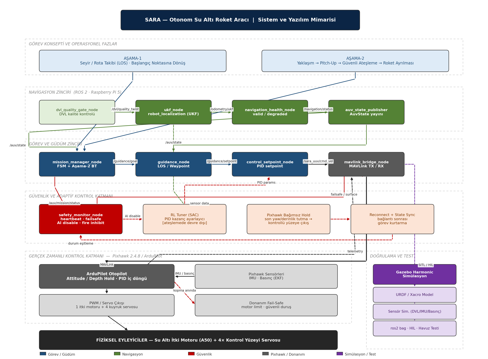
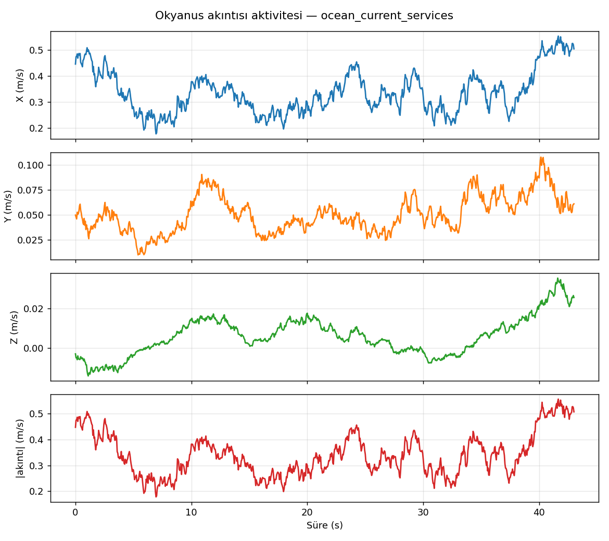

# SARA Validation Suite

**SARA — Otonom Sualtı Aracı · Algoritma Doğrulama Paketi**
TEKNOFEST 2026 — Su Altı Roket Yarışması · Hazırlık tarihi: 15 Haziran 2026

> Bu depo, SARA otonom yazılım zincirinin (**sensörler → UKF → guidance → kontrolcü → görev FSM/BT**)
> Gazebo Harmonic simülasyonunda uçtan uca doğrulanmasını belgeler. Her metrik, mümkün olduğunda
> depo içindeki dosyalardan yeniden hesaplanarak doğrulanmıştır. Doğrulanamayan (ham kaydı bu
> bundle'da olmayan) metrikler **açıkça etiketlenmiştir** — abartılı veya ispatlanmamış başarı
> iddiası kullanılmamıştır.

---

## Table of Contents

- [System Architecture](#system-architecture)
- [Validation Methodology](#validation-methodology)
- [Test Matrix](#test-matrix)
- [Navigation Validation](#navigation-validation)
- [Guidance Validation](#guidance-validation)
- [Controller Validation](#controller-validation)
- [Mission FSM Validation](#mission-fsm-validation)
- [Fire Behavior Tree Validation](#fire-behavior-tree-validation)
- [Ocean Current Validation](#ocean-current-validation)
- [RL Policy Validation](#rl-policy-validation)
- [Results Summary](#results-summary)
- [Raw Data](#raw-data)
- [Reproducibility](#reproducibility)
- [Known Limitations](#known-limitations)
- [Repository Structure](#repository-structure)

---

## System Architecture

SARA'nın otonom zinciri ROS 2 tarafında seyir/görev mantığını, Pixhawk/ArduPilot tarafında
ise iç döngü tutum/derinlik kontrolünü ve bağımsız failsafe'i barındırır. Tam mimari şeması ve
makine-okunur düğüm/bağlantı listeleri [docs/architecture/](docs/architecture/) altındadır.



**Kaynak dosyalar** ( [docs/architecture/](docs/architecture/) ):
| Dosya | İçerik |
|---|---|
| [SARA_Sistem_Mimarisi_temiz.png](docs/architecture/SARA_Sistem_Mimarisi_temiz.png) | Mimari diyagram (görsel) |
| [SARA_Sistem_Mimarisi_temiz.pdf](docs/architecture/SARA_Sistem_Mimarisi_temiz.pdf) | Baskı/sunum sürümü |
| [SARA_Sistem_Mimarisi_temiz.drawio](docs/architecture/SARA_Sistem_Mimarisi_temiz.drawio) | Düzenlenebilir draw.io kaynağı |
| [SARA_Sistem_Mimarisi.csv](docs/architecture/SARA_Sistem_Mimarisi.csv) | 23 düğüm (katman + stil), draw.io CSV import |
| [SARA_Baglanti_Listesi.csv](docs/architecture/SARA_Baglanti_Listesi.csv) | 28 bağlantı (kaynak→hedef→veri→tip) |

> **Tutarlılık kontrolü (doğrulandı):** Bağlantı listesindeki tüm 28 kenar uç noktası, düğüm
> listesindeki 23 düğümden biridir — eksik/yetim referans yoktur.
> (`python scripts/verify_validation_artifacts.py`).

### ROS 2 navigasyon/görev zinciri (tüm testlerde ortak)

```
Gazebo Harmonic (buoyant_sara.world)
   │  GT odometri, IMU, DVL, basınç
   ▼
ros_gz köprüleri → dvl_quality_gate_node → ukf_node (robot_localization, UKF)
   │                                            │ /odometry/ukf
   ▼                                            ▼
ocean_current_node                       navigation_health_node (valid / degraded)
                                                │ /navigation/status
                                                ▼
                                         auv_state_publisher → mission_manager_node (FSM + Aşama-2 BT)
                                                │ /auv/state                 │ /guidance/goal
                                                ▼                            ▼
                                         guidance_node (LOS / Waypoint) → control_setpoint_node (PID setpoint)
                                                                              │ /sara_uuv/cmd_vel
                                                                              ▼
                                         mavlink_bridge_node ──MAVLink──► ArduPilot (Attitude / Depth Hold)
                                                                              ▼
                                                                  PWM/Servo → 1 itki motoru + 4 kuyruk servosu
```

### Bağlantı kopması / failsafe mantığı

| Katman | Mekanizma | Davranış |
|---|---|---|
| ROS 2 (seyir/görev) | `safety_monitor_node` — heartbeat · AI disable · fire inhibit | Kalp atışı kesilirse görevi durdurur, RL tuner'ı devre dışı bırakır, ateşlemeyi inhibe eder |
| MAVLink köprüsü | `mavlink_bridge_node` TX/RX | ROS ↔ ArduPilot telemetri/komut köprüsü; kopma tespiti |
| Pixhawk (bağımsız) | `Pixhawk Hold` | Bağlantı koptuğunda son yaw/derinliği tutar → kontrollü yüzeye çıkış |
| Donanım | `hw_failsafe` | Motor limit · güvenli duruş (kopma anında) |
| Kurtarma | `reconnect_sync` | Bağlantı geri geldiğinde durum eşitleme → görev devam / abort kararı |

> **Not (kapsam):** RL Tuner (SAC tabanlı PID kazanç ayarlayıcı), mimaride **ateşleme fazında
> devre dışı** olarak tanımlıdır. Bu deposundaki RL doğrulaması bir *aday politika* değerlendirmesidir
> (bkz. [RL Policy Validation](#rl-policy-validation)).

---

## Validation Methodology

- Tüm performans testleri **ROS kontrol zinciri** (`control_backend:=ros`) ile koşturulur.
  ArduPilot hız/tutum kontrolü henüz kalibre edilmediğinden performans doğrulamasına **dahil
  edilmemiştir** (bilinçli kapsam kararı).
- Her test Gazebo'da sıfırdan başlatılır; rosbag alınır; analiz scriptleri RMSE/metrik üretir;
  Gazebo kapatılır.
- Bu **dokümantasyon bundle'ı** her test için analiz raporunu (özet sayfa) içerir. Bazı testlerin
  ham rosbag/CSV/PNG çıktıları boyut nedeniyle bu bundle'a dahil **değildir**; bu durum aşağıdaki
  matriste *Evidence* sütununda açıkça gösterilir.

### Durum etiketleri

| Etiket | Anlamı |
|---|---|
| **PASS** | Test bir kabul/ret kararı verir ve **kabul** çıktı, ya da performans testi temiz tamamlandı. |
| **WIP** | Koştu/koşturulabilir ancak kabul eşiği henüz sağlanmadı veya kanıt bu bundle'da kısmi. |
| **Needs Evidence** | İddia için bu bundle'da doğrudan dosya kanıtı yok. |

---

## Test Matrix

Kanıt sütunundaki ⓛ = ham rosbag/CSV/PNG bu **dokümantasyon bundle'ında yok**; metrik ilgili
test analiz sayfasından taşınmıştır. ✓ = kanıt dosyası bu depoda mevcuttur.

| Layer | Test | Evidence | Status |
|---|---|---|---|
| Navigation | Straight Line | [tests/01](tests/01_navigation_straight.md) · ⓛ raw CSV/PNG | PASS |
| Navigation | Resilience | [tests/05](tests/05_navigation_resilience.md) · ⓛ raw CSV/PNG | PASS |
| Guidance | LOS | [tests/03](tests/03_guidance_los.md) · ⓛ raw CSV/PNG | PASS |
| Guidance | Waypoint | [tests/04](tests/04_guidance_waypoint.md) · ⓛ raw CSV/PNG | PASS |
| Controller | Tracking | [tests/02](tests/02_controller_tracking.md) · ⓛ raw CSV/PNG | PASS |
| Sensor | Health | [tests/06](tests/06_sensor_health.md) · ⓛ raw CSV/PNG | PASS |
| FSM | Mission (Stage 1) | [tests/08](tests/08_stage1_fsm.md) · ⓛ raw CSV/PNG | PASS |
| BT | Mission (Stage 2) | [tests/09](tests/09_stage2_bt.md) · ⓛ raw CSV/PNG | PASS |
| BT | Fire Decision Logic | safety_monitor (architecture) · no isolated test | Needs Evidence |
| Ocean Current | Service Robustness | [tests/07](tests/07_ocean_current_services.md) · ✓ [figure](figures/ocean_current_service_activity.png) | PASS |
| RL | Policy Candidate Validation | ✓ [diagnostics](docs/diagnostics/rl_ukf/) · ✓ [figures](docs/figures/rl/) · ✓ [episode CSV](data/episodes/sara_best_episode.csv) | WIP |

---

## Navigation Validation

Ayrıntı: [tests/01_navigation_straight.md](tests/01_navigation_straight.md) ·
[tests/05_navigation_resilience.md](tests/05_navigation_resilience.md) ·
Wiki: [docs/wiki/navigation_validation.md](docs/wiki/navigation_validation.md)

### Purpose
Düz hatta UKF kestiriminin gerçek harekete tutarlılığını; ayrıca DVL gecikme/kesintisi altında
navigasyonun çökmediğini doğrulamak.

### Methodology
`control_backend:=ros`, 50 s düz hat (warmup 5 s, hedef derinlik 2 m). Resilience testi ek olarak
DVL **0.6 s gecikme** + periyodik **kesinti** düğümleri ve üç paralel UKF dalı (ham/korumalı/OOSM) koşturur.

### Inputs
Gazebo `buoyant_sara.world`, DVL/IMU/basınç köprüleri, `ukf_node`, `navigation_health_node`.

### Results
| Metrik | Straight | Resilience |
|---|---:|---:|
| Konum RMSE | 0.824 m | korumalı/ham karşılaştırması |
| Derinlik RMSE | 0.051 m | — |
| Maks. cross-track | 0.158 m | — |
| Yaw RMSE | 1.51° | — |
| Sonuç | temiz tamamlandı | `[COMPLETE]`, dropped=0 |

> *(Metrikler test analiz manifestlerinden; ham rosbag/CSV bu bundle'da değil.)*

### Decision
**PASS** — düz hat kontrol zinciri kararlı; resilience testi DVL bozulması altında temiz tamamlandı.

---

## Guidance Validation

Ayrıntı: [tests/03_guidance_los.md](tests/03_guidance_los.md) ·
[tests/04_guidance_waypoint.md](tests/04_guidance_waypoint.md) ·
Wiki: [docs/wiki/guidance_validation.md](docs/wiki/guidance_validation.md)

### Purpose
LOS güdümünün rota eksenini yakalamasını ve çoklu-waypoint rotasının kabul yarıçapı içinde
tamamlanmasını doğrulamak.

### Methodology
LOS: 1 waypoint, 5 m başlangıç sapması, lookahead 5 m. Waypoint: 4 waypoint, kabul 1.5 m.

### Inputs
`guidance_node` (LOS/Waypoint), `control_setpoint_node`, UKF state.

### Results
| Metrik | LOS | Waypoint |
|---|---:|---:|
| Başlangıç → son cross-track | −4.97 m → 0.0013 m | — |
| Cross-track azalma | %99.97 | — |
| Cross-track RMSE | 2.16 m | 0.580 m |
| Son waypoint mesafesi | 4.62 m | 2.54 m |

### Decision
**PASS** — LOS rota eksenine yakınsadı (%99.97 azalma); 4-waypoint rotası tamamlandı.

---

## Controller Validation

Ayrıntı: [tests/02_controller_tracking.md](tests/02_controller_tracking.md) ·
Wiki: [docs/wiki/controller_validation.md](docs/wiki/controller_validation.md)

### Purpose
Hız (0.8 m/s) ve derinlik (2 m) referanslarında setpoint/velocity kontrolcülerinin takip
başarımını ölçmek.

### Methodology
`control_backend:=ros`, 55 s, mesafe 35 m, derinlik 2 m, hedef hız 0.8 m/s.

### Inputs
`control_setpoint_node`, `velocity_controller`, UKF state.

### Results
| Metrik | Değer |
|---|---:|
| Konum RMSE | 0.200 m |
| Derinlik RMSE | 0.0011 m |
| Yaw RMSE | 0.011° |
| Roll / Pitch RMSE | 0.006° / 0.005° |

> Büyük cross-track (6.59 m) komutla yapılan manevradan kaynaklanır; bu test referans takibini
> ölçer, cross-track'i değil.

### Decision
**PASS** — derinlik/tutum hataları milimetre/yüzde-derece seviyesinde.

---

## Mission FSM Validation

Ayrıntı: [tests/08_stage1_fsm.md](tests/08_stage1_fsm.md) ·
Wiki: [docs/wiki/mission_fsm_validation.md](docs/wiki/mission_fsm_validation.md)

### Purpose
Yarışma Aşama-1 görevini sonlu durum makinesi (FSM) ile uçtan uca koşturmak.

### Methodology
`control_backend:=ros`, 240 s'ye kadar, tam görev düğüm yığını.

### Inputs
`mission_manager_node` (FSM), guidance, kontrolcüler, failsafe, ocean current, UKF.

### Results
| Metrik | Değer |
|---|---:|
| İz boyu mesafe | 73.84 m |
| Konum RMSE | 1.34 m |
| Derinlik RMSE | 0.075 m |
| Yaw RMSE | 3.38° |

> Maks. cross-track 32.6 m, görevin çoklu manevra geometrisinden kaynaklanır (hata değil).

### Decision
**PASS** — görev FSM'i baştan sona kesintisiz yürüdü.

---

## Fire Behavior Tree Validation

Ayrıntı: [tests/09_stage2_bt.md](tests/09_stage2_bt.md) ·
Wiki: [docs/wiki/fire_behavior_tree_validation.md](docs/wiki/fire_behavior_tree_validation.md)

### Purpose
Aşama-2 görevini (yaklaşım → pitch-up → güvenli ateşleme → roket ayrılması) Davranış Ağacı (BT)
ile koşturmak ve modüler görev kurgusunun çalıştığını doğrulamak.

### Methodology
`control_backend:=ros`, 100 s'ye kadar, tam görev düğüm yığını.

### Inputs
`mission_manager_node` (Aşama-2 BT), `safety_monitor_node` (fire inhibit), kontrolcüler, UKF.

### Results
| Metrik | Değer |
|---|---:|
| İz boyu mesafe | 42.73 m |
| Konum RMSE | 0.722 m |
| Maks. cross-track | 0.43 m |
| Maks. pitch (GT) | 29.09° (dalış/çıkış manevrası) |

### Decision
**PASS (görev yürütme)** — BT görevi düşük cross-track (0.43 m) ile tamamlandı.
**Needs Evidence (ateşleme karar mantığı):** Ateşleme inhibit/permit kararı mimaride
`safety_monitor_node` üzerinde tanımlıdır, ancak bu bundle'da **izole bir ateşleme-karar testi
ve kanıt dosyası yoktur**. Ateşleme mantığının ayrı doğrulanması bir sonraki adımdır.

---

## Ocean Current Validation

Ayrıntı: [tests/07_ocean_current_services.md](tests/07_ocean_current_services.md) ·
Wiki: [docs/wiki/ocean_current_validation.md](docs/wiki/ocean_current_validation.md)

### Purpose
RL/dayanıklılık senaryolarının dayandığı okyanus akıntısı servislerinin çağrılara doğru yanıt
verdiğini doğrulamak.

### Methodology
8 servise programatik çağrı; ölçülen akıntı zaman serisi ile karşılaştırma.

### Inputs
`ocean_current_node`, `ocean_current_service_timeseries.csv`.

### Results
8/8 servis yanıt verdi. Hedef `(0.4, 0.2, 0.0)` m/s; ölçülen ort. X≈0.34, Y≈0.05 m/s, anlık maks.
büyüklük 0.557 m/s.



> Bu grafik orijinalde 0 bayt geldiği için kayıtlı CSV'den **yeniden üretilmiştir** (4 panel).

### Decision
**PASS** — sekiz servis çalışıyor; ölçülen akıntı komutlarla tutarlı.

---

## RL Policy Validation

Ayrıntı: [tests/10_rl_policy.md](tests/10_rl_policy.md) ·
Wiki: [docs/wiki/rl_policy_validation.md](docs/wiki/rl_policy_validation.md) ·
Teşhis: [docs/wiki/rl_ukf_diagnosis.md](docs/wiki/rl_ukf_diagnosis.md)

> **This section validates a policy candidate / RL-style control candidate under multiple current
> scenarios. It should not be presented as a fully trained SAC agent unless the corresponding
> training checkpoints, training curves, and evaluation protocol are included.**
>
> Bu bölüm, eğitilmiş bir SAC ajanı kesinliğiyle değil; farklı akıntı senaryolarında test edilen
> bir **policy candidate** doğrulaması olarak değerlendirilmelidir. Bu depoda eğitim checkpoint'i,
> ödül/öğrenme eğrisi ve değerlendirme protokolü **bulunmamaktadır** — bu nedenle "trained RL agent"
> ifadesi kullanılmamıştır.

### Purpose
Seçilen politika adayının, tam ROS/Gazebo zinciri (UKF + guidance + kontrolcü) üzerinde 6 farklı
akıntı senaryosunda hedefe ilerleyip ilerlemediğini ölçmek; ve ilk RL metriklerindeki yüksek UKF
RMSE değerinin kök nedenini denetlemek.

### Methodology
6 senaryoluk episode matrisi (`no_current` … `hard_cross_current`). UKF–GT konum hatası hem **raw**
hem **başlangıç-hizalı (aligned)** olarak ham `recording/telemetry.csv` kayıtlarından yeniden
hesaplanmıştır (teşhis paketi). Figürler [scripts/generate_rl_figures.py](scripts/generate_rl_figures.py)
ile düzeltilmiş özet CSV'den üretilir.

### Inputs
- [data/episodes/sara_best_episode.csv](data/episodes/sara_best_episode.csv) — tek episode (calm), 34 kolon, 662 adım.
- [docs/diagnostics/rl_ukf/corrected_rl_ukf_summary_from_raw_telemetry.csv](docs/diagnostics/rl_ukf/corrected_rl_ukf_summary_from_raw_telemetry.csv)
- [docs/diagnostics/rl_ukf/metrics_vs_raw_telemetry_ukf_span_check.csv](docs/diagnostics/rl_ukf/metrics_vs_raw_telemetry_ukf_span_check.csv)

### Results

**Düzeltilmiş UKF–GT RMSE (ham telemetriden, başlangıç hizalı):**

| Senaryo | Metrics UKF RMSE (eski) | Raw RMSE | Aligned RMSE | Progress | Cross-track RMSE |
|---|---:|---:|---:|---:|---:|
| no_current | 30.34 m | 3.86 m | **0.73 m** | 50.12 m | 0.54 m |
| following_current | 36.98 m | 4.13 m | **0.16 m** | 56.82 m | 0.42 m |
| cross_current | 31.91 m | 4.01 m | **0.19 m** | 53.77 m | 1.27 m |
| diagonal_current | 46.03 m | 4.12 m | **0.27 m** | 81.55 m | 0.81 m |
| reverse_current | 32.88 m | 4.00 m | **0.09 m** | 47.68 m | 0.34 m |
| hard_cross_current | 35.09 m | 3.94 m | **0.16 m** | 58.07 m | 4.79 m |


> **UKF kök neden (doğrulandı):** İlk RL metriklerinde raporlanan ~30–46 m UKF konum RMSE değerleri,
> üretilen `metrics/rl_policy_timeseries.csv` dosyasında UKF kolonlarının (`x_ukf`,`y_ukf`,`z_ukf`)
> episode boyunca **güncellenmemiş (donmuş, span≈0)** olmasından kaynaklanır; oysa aynı episode'un ham
> `/odometry/ukf` kaydı 50–81 m boyunca normal ilerler. Ham telemetriden yeniden hesaplanan
> **başlangıç-hizalı** UKF-GT RMSE değerleri **0.09–0.73 m** bandındadır ve diğer navigasyon/controller
> testleriyle (≈0.82 m / ≈0.20 m) tutarlıdır. Bu nedenle yüksek RMSE, gerçek bir UKF çökmesi değil,
> bir **analiz/export artefaktı** olarak ele alınmıştır. Tam teşhis: [docs/wiki/rl_ukf_diagnosis.md](docs/wiki/rl_ukf_diagnosis.md).
>
> **Sınır (dürüstlük):** Bu kanıt, teşhis paketinin span-check çıktısıyla **doğrulanmıştır**
> (metrics span≈0 vs raw span≈50–81 m). Donmuş kolonu üreten **kaynak script bu depoda mevcut
> değildir**; bu yüzden hatalı kod satırı gösterilememektedir — yalnızca semptom ve kök-neden sınıfı
> dosyalardan ispatlanmıştır.

### Decision
**WIP** — Navigasyon altyapısı 6 senaryoda da geçerli kaldı (`nav_valid_ratio = 1.0`). Aday politika
çoğu senaryoda hedefe oturdu; ancak `reverse_current` ilerlemesi 47.68 m (<50 m hedef) ve
`hard_cross_current` cross-track RMSE'si 4.79 m olduğundan, **aday politika** olarak işaretlenmiştir.
Bu sonuç **zincirin değil, aday politikanın** eşik durumunu yansıtır.

---

## Results Summary

| Katman | Test | Durum | Anahtar sonuç |
|---|---|:---:|---|
| Navigation | Straight | PASS | cross-track 0.158 m, derinlik RMSE 0.051 m |
| Navigation | Resilience | PASS | DVL gecikme+kesinti altında `[COMPLETE]` |
| Guidance | LOS | PASS | cross-track %99.97 azaldı |
| Guidance | Waypoint | PASS | cross-track RMSE 0.580 m |
| Controller | Tracking | PASS | derinlik RMSE 0.0011 m, yaw RMSE 0.011° |
| Sensor | Health | PASS | tüm sağlık oranları 1.0 |
| FSM | Stage 1 | PASS | 73.8 m iz, kesintisiz |
| BT | Stage 2 | PASS | cross-track 0.43 m |
| BT | Fire decision | Needs Evidence | izole ateşleme-karar testi yok |
| Ocean Current | Services | PASS | 8/8 servis |
| RL | Policy candidate | WIP | aligned UKF RMSE 0.09–0.73 m; aday politika eşik-altı senaryolar |

---

## Raw Data

Ayrıntılı indeks: [docs/wiki/raw_data_index.md](docs/wiki/raw_data_index.md)

| Veri | Yol | Bu bundle'da? |
|---|---|:---:|
| En iyi episode (34 kolon, 662 adım) | [data/episodes/sara_best_episode.csv](data/episodes/sara_best_episode.csv) | ✓ |
| Düzeltilmiş RL UKF özeti | [docs/diagnostics/rl_ukf/corrected_rl_ukf_summary_from_raw_telemetry.csv](docs/diagnostics/rl_ukf/corrected_rl_ukf_summary_from_raw_telemetry.csv) | ✓ |
| UKF span-check (donmuş-kolon kanıtı) | [docs/diagnostics/rl_ukf/metrics_vs_raw_telemetry_ukf_span_check.csv](docs/diagnostics/rl_ukf/metrics_vs_raw_telemetry_ukf_span_check.csv) | ✓ |
| Mimari düğüm/bağlantı CSV'leri | [docs/architecture/](docs/architecture/) | ✓ |
| Görev raporu (HTML) | [reports/sara_mission_report.html](reports/sara_mission_report.html) | ✓ |
| Episode özet/görsel | [reports/sara_best_episode.png](reports/sara_best_episode.png) · [reports/sara_episode_summary.png](reports/sara_episode_summary.png) | ✓ |
| Görev videosu | [reports/sara_mission_video.mp4](reports/sara_mission_video.mp4) | ✓ |
| Per-test ham rosbag/CSV/PNG | (analiz manifestlerinde) | ✗ boyut nedeniyle |
| RL ham `recording/telemetry.csv` | (final_validation arşivi) | ✗ bu bundle'da yok |

---

## Reproducibility

```bash
# 1) Doğrulama artefaktlarını denetle (linkler, CSV şeması, metrikler, tutarlılık)
python scripts/verify_validation_artifacts.py

# 2) RL figürlerini düzeltilmiş özet CSV'den yeniden üret
python scripts/generate_rl_figures.py

# 3) SARA RL/sim deneylerini yeniden koştur (deterministik: seed=42, 16 episode)
#    not: notebook sara_sedaa.py ve sara_best_episode.csv'yi çalışma dizininde bekler
jupyter notebook notebooks/sara_rl_validation.ipynb
#    veya doğrudan:  python sim/sara_sedaa.py
```

> `data/episodes/sara_best_episode.csv` üzerinde doğrulanan değerler: final x = 50.037 m,
> derinlik z = 1.984 m, cross-track y = 0.029 m, energy = 7.274 Wh, toplam reward = 932.45,
> `done=True`, `truncated=False`, kütle = 15.85 kg (sim `sara_sedaa.py:74`).

---

## Known Limitations

1. **Ham per-test çıktıları bu bundle'da yok.** Navigation/Guidance/Controller/FSM/BT/Sensor
   metrikleri test analiz manifestlerinden taşınmıştır; bu deposundan bağımsız olarak yeniden
   hesaplanamaz.
2. **RL metriklerini üreten kaynak script burada değil.** Donmuş UKF kolonu semptomu ve kök-neden
   *sınıfı* dosyalardan ispatlandı; hatalı kod satırı, üretici script eklenmeden gösterilemez.
3. **RL ≠ eğitilmiş SAC.** Checkpoint/öğrenme eğrisi/değerlendirme protokolü yok → policy candidate.
4. **Ateşleme karar mantığı izole test edilmedi** (mimaride tanımlı, ayrı kanıt yok).
5. **ArduPilot kontrol arka ucu** performans doğrulamasına dahil değil (kalibre edilmedi).
6. **Kapanış anomalileri** (bazı testlerde SIGINT sırasında segfault/traceback) ölçümleri etkilemez
   ancak kapanış sırası ileride sağlamlaştırılmalıdır.

---

## Repository Structure

```
zemheri_validation/
├── README.md                       ← bu dosya (jüri özeti, wiki formatı)
├── CLAUDE.md                       ← gelecekteki bağlam için depo özeti
├── .gitignore
├── tests/                          ← 10 test analiz sayfası (01…10)
├── figures/                        ← yeniden üretilen + örnek doğrulama figürleri
├── rl_tools/
│   ├── plot_validation_figures.py  ← genel RL/doğrulama figür üreticisi
│   └── README_RL.md
├── docs/
│   ├── architecture/               ← SARA mimari (png/pdf/drawio + 2 CSV)
│   ├── diagnostics/rl_ukf/         ← RL UKF/GT teşhis paketi (MD + 2 CSV + 2 PNG)
│   ├── figures/rl/                 ← üretilen RL figürleri (4 PNG)
│   └── wiki/                       ← 9 wiki sayfası (katman başına)
├── data/episodes/
│   └── sara_best_episode.csv       ← .xls'ten dönüştürüldü (gerçekte CSV)
├── reports/                        ← HTML rapor, episode görselleri, görev videosu
├── notebooks/
│   └── sara_rl_validation.ipynb    ← temiz çalışma notebook'u
├── sim/
│   └── sara_sedaa.py               ← RL/sim ortamı (Gymnasium-tarzı)
└── scripts/
    ├── verify_validation_artifacts.py   ← teslim öncesi tutarlılık denetimi
    └── generate_rl_figures.py           ← RL figür üreticisi (düzeltilmiş)
```
