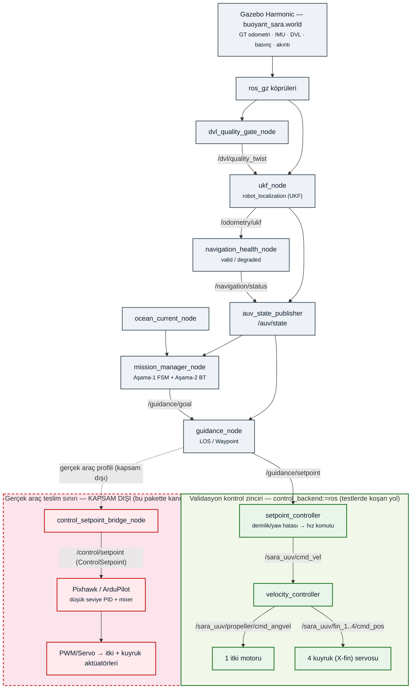
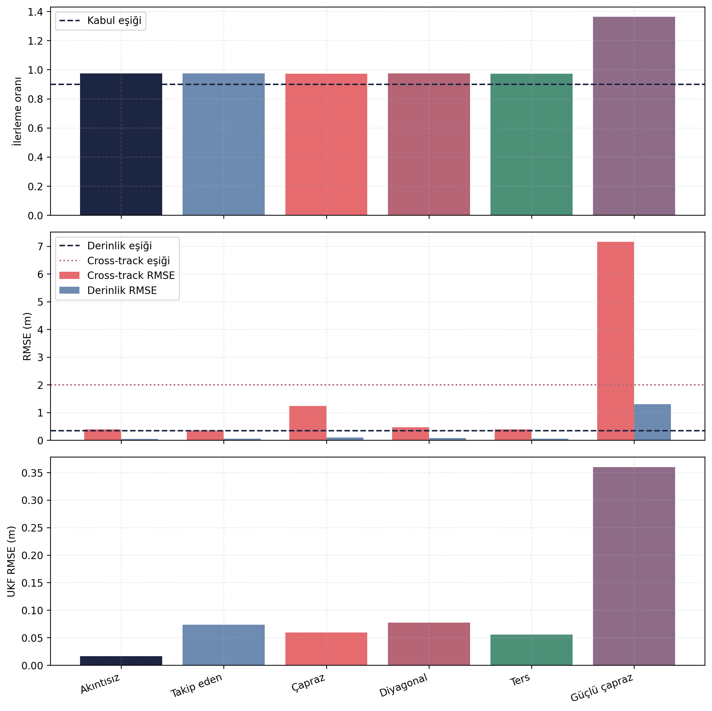
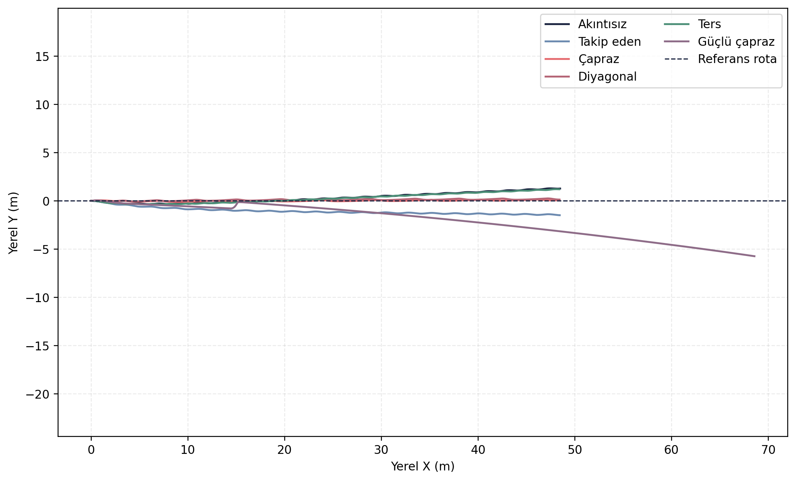
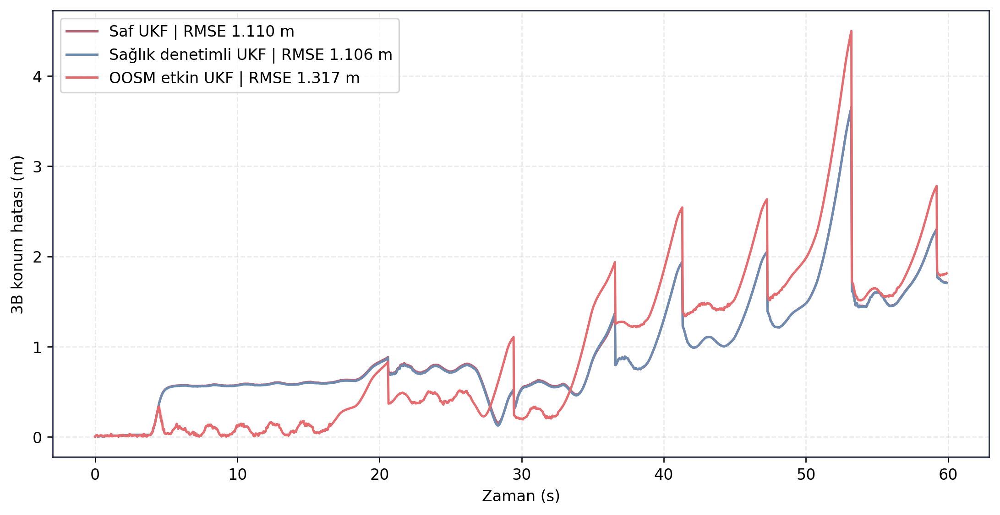
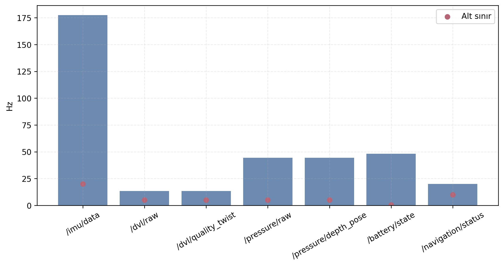

# ZEMHERI Dogrulama Sonuclari

Bu depo, SARA/ZEMHERI ROS 2 yazilim sisteminden uretilen paylasilabilir dogrulama ciktilarini icerir. Ana gelistirme deposu degildir; rapor, teknik inceleme ve takim ici sonuc paylasimi icin duzenlenmis CSV, PNG, Markdown, YAML ve log dosyalari tutulur.

Testler Gazebo/ROS 2 simülasyon ortaminda mevcut ZEMHERI kontrol, gudum, navigasyon ve gorev yonetimi katmanlari ile kosulmustur. ArduPilot entegrasyonu bu sonuc setine dahil degildir.

## Genel Sistem Mimarisi

SARA/ZEMHERI otonom yazilim zinciri simülasyon dogrulamalarinda su akisa gore ele alinmistir:

```text
sensorler -> UKF/navigasyon -> guidance -> controller -> gorev FSM/BT -> sim aktüator komutlari
```


Veri akisinin ROS 2 topic/düğüm seviyesindeki kisa ozeti icin: [`ros2_navigation_dataflow.md`](mimari/ros2_navigation_dataflow.md)

**Not (kapsam):** RL Tuner (SAC tabanlı PID kazanç ayarlayıcı) mimaride **ateşleme fazında devre dışı**
olarak tanımlıdır. Bu depodaki RL doğrulaması bir *aday politika* değerlendirmesidir

**Kapsam uyarisi:** Bu dogrulama paketindeki performans sonuclari ROS tabanli simülasyon kontrol zincirine aittir. Gercek arac tarafindaki Pixhawk/ArduPilot entegrasyonu ve dusuk seviye kontrol performansi bu sonuc setinde dogrudan dogrulanmamistir.

**Kod uyarisi:** [`kodlar/`](kodlar/README.md) altindaki Python dosyalari, test kosum mantigini ve metrik uretim yaklasimini gostermek icin eklenmistir. Bu dosyalar tek basina calisan bagimsiz bir paket degildir; ana ZEMHERI ROS 2 workspace, mesaj arayuzleri, launch/config dosyalari ve simülasyon altyapisi olmadan ayni ciktilari uretmez.

## Icerik

- [Kapsam](#kapsam)
- [Dogrulama Metodolojisi](#dogrulama-metodolojisi)
- [Klasor Duzeni](#klasor-duzeni)
- [Genel Sonuc Tablosu](#genel-sonuc-tablosu)
- [One Cikan Gorseller](#one-cikan-gorseller)
- [Ham Veri ve Arsiv Politikasi](#ham-veri-ve-arsiv-politikasi)
- [Okuma Notu](#okuma-notu)

## Kapsam

Bu paket, SARA otonom yazilim zincirinin simülasyon ortamindaki algoritma dogrulama kanitlarini bir araya getirir:

```text
sensorler -> UKF/navigasyon -> gudum -> kontrolcu -> gorev FSM/BT -> sim aktüator komutlari
```
---


Bu validasyon paketinde performans kaniti verilen kontrol yolu ROS tabanli simülasyon kontrol zinciridir. Pixhawk/ArduPilot entegrasyonu ve gercek arac dusuk seviye kontrol performansi bu paket kapsaminda degerlendirilmemistir. Bu ayrim ozellikle okunmalidir; burada yer alan metrikler simülasyon testleri icindir.

## Dogrulama Metodolojisi

Her test icin ayni temel akis uygulanmistir:

1. Gazebo/ROS 2 simülasyonu ilgili senaryoya gore baslatilir.
2. Test kosumu sirasinda secili ROS 2 topic'leri kaydedilir.
3. Analiz betikleri ground truth, UKF, guidance, sensor ve gorev durumlarini hizalayarak metrik uretir.
4. Metrikler CSV/Markdown olarak, grafikler PNG olarak saklanir.
5. Raporlanabilir ozetler, gorseller ve guncel kayıt dışa aktarımları paylaşım klasörüne alınır; rosbag veritabanları ayrı tutulur.

Durum etiketleri:

| Etiket | Anlam |
|---|---|
| `KABUL` | Test kosulu icin tekrar uretilebilir ve hedeflenen metrikleri saglayan sonuc. |
| `KISMEN KABUL` | Sistem calismis, ancak belirli bir stres/sinir kosulu tam saglanmamistir. |
| `GELISTIRME GEREKTIRIYOR` | Yazilim akisi kosulmus, fakat performans metrikleri gorev hedefi icin yeterli degildir. |
| `GELISTIRME ASAMASINDA` | Algoritma/akış kaniti vardir; fizik modeli, kontrol ayari veya saha uyumu henuz tamamlanmamistir. |

## Klasor Duzeni

| Klasor | Icerik |
|---|---|
| [`controller_tracking`](controller_tracking/README.md) | Kontrol katmani izleme testi ve arac davranis grafigi. |
| [`guidance_los`](guidance_los/README.md) | LOS gudum algoritmasi rota yakinsama testi. |
| [`guidance_waypoint`](guidance_waypoint/README.md) | Waypoint tabanli gudum testi. |
| [`stage1_fsm`](stage1_fsm/README.md) | Asama-1 FSM gorev akisi testi. |
| [`stage2_bt`](stage2_bt/README.md) | Asama-2 BT/FSM destekli atis hazirlik testi. |
| [`rl_politika`](rl_politika/README.md) | RL politika adayinin farkli akinti kosullarinda dogrulanmasi. |
| [`navigation_straight`](navigation_straight/README.md) | Duz seyirde UKF/ground truth karsilastirmasi. |
| [`navigation_resilience`](navigation_resilience/README.md) | DVL kesintisi, degraded durum ve OOSM etkisi analizi. |
| [`ocean_current_services`](ocean_current_services/README.md) | Akinti servisleri ve senaryo yukleme dogrulamasi. |
| [`sensor_health`](sensor_health/README.md) | IMU, DVL, basinc ve navigasyon saglik durumu testi. |
| [`kodlar`](kodlar/README.md) | Sonuc uretiminde kullanilan analiz ve test kosum betiklerinin inceleme kopyalari. |
| `arsiv/` | Onceki daginik yapi ve ham kayit arsivi. `.gitignore` kapsamindadir. |

Her test klasorunde ortak olarak `gorseller`, `metrikler`, `loglar`, `ham_veriler` ve `test_manifest.yaml` yapisi kullanilir. Kayit ozetleri ilgili test README dosyasina islenmistir. `ham_veriler/` klasorleri, `analysis/final_validation/results` altindaki guncel test kosumlarindan alinmis CSV/JSON/Markdown kayıt dışa aktarımlarını icerir.

## Genel Sonuc Tablosu

| Test | Karar | Ana sonuc | Gelistirme notu |
|---|---|---|---|
| Controller tracking | GELISTIRME GEREKTIRIYOR | UKF konum RMSE 0.1997 m; maksimum yanal sapma 6.5884 m | Kontrol zinciri calisiyor, yanal kararlilik iyilestirilmeli. |
| Guidance LOS | KABUL | Cross-track hata 4.9737 m'den 0.0013 m'ye indi | LOS yakinsama davranisi raporlanabilir. |
| Guidance waypoint | KABUL | 4 waypoint rotasi tamamlandi; cross-track RMSE 0.5797 m | Waypoint gecisleri calisiyor. |
| Stage-1 FSM | GELISTIRME GEREKTIRIYOR | Gorev akisi kosuldu; bitis yanal hatasi 32.4550 m | Donus ve geri donus geometri kontrolu iyilestirilmeli. |
| Stage-2 BT | GELISTIRME ASAMASINDA | Pitch 29.0937 dereceye ulasti; yanal sapma 0.4335 m | X-konfigürasyon yuzey/pitch modeli tam saha kabulu icin yeterli degil. |
| RL politika | KISMEN KABUL | 6 senaryonun 5'i kabul edildi; DVL hiz ihlali yok | 0.4 m/s guclu capraz akinti stres siniri olarak kaldı. |
| Navigation straight | KABUL | 3B UKF RMSE 0.8237 m; yanal sapma 0.1578 m | Duz seyir navigasyon cikisi tutarli. |
| Navigation resilience | KISMEN KABUL | Saglik denetimli UKF saf UKF'ye yakin; OOSM RMSE orani 1.1865 | OOSM dogruluk kazanci olarak raporlanmamali, degraded yonetimi raporlanmali. |
| Ocean current services | KABUL | 8/8 servis basarili | Akinti senaryo servisleri calisiyor. |
| Sensor health | KABUL | IMU, DVL, basinc ve navigation valid oranlari 1.0 | Sensor veri surekliligi saglandi. |

## One Cikan Gorseller

### RL Politika





### Navigasyon Dayanikliligi



### Sensor Sagligi



## Ham Veri ve Arsiv Politikasi

Paylasim klasorunde raporlamaya yetecek metrik CSV'leri, gorseller, manifest dosyalari, analiz loglari ve guncel test kosumlarindan uretilen ham CSV/JSON/Markdown kayıt dışa aktarımları tutulur. Bu ham kayıtlar `arsiv/` icinden degil, dogrudan ana calisma alanindaki `analysis/final_validation/results` klasorunden alinmistir.

- GitHub uzerinde tekil dosya limitini asan rosbag veritabanlarini paylasim disinda tutmak.
- Okuyucunun metrik/gorsel sonuc yaninda CSV/JSON kayıt dışa aktarımlarını da dogrudan inceleyebilmesini saglamak.

Ham `bag_0.db3`, `.mcap` ve bag klasorleri paylasim setine dahil edilmez. `telemetry.csv`, `topic_summary.csv`, `resources.csv`, `rosout.csv`, `summary.json` ve benzeri paylasilabilir kayıt dışa aktarımları ilgili test klasorlerindeki `ham_veriler/` altinda tutulur. Onceki daginik yapi `arsiv/` altinda yerel olarak saklanir ve `.gitignore` nedeniyle push setine dahil edilmez.

## Okuma Notu

Bu sonuc paketi final saha kabul raporu olarak degil, mevcut gelistirme durumunun sayisal ve gorsel dogrulama paketi olarak hazirlanmistir. `KABUL` etiketi ilgili test kosulu icin tekrar uretilebilir simülasyon sonucunu ifade eder. `GELISTIRME GEREKTIRIYOR` etiketi algoritmanin calistigini ancak performans veya fiziksel model uyumu acisindan gelistirme ihtiyacinin devam ettigini gosterir.
