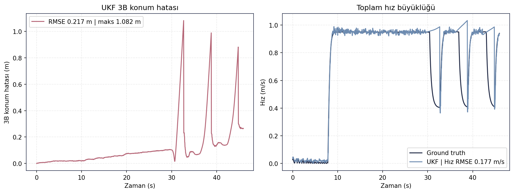
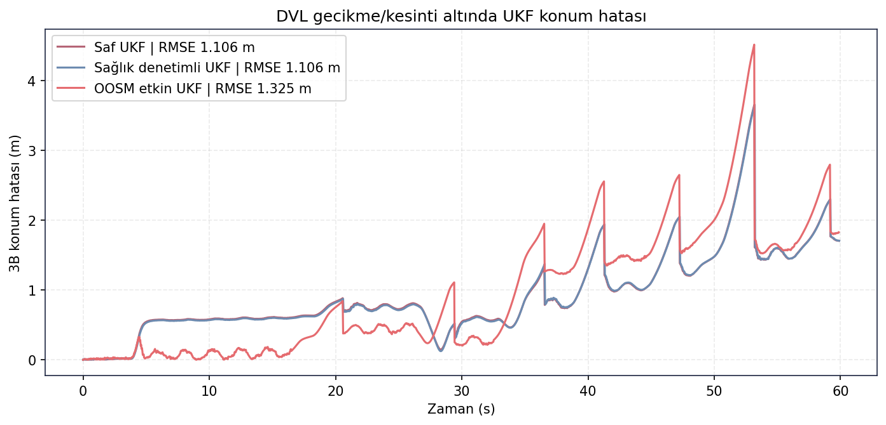
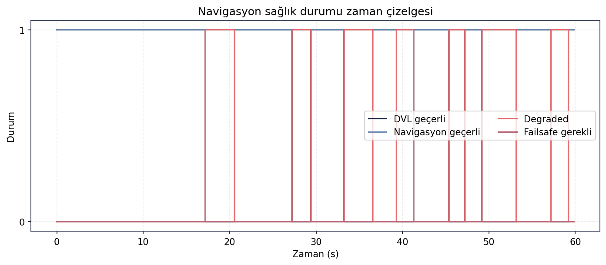
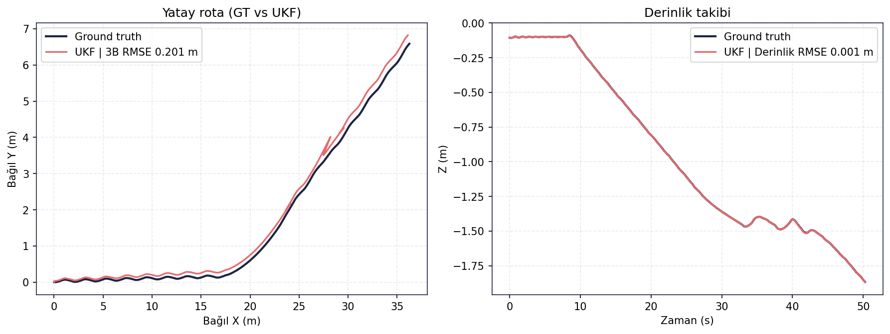
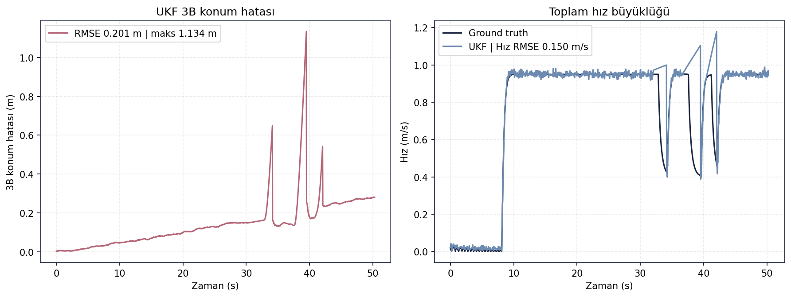
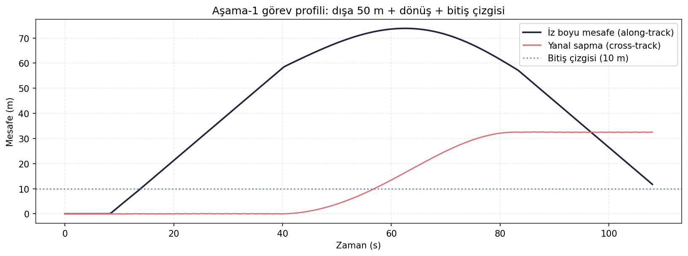
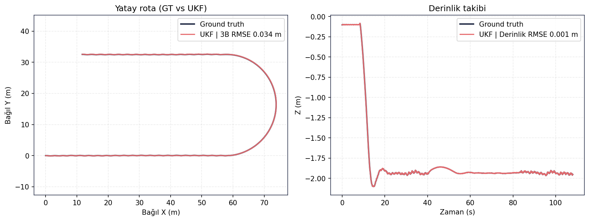
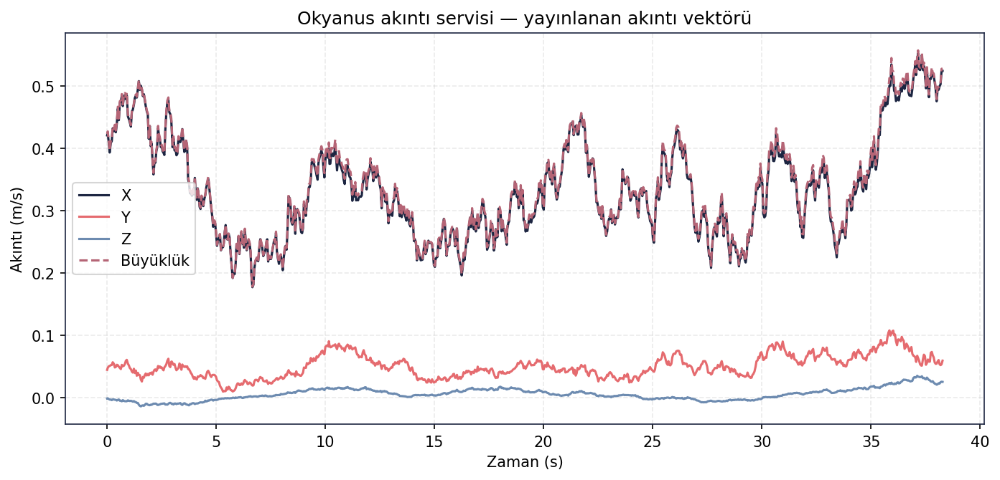

# SARA Validation Suite

**SARA — Otonom Sualtı Aracı · Algoritma Doğrulama Paketi**
TEKNOFEST 2026 — Su Altı Roket Yarışması · Hazırlık tarihi: 15 Haziran 2026

> Bu depo, SARA otonom yazılım zincirinin (**sensörler → UKF → guidance → kontrolcü → görev FSM/BT**)
> Gazebo Harmonic simülasyonunda uçtan uca doğrulanmasını belgeler. Buradaki **tüm sayısal sonuçlar**,
> takımın gerçek test koşumlarından gelen ham `recording/telemetry.csv` kayıtlarından (final_validation
> arşivi) **yeniden hesaplanmıştır** — takımın kendi analiz kodundaki ([src/validation/](src/validation/))
> matematiğin birebir aynısı ile. Hiçbir metrik varsayılmamış, abartılmamış; kabul ölçütünü sağlamayan
> testler **dürüstçe** `KISMİ` / `WIP` / `Needs Evidence` olarak işaretlenmiştir.

---

## Table of Contents

- [System Architecture](#system-architecture)
- [Validation Methodology](#validation-methodology)
- [Test Inventory](#test-inventory)
- [Navigation Validation](#navigation-validation)
- [Guidance Validation](#guidance-validation)
- [Controller Validation](#controller-validation)
- [Sensor Health Validation](#sensor-health-validation)
- [Mission FSM Validation](#mission-fsm-validation)
- [Fire Behavior Tree Validation](#fire-behavior-tree-validation)
- [Ocean Current Validation](#ocean-current-validation)
- [RL Policy Validation](#rl-policy-validation)
- [RL UKF Diagnosis](#rl-ukf-diagnosis)
- [Results Summary](#results-summary)
- [Core Code / Test Entry Points](#core-code--test-entry-points)
- [Raw Data and Logs](#raw-data-and-logs)
- [Reproducibility](#reproducibility)
- [Known Limitations](#known-limitations)
- [Repository Structure](#repository-structure)

---

## System Architecture

SARA'nın otonom zinciri ROS 2 tarafında seyir/görev mantığını, Pixhawk/ArduPilot tarafında
iç döngü tutum/derinlik kontrolünü ve bağımsız failsafe'i barındırır. Tam mimari şeması ve
makine-okunur düğüm/bağlantı listeleri [docs/architecture/](docs/architecture/) altındadır.


*SARA sistem mimarisi — sensörlerden ArduPilot/PWM çıkışına kadar ROS 2 düğüm zinciri ve failsafe katmanları.*

**Kaynak dosyalar** ( [docs/architecture/](docs/architecture/) ):

| Dosya | İçerik |
|---|---|
| [SARA_Sistem_Mimarisi_temiz.png](docs/architecture/SARA_Sistem_Mimarisi_temiz.png) | Mimari diyagram (görsel) |
| [SARA_Sistem_Mimarisi_temiz.pdf](docs/architecture/SARA_Sistem_Mimarisi_temiz.pdf) | Baskı/sunum sürümü |
| [SARA_Sistem_Mimarisi_temiz.drawio](docs/architecture/SARA_Sistem_Mimarisi_temiz.drawio) | Düzenlenebilir draw.io kaynağı |
| [SARA_Sistem_Mimarisi.csv](docs/architecture/SARA_Sistem_Mimarisi.csv) | 23 düğüm (katman + stil) |
| [SARA_Baglanti_Listesi.csv](docs/architecture/SARA_Baglanti_Listesi.csv) | 28 bağlantı (kaynak→hedef→veri→tip) |

> **Tutarlılık kontrolü (doğrulandı):** Bağlantı listesindeki 28 kenar uç noktasının tümü, düğüm
> listesindeki 23 düğümden biridir — yetim referans yok (`python scripts/verify_validation_artifacts.py`).

### ROS 2 navigasyon/görev zinciri (tüm testlerde ortak)

```
Gazebo Harmonic (buoyant_sara.world)
   │  GT odometri, IMU, DVL, basınç
   ▼
ros_gz köprüleri → dvl_quality_gate_node → ukf_node (robot_localization, UKF)
   │                                            │ /odometry/ukf
   ▼                                            ▼
ocean_current_node                       navigation_health_node (valid / degraded)
                                                │ /navigation/status
                                                ▼
                                         auv_state_publisher → mission_manager_node (FSM + Aşama-2 BT)
                                                │ /auv/state                 │ /guidance/goal
                                                ▼                            ▼
                                         guidance_node (LOS / Waypoint) → control_setpoint_node (PID setpoint)
                                                                              │ /sara_uuv/cmd_vel
                                                                              ▼
                                         mavlink_bridge_node ──MAVLink──► ArduPilot (Attitude / Depth Hold)
                                                                              ▼
                                                                  PWM/Servo → 1 itki motoru + 4 kuyruk servosu
```

> **Not (kapsam):** RL Tuner (SAC tabanlı PID kazanç ayarlayıcı) mimaride **ateşleme fazında devre dışı**
> olarak tanımlıdır. Bu depodaki RL doğrulaması bir *aday politika* değerlendirmesidir
> (bkz. [RL Policy Validation](#rl-policy-validation)).

---

## Validation Methodology

- Tüm performans testleri **ROS kontrol zinciri** (`control_backend:=ros`) ile koşturulur. ArduPilot
  hız/tutum kontrolü henüz kalibre edilmediğinden performans doğrulamasına **dahil edilmemiştir** (bilinçli kapsam).
- Her test Gazebo'da sıfırdan başlatılır → rosbag alınır → takımın analiz kodu RMSE/metrik üretir → Gazebo kapatılır.
- **Bu depodaki figür ve metrikler**, takımın gerçek koşumlarından gelen ham `recording/telemetry.csv`
  dışa-aktarımlarından, takım analiz kodundaki aynı matematik ([src/validation/](src/validation/)) ile
  [scripts/generate_validation_figures.py](scripts/generate_validation_figures.py) tarafından **yeniden
  üretilmiştir**. Ham telemetry (~235 MB) boyut nedeniyle repoya **dahil değildir**.

### Durum etiketleri

| Etiket | Anlamı |
|---|---|
| **PASS** | Test bir kabul/ret kararı verir ve **kabul** çıktı; ya da performans testi temiz tamamlandı ve metrikler iyi. |
| **KISMİ** | Zincir/akış çalıştı ve bir kısmı kabul oldu, ancak bir kabul ölçütü bu koşumda sağlanmadı. |
| **WIP** | Koşturulabilir, ancak kabul eşiği henüz sağlanmadı. |
| **Needs Evidence** | İddia için bu pakette doğrudan izole test kanıtı yok. |

---

## Test Inventory

Her satır, **gerçek telemetriden yeniden üretilmiş** kanıta bağlanır. Figürler ilgili wiki sayfasına
ve aşağıdaki bölümlere gömülüdür.

| Layer | Test | Evidence | Figür | Status |
|---|---|---|---|:---:|
| Navigation | Straight Line | [wiki](docs/wiki/navigation_validation.md) · [summary](docs/metrics/navigation_straight/summary.csv) | [göm](#navigation-validation) | **PASS** |
| Navigation | Resilience (DVL) | [wiki](docs/wiki/navigation_validation.md) · [summary](docs/metrics/navigation_resilience/summary.csv) | [göm](#navigation-validation) | **KISMİ** |
| Guidance | LOS | [wiki](docs/wiki/guidance_validation.md) · [summary](docs/metrics/guidance_los/summary.csv) | [göm](#guidance-validation) | **PASS** |
| Guidance | Waypoint | [wiki](docs/wiki/guidance_validation.md) · [summary](docs/metrics/guidance_waypoint/summary.csv) | [göm](#guidance-validation) | **PASS** |
| Controller | Tracking | [wiki](docs/wiki/controller_validation.md) · [summary](docs/metrics/controller_tracking/summary.csv) | [göm](#controller-validation) | **PASS** |
| Sensor | Health | [wiki](docs/wiki/sensor_health_validation.md) · [rates](docs/metrics/sensor_health/topic_rates.csv) | [göm](#sensor-health-validation) | **PASS** |
| FSM | Mission (Stage 1) | [wiki](docs/wiki/mission_fsm_validation.md) · [summary](docs/metrics/stage1_fsm/summary.csv) | [göm](#mission-fsm-validation) | **KISMİ** |
| BT | Mission (Stage 2) | [wiki](docs/wiki/fire_behavior_tree_validation.md) · [summary](docs/metrics/stage2_bt/summary.csv) | [göm](#fire-behavior-tree-validation) | **KISMİ** |
| BT | Fire Decision Logic | mimaride tanımlı · izole test yok | — | **Needs Evidence** |
| Ocean Current | Service Robustness | [wiki](docs/wiki/ocean_current_validation.md) · [summary](docs/metrics/ocean_current_services/summary.csv) | [göm](#ocean-current-validation) | **PASS** |
| RL | Policy Candidate | [diagnostics](docs/diagnostics/rl_ukf/) · [figures](docs/figures/rl/) · [episode CSV](data/episodes/sara_best_episode.csv) | [göm](#rl-policy-validation) | **WIP** |

---

## Navigation Validation

Wiki: [docs/wiki/navigation_validation.md](docs/wiki/navigation_validation.md)

### Purpose
Düz hatta UKF kestiriminin gerçek harekete (ground truth) tutarlılığını; ve DVL gecikme/kesintisi
altında navigasyon sağlık denetiminin çökmediğini doğrulamak.

### Methodology
`control_backend:=ros`, düz hat (warmup 5 s, hedef derinlik 2 m). Resilience testi ek olarak DVL
bozulması (gecikme + periyodik kesinti) ve üç paralel UKF dalı koşturur: **saf** robot_localization,
**sağlık-denetimli** ve **OOSM** (out-of-sequence measurement).

### Results — Straight Line (gerçek telemetriden)
| Metrik | Değer |
|---|---:|
| 3B konum RMSE | **0.217 m** |
| Maks. 3B konum hatası | 1.082 m |
| Derinlik RMSE | **0.0012 m** |
| Maks. cross-track | 0.158 m |
| Yaw RMSE | 0.011° |
| İz boyu mesafe | 32.52 m |


*Düz hat: GT vs UKF yatay rota (3B RMSE 0.217 m) ve derinlik takibi (RMSE 0.0012 m). Y ekseni
ölçeği küçüktür; salınım kuyruk-servo manevrasıdır, gerçek yanal sapma < 0.16 m.*



*UKF 3B konum hatası zaman geçmişi ve toplam hız büyüklüğü (GT vs UKF).*

### Results — Resilience (DVL gecikme/kesinti)
| UKF dalı | 3B konum RMSE | Maks. hata |
|---|---:|---:|
| Saf robot_localization | **1.106 m** | 3.65 m |
| Sağlık denetimli | 1.106 m | — |
| OOSM etkin | 1.325 m | 4.51 m |

- `navigation_valid` oranı: **1.0** · `degraded` oranı: **0.308** → DVL kesintileri *degraded* olarak yönetildi, navigasyon hiç geçersiz olmadı.
- OOSM/saf RMSE oranı **1.198** (> 1.05 eşik) → bu koşumda OOSM doğruluk **kazandırmadı**.



*Saf / sağlık-denetimli / OOSM UKF dallarının GT'ye göre 3B konum hatası.*



*Navigasyon sağlık durumu: DVL kesintilerinde sistem `degraded`'a geçti ama `navigation_valid` korundu; `failsafe` hiç gerekmedi.*

### Decision
- **Straight Line → PASS** — UKF kestirimi gerçek harekete çok yakın (derinlik RMSE mm seviyesi, cross-track < 0.16 m).
- **Resilience → KISMİ** — Sağlık denetimi/`degraded` yönetimi **çalışıyor** (valid oranı 1.0, failsafe gerekmedi); ancak **OOSM doğruluk kazanımı bu koşumda gösterilemedi** (RMSE oranı 1.20). OOSM dalı doğruluk iyileştirmesi olarak raporlanmamalıdır.

---

## Guidance Validation

Wiki: [docs/wiki/guidance_validation.md](docs/wiki/guidance_validation.md)

### Purpose
LOS güdümünün rota eksenini yakalamasını ve çoklu-waypoint rotasının kabul yarıçapı (1.5 m) içinde
tamamlanmasını doğrulamak.

### Methodology
LOS: 1 hedef, ~5 m başlangıç yanal sapması. Waypoint: 4 waypoint, kabul yarıçapı 1.5 m. Cross-track,
takımın `analyze_guidance_validation.py` referans-ekseni matematiği ile hesaplanır.

### Results (gerçek telemetriden)
| Metrik | LOS | Waypoint |
|---|---:|---:|
| Güdüm kararı | **KABUL** | **KABUL** |
| Waypoint sayısı | 1 | 4 |
| Başlangıç → son cross-track | −4.97 m → **0.0013 m** | 0.0 m → 1.15 m |
| Cross-track RMSE | 2.158 m | **0.580 m** |
| Maks. cross-track | 4.97 m | 1.18 m |
| Heading RMSE | 3.64° | 5.42° |
| Son hedef mesafesi | 4.61 m | 2.54 m |


*LOS: araç başlangıçtaki ~5 m yanal sapmadan rota eksenine yakınsıyor (son yanal hata ≈ 0.001 m).*


*LOS cross-track ve heading/mesafe hata zaman geçmişi.*


*Waypoint: 4 hedef (kabul yarıçapı 1.5 m halkalarla) — rota baştan sona takip edildi.*


*Waypoint cross-track (RMSE 0.580 m) ve heading/mesafe hata geçmişi.*

### Decision
**PASS** — LOS rota eksenine yakınsadı (yanal hata −4.97 m → 0.001 m); 4-waypoint rotası kabul yarıçapı
ölçütünü sağlayarak tamamlandı (cross-track RMSE 0.58 m).

---

## Controller Validation

Wiki: [docs/wiki/controller_validation.md](docs/wiki/controller_validation.md)

### Purpose
Hız (0.8 m/s) ve derinlik (2 m) referanslarında kontrol zincirinin gerçekleşen hareketini ve UKF
kestirim doğruluğunu ölçmek.

### Methodology
`control_backend:=ros`, mesafe 35 m, derinlik 2 m, hedef hız 0.8 m/s. Mevcut analiz aracı öncelikle
GT↔UKF doğruluğunu ve aracın gerçekleşen hareketini raporlar.

### Results (gerçek telemetriden)
| Metrik | Değer |
|---|---:|
| 3B konum RMSE | 0.201 m |
| Derinlik RMSE | 0.0012 m |
| Yaw RMSE | 0.022° |
| Hız RMSE | 0.150 m/s |
| İz boyu mesafe | 36.26 m |
| Maks. cross-track | 6.59 m |



*Kontrolcü: GT vs UKF yatay rota ve derinlik takibi (derinlik RMSE 0.0012 m).*



*UKF 3B konum hatası ve toplam hız büyüklüğü; hedef ~0.8 m/s seyir hızı korunmuş.*

### Decision
**PASS** — derinlik/yaw kestirim hataları mm/yüzde-derece seviyesinde, seyir hızı korunuyor. Görece
büyük cross-track (6.59 m) **komutla yapılan manevradan** kaynaklanır; bu test referans takibi/UKF
doğruluğunu ölçer, yanal sapmayı değil.

---

## Sensor Health Validation

Wiki: [docs/wiki/sensor_health_validation.md](docs/wiki/sensor_health_validation.md)

### Purpose
IMU, DVL, basınç, batarya ve navigation status topic'lerinin gerçek koşumda minimum yayın frekanslarını
sağladığını doğrulamak.

### Results (gerçek telemetriden)
| Metrik | Değer |
|---|---:|
| navigation_valid oranı | 1.0 |
| IMU / DVL / basınç OK oranı | 1.0 / 1.0 / 1.0 |
| Minimum topic-rate oranı | 2.256 |
| Tüm topic sonuçları | KABUL |


*Sensor health: izlenen topic yayın frekansları minimum eşiklerin üzerinde kaldı.*

### Decision
**PASS** — tüm izlenen topic'ler minimum frekans eşiğinin üzerinde; sensör veri sürekliliği sağlandı.

---

## Mission FSM Validation

Wiki: [docs/wiki/mission_fsm_validation.md](docs/wiki/mission_fsm_validation.md)

### Purpose
Yarışma Aşama-1 görevini (kaydet → dal → 10 m ön-seyir → 50 m zamanlı koşu → dönüş → bitiş çizgisi →
gücü kes) sonlu durum makinesi (FSM) ile uçtan uca koşturmak.

### Methodology
`control_backend:=ros`, tam görev düğüm yığını. Faz dizisi `/auv/mission/status`'tan, bitiş-çizgisi
ölçütü `analyze_report_bag.py` stage1 mantığından (`|along−10|≤2 m` ve `|cross|≤3 m`).

### Results (gerçek telemetriden)
| Metrik | Değer |
|---|---:|
| İz boyu maks. mesafe (along) | **73.84 m** (dışa 50 m + dönüş yayı) |
| 3B konum RMSE (UKF) | 0.034 m |
| Derinlik RMSE | 0.0015 m |
| Bitiş çizgisi boyuna hatası | 1.72 m ✓ (≤ 2 m) |
| Bitiş çizgisi **yanal** hatası | **32.54 m** ✗ (≤ 3 m sağlanmadı) |
| Dışa 50 m geçerli | **Evet** |
| FSM faz dizisi | IDLE → SAVE_START_POINT → DIVE_TO_DEPTH → PRE_CRUISE_10M → START_TIMED_RUN → OUTBOUND_CRUISE_50M → TURN_AROUND → RETURN_TO_FINISH_LINE → CUT_POWER → COMPLETE |



*Aşama-1 görev profili: araç along-track 74 m'ye çıkıp dönüyor; ancak dönüş manevrası ~32 m yanal
sapma yaratıyor — bitiş çizgisine boyuna yakın (1.7 m) ama yanal olarak uzak (32.5 m) tamamlanıyor.*



*Aşama-1 GT vs UKF rota ve derinlik takibi (UKF doğruluğu çok yüksek: konum RMSE 0.034 m).*

### Decision
**KISMİ** — FSM'in **10 fazlık tam dizisi sırayla yürüdü** ve dışa 50 m koşusu geçerli; UKF kestirimi
mükemmele yakın. Ancak `TURN_AROUND` manevrası geniş yarıçaplı olduğundan araç bitiş çizgisine **32.5 m
yanal sapma** ile döndü → bitiş-çizgisi yanal kabul ölçütü (≤ 3 m) **sağlanmadı**. Dönüş geometrisi /
guidance ayarı bir sonraki iyileştirme adımıdır.

---

## Fire Behavior Tree Validation

Wiki: [docs/wiki/fire_behavior_tree_validation.md](docs/wiki/fire_behavior_tree_validation.md)

### Purpose
Aşama-2 görevini (yaklaşım → dalış/pitch → ateşleme izni → roket ayrılması) Davranış Ağacı (BT) ile
koşturmak; modüler görev kurgusu ve ateşleme durum makinesini gözlemlemek.

### Methodology
`control_backend:=ros`, tam görev düğüm yığını. Dalış ölçütü `pitch ≤ −30°`; ateşleme durumu
`/auv/fire/status` (state / actuator_command / fired).

### Results (gerçek telemetriden)
| Metrik | Değer |
|---|---:|
| İz boyu mesafe | 43.21 m |
| 3B konum RMSE (UKF) | 0.033 m |
| Maks. cross-track | **0.478 m** |
| Min. pitch (GT) | **−29.10°** (−30° eşiğinin hemen altında) |
| Ateşleme durumu | `IDLE` (actuator_command=False, fired=False) |


*Aşama-2: dalış (pitch) profili −29.1°'ye ulaşıyor (−30° eşiğine çok yakın); ateşleme durum makinesi
bu koşumda `IDLE`'da kaldı — ateşleme izni verilmedi.*


*Aşama-2 GT vs UKF rota ve derinlik takibi; düşük cross-track (0.48 m).*

### Decision
- **Görev yürütme → KISMİ** — BT görevi düşük yanal sapma (0.48 m) ve yüksek UKF doğruluğu ile yürüdü;
  dalış manevrası −30° hedefine çok yaklaştı (−29.1°) ama eşiği tam geçmedi.
- **Ateşleme karar mantığı → Needs Evidence** — bu koşumda ateşleme durumu `IDLE`'da kaldı (izin
  verilmedi, aktüatör komutu yok). İzin/inhibit mantığının izole, kanıtlı bir testi henüz yoktur.

---

## Ocean Current Validation

Wiki: [docs/wiki/ocean_current_validation.md](docs/wiki/ocean_current_validation.md)

### Purpose
RL/dayanıklılık senaryolarının dayandığı okyanus akıntısı servislerinin belirleyici (deterministic)
şekilde akıntı vektörü yayınladığını doğrulamak.

### Methodology
Akıntı servisleri programatik çağrılır; `/ocean_current` zaman serisi kaydedilir ve özetlenir.

### Results (gerçek telemetriden)
| Metrik | Değer |
|---|---:|
| Akıntı örnek sayısı | 871 |
| Ortalama X / Y / Z | 0.336 / 0.050 / 0.006 m/s |
| Maks. büyüklük | 0.557 m/s |



*Okyanus akıntı servisi: yayınlanan X/Y/Z bileşenleri ve toplam büyüklük zaman serisi.*

### Decision
**PASS** — akıntı servisleri belirleyici şekilde yayın yaptı; ölçülen akıntı vektörü senaryo
beklentisiyle tutarlı.

---

## RL Policy Validation

Wiki: [docs/wiki/rl_policy_validation.md](docs/wiki/rl_policy_validation.md) ·
Teşhis: [docs/wiki/rl_ukf_diagnosis.md](docs/wiki/rl_ukf_diagnosis.md)

> **This section validates a policy candidate / RL-style control candidate under multiple current
> scenarios. It should not be presented as a fully trained SAC agent unless the corresponding training
> checkpoints, training curves, and evaluation protocol are included.**
>
> Bu bölüm, eğitilmiş bir SAC ajanı kesinliğiyle değil; farklı akıntı senaryolarında test edilen bir
> **policy candidate** doğrulaması olarak değerlendirilmelidir. Depoda eğitim checkpoint'i, ödül/öğrenme
> eğrisi ve değerlendirme protokolü **yoktur** — bu nedenle "trained RL agent" ifadesi kullanılmamıştır.

### Purpose
Seçilen politika adayının tam ROS/Gazebo zincirinde (UKF + guidance + kontrolcü) 6 akıntı senaryosunda
hedefe ilerleyip ilerlemediğini ölçmek; ve ilk RL metriklerindeki yüksek UKF RMSE değerinin kök nedenini
denetlemek.

### Methodology
6 senaryoluk episode matrisi (`no_current` … `hard_cross_current`). UKF–GT konum hatası hem **raw** hem
**başlangıç-hizalı (aligned)** olarak ham `recording/telemetry.csv`'den
[scripts/recompute_rl_ukf_from_telemetry.py](scripts/recompute_rl_ukf_from_telemetry.py) ile **bağımsız**
yeniden hesaplanmıştır. Figürler [scripts/generate_rl_figures.py](scripts/generate_rl_figures.py) ile üretilir.

### Results
| Senaryo | Eski (buggy) | Raw RMSE | **Aligned RMSE** | Progress | Cross-track RMSE | Depth RMSE | nav_valid |
|---|---:|---:|---:|---:|---:|---:|---:|
| no_current | 30.34 m | 3.86 m | **0.73 m** | 50.12 m | 0.54 m | 1.10 m | 1.0 |
| following_current | 36.98 m | 4.13 m | **0.16 m** | 56.82 m | 0.42 m | 1.09 m | 1.0 |
| cross_current | 31.91 m | 4.01 m | **0.19 m** | 53.77 m | 1.27 m | 1.21 m | 1.0 |
| diagonal_current | 46.03 m | 4.12 m | **0.26 m** | 81.55 m | 0.81 m | 0.79 m | 1.0 |
| reverse_current | 32.88 m | 4.00 m | **0.09 m** | 47.68 m | 0.34 m | 1.48 m | 1.0 |
| hard_cross_current | 35.09 m | 3.94 m | **0.16 m** | 58.07 m | 4.79 m | 1.68 m | 1.0 |


> **UKF kök neden (kod + telemetri ile doğrulandı):** İlk RL metriklerindeki ~30–46 m UKF RMSE, exporter
> `rl_policy_validation.py` içindeki zaman-tabanı uyuşmazlığından kaynaklanır: `ukf` DataFrame'i başlangıç
> normalizasyonundan önce kopyalanıp normalize edilmediği için `merge_asof(nearest)` tüm UKF değerlerini
> **ilk örneğe sabitler** (donmuş kolon). Bağımsız yeniden hesapta **başlangıç-hizalı** UKF-GT RMSE
> **0.09–0.73 m** çıkar. Tam teşhis: [RL UKF Diagnosis](#rl-ukf-diagnosis).

### Decision
**WIP** — Zincir 6 senaryoda da çalıştı (`nav_valid_ratio = 1.0`). Ancak aday politikanın gerçek kabul
ölçütü (progress + **derinlik RMSE ≤ 0.35 m** + hız + nav_valid) hiçbir senaryoda sağlanmadı: derinlik
RMSE 0.79–1.68 m (> 0.35 m). Bu, UKF artefaktından **bağımsız**, aday politikanın gerçek derinlik-takip
sonucudur. Sonuç **zincirin değil, aday politikanın** durumudur.

---

## RL UKF Diagnosis

Tam teşhis: [docs/wiki/rl_ukf_diagnosis.md](docs/wiki/rl_ukf_diagnosis.md)

| Konu | Bulgu |
|---|---|
| Belirti | RL `metrics/rl_policy_timeseries.csv`'de `x_ukf/y_ukf/z_ukf` donmuş (span = 0). |
| Karşıt kanıt | Ham `recording/telemetry.csv`'de `/odometry/ukf` 50–81 m ilerliyor. |
| Kök neden (kod) | `rl_policy_validation.py`: `ukf` kopyası `start` ile normalize edilmemiş → `merge_asof(nearest)` tüm UKF'i ilk örneğe sabitliyor. |
| Eski (hatalı) | 30.34 / 36.98 / 31.91 / 46.03 / 32.88 / 35.09 m → **kullanılmıyor**, `legacy/` altında. |
| Düzeltilmiş (aligned) | 0.73 / 0.16 / 0.19 / 0.26 / 0.09 / 0.16 m → diğer testlerle tutarlı. |
| Düzeltme | [rl_policy_validation_fixed.py](docs/diagnostics/rl_ukf/rl_policy_validation_fixed.py) (tek satır: `ukf["t"] -= start`). |
| Bağımsız doğrulama | [scripts/recompute_rl_ukf_from_telemetry.py](scripts/recompute_rl_ukf_from_telemetry.py) → [verification CSV](docs/diagnostics/rl_ukf/recomputed_rl_ukf_from_telemetry_verification.csv). |
| Karar üzerine etkisi | Yok — accept/reject kararı derinlik RMSE'ye bağlıdır, UKF konum hatasına değil. |

---

## Results Summary

| Katman | Test | Durum | Anahtar sonuç (gerçek telemetriden) |
|---|---|:---:|---|
| Navigation | Straight | **PASS** | 3B RMSE 0.217 m · derinlik RMSE 0.0012 m · cross-track 0.158 m |
| Navigation | Resilience | **KISMİ** | valid oranı 1.0, degraded 0.31 (sağlık yönetimi OK); OOSM/saf RMSE 1.20 → doğruluk kazanımı yok |
| Guidance | LOS | **PASS** | cross-track −4.97 m → 0.001 m (yakınsadı) |
| Guidance | Waypoint | **PASS** | cross-track RMSE 0.580 m · 4 waypoint kabul |
| Controller | Tracking | **PASS** | derinlik RMSE 0.0012 m · yaw RMSE 0.022° |
| Sensor | Health | **PASS** | tüm sağlık oranları 1.0 · tüm topic'ler frekans sınırı üstünde |
| FSM | Stage 1 | **KISMİ** | 10 faz dizisi + 50 m koşu OK; bitiş çizgisi yanal 32.5 m (> 3 m) |
| BT | Stage 2 | **KISMİ** | dalış −29.1° (≈ −30°), cross-track 0.48 m; ateşleme `IDLE` |
| BT | Fire decision | **Needs Evidence** | izole ateşleme-karar testi yok |
| Ocean Current | Services | **PASS** | akıntı servisleri belirleyici yayın · maks 0.557 m/s |
| RL | Policy candidate | **WIP** | aligned UKF RMSE 0.09–0.73 m (düzeltildi); derinlik RMSE 0.79–1.68 m > 0.35 m → aday eşik altı |

---

## Core Code / Test Entry Points

Takımın gerçek doğrulama/analiz kodu [src/validation/](src/validation/) altındadır (provenance:
final_validation arşivi). Detay: [src/validation/README.md](src/validation/README.md).

| Bileşen | Giriş noktası | Açıklama |
|---|---|---|
| Final test orkestrasyonu | [src/validation/run_final_validation.py](src/validation/run_final_validation.py) | Tüm testleri Gazebo'da izole koşturur; parametreler burada |
| Tek senaryo koşucu | [src/validation/report_test_runner.py](src/validation/report_test_runner.py) | ROS 2 üzerinde tek `--case` koşar ve kaydeder |
| Navigation/FSM/BT analizi | [src/validation/analyze_report_bag.py](src/validation/analyze_report_bag.py) | GT↔UKF doğruluk metrikleri + stage1/stage2 ölçütleri |
| Guidance analizi | [src/validation/analyze_guidance_validation.py](src/validation/analyze_guidance_validation.py) | LOS/Waypoint cross-track, heading |
| Resilience analizi | [src/validation/analyze_navigation_resilience.py](src/validation/analyze_navigation_resilience.py) | saf/korumalı/OOSM UKF + sağlık |
| Sensör/akıntı analizi | [src/validation/analyze_environment_validation.py](src/validation/analyze_environment_validation.py) | sensor_health + ocean_current |
| Yarışma görev sürücüsü | [src/validation/competition_mission_runner.py](src/validation/competition_mission_runner.py) | Aşama-1/2 FSM+BT görev akışı |
| RL policy analizi | [src/validation/rl_policy_validation.py](src/validation/rl_policy_validation.py) | RL aday politika (UKF zaman-tabanı hatası içerir; bkz. diagnosis) |

**Yardımcı (Claude-üretimi) scriptler** — `scripts/`: figür yeniden üretimi
([generate_validation_figures.py](scripts/generate_validation_figures.py),
[generate_rl_figures.py](scripts/generate_rl_figures.py)), ROS-bağımsız UKF recompute
([recompute_rl_ukf_from_telemetry.py](scripts/recompute_rl_ukf_from_telemetry.py)) ve teslim denetimi
([verify_validation_artifacts.py](scripts/verify_validation_artifacts.py)).

---

## Raw Data and Logs

Ayrıntılı indeks: [docs/wiki/raw_data_index.md](docs/wiki/raw_data_index.md)

| Veri | Yol | Repoda? |
|---|---|:---:|
| Yeniden üretilmiş test özet metrikleri (9 test) | [docs/metrics/](docs/metrics/) | ✓ |
| Yeniden üretilmiş test figürleri | [docs/figures/](docs/figures/) | ✓ |
| En iyi episode (34 kolon, 662 adım) | [data/episodes/sara_best_episode.csv](data/episodes/sara_best_episode.csv) | ✓ |
| Düzeltilmiş RL UKF özeti + span-check + bağımsız doğrulama | [docs/diagnostics/rl_ukf/](docs/diagnostics/rl_ukf/) | ✓ |
| Hatalı + düzeltilmiş RL exporter | [docs/diagnostics/rl_ukf/legacy/](docs/diagnostics/rl_ukf/legacy/) · [fixed](docs/diagnostics/rl_ukf/rl_policy_validation_fixed.py) | ✓ |
| Mimari düğüm/bağlantı CSV'leri | [docs/architecture/](docs/architecture/) | ✓ |
| Görev raporu (HTML) + episode görselleri + video | [reports/](reports/) | ✓ |
| Takımın gerçek doğrulama kodu | [src/validation/](src/validation/) | ✓ |
| Per-test ham `recording/telemetry.csv` (~235 MB) ve `.db3` | final_validation arşivi | ✗ büyük/ham — repoya alınmaz |

> **Loglar:** Takımın koşum loglarının özeti, her testin metrik `summary.csv/json` dosyalarına
> ([docs/metrics/](docs/metrics/)) sığdırılmıştır (test adı, süre, örnek sayısı, kabul ölçütü sonucu).
> Büyük ham ROS logları (`*.log`) `.gitignore` ile dışarıda tutulur.

---

## Reproducibility

```bash
# 1) Teslim denetimi (linkler, gömülü figürler, CSV şeması, mimari tutarlılık)
python scripts/verify_validation_artifacts.py

# 2) Test figür + metriklerini ham telemetriden yeniden üret (harici results klasörü gerekir)
python scripts/generate_validation_figures.py --results <final_validation/results>

# 3) RL UKF RMSE'yi ham telemetriden bağımsız yeniden hesapla
python scripts/recompute_rl_ukf_from_telemetry.py <final_validation/results> --out out.csv

# 4) RL figürlerini üret
python scripts/generate_rl_figures.py [--results <final_validation/results>]
```

> `data/episodes/sara_best_episode.csv` üzerinde doğrulanan değerler: final x = 50.037 m, derinlik
> z = 1.984 m, cross-track y = 0.029 m, energy = 7.274 Wh, toplam reward = 932.45, `done=True`,
> `truncated=False`, kütle = 15.85 kg (`sim/sara_sedaa.py:74`).

---

## Known Limitations

1. **Ham per-test rosbag/büyük telemetry repoda yok** (boyut). Tüm metrikler bu ham telemetriden
   yeniden üretilebilir; `scripts/generate_validation_figures.py` aynı çıktıyı verir.
2. **Resilience OOSM** bu koşumda doğruluk kazandırmadı (RMSE oranı 1.20); sağlık/degraded yönetimi çalışıyor.
3. **Stage 1** bitiş çizgisine yanal 32.5 m sapma ile döndü (dönüş geometrisi iyileştirilmeli); FSM dizisi tam.
4. **Stage 2** ateşleme durumu `IDLE`'da kaldı; ateşleme izin mantığının izole testi yok (Needs Evidence).
5. **RL ≠ eğitilmiş SAC.** Checkpoint/öğrenme eğrisi/değerlendirme protokolü yok → policy candidate.
   UKF kök neden tamamen çözüldü ve düzeltildi.
6. **ArduPilot kontrol arka ucu** performans doğrulamasına dahil değil (kalibre edilmedi).

---

## Repository Structure

```
zemheri_validation/
├── README.md                       ← bu dosya (jüri özeti, wiki formatı, gömülü gerçek figürler)
├── .gitignore
├── src/validation/                 ← TAKIMIN gerçek doğrulama/analiz kodu (+ README provenance)
├── docs/
│   ├── architecture/               ← SARA mimari (png/pdf/drawio + 2 CSV)
│   ├── figures/                    ← gerçek telemetriden YENİDEN ÜRETİLEN figürler
│   │   ├── navigation/  guidance/  controller/  fsm/  behavior_tree/
│   │   ├── sensor/      ocean_current/          rl/
│   ├── metrics/                    ← test başına summary.csv/json (yeniden üretilmiş)
│   ├── diagnostics/rl_ukf/         ← RL UKF teşhisi (+ legacy buggy/fixed exporter)
│   └── wiki/                       ← katman başına detay sayfaları (gömülü figürler)
├── data/episodes/sara_best_episode.csv
├── reports/                        ← HTML rapor, episode görselleri, görev videosu
├── notebooks/sara_rl_validation.ipynb
├── sim/sara_sedaa.py               ← RL/sim ortamı
├── rl_tools/                       ← yardımcı RL figür üreticisi
└── scripts/                        ← yeniden-üretim + teslim denetimi scriptleri
```
