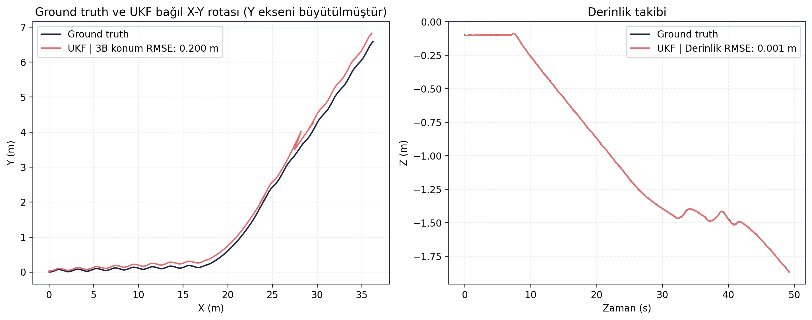
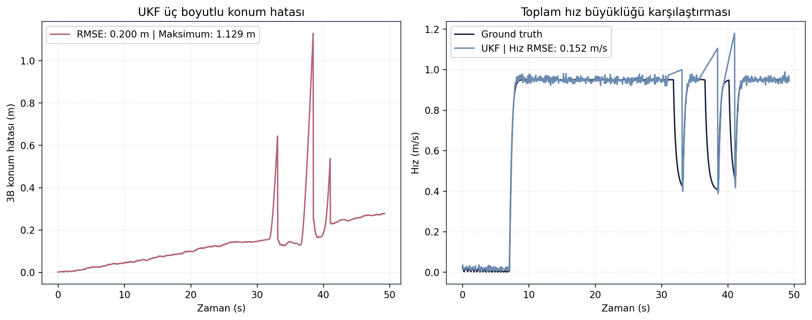
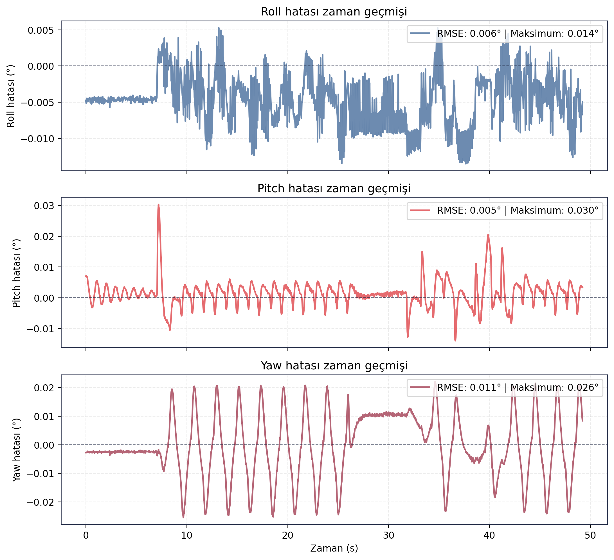

> [Ana Dogrulama Sayfasi](../README.md) - [Guidance LOS →](../guidance_los/README.md)

# Controller Tracking Dogrulama Sonuclari

## Amac

Bu test, ZEMHERI kontrol katmaninin verilen hiz, derinlik ve yonelim hedeflerine karsi arac hareketini nasil izledigini degerlendirmek icin kosulmustur. Analiz, ground truth odometri ile UKF odometri arasindaki hata metrikleri ve arac davranis grafikleri uzerinden yapilmistir.

## Sayisal Ozet

| Metrik | Deger |
|---|---:|
| Test suresi | 49.2300 s |
| 3B konum RMSE | 0.1997 m |
| Maksimum 3B konum hatasi | 1.1287 m |
| Derinlik RMSE | 0.0011 m |
| Toplam hiz RMSE | 0.1516 m/s |
| Roll RMSE | 0.0058 derece |
| Pitch RMSE | 0.0046 derece |
| Yaw RMSE | 0.0112 derece |
| Maksimum yanal sapma | 6.5884 m |

## Gorsel Sonuclar

## Yorum

UKF ile ground truth arasindaki konum ve yonelim hatalari dusuk seviyededir. Bu durum, sensor fusion tarafinin kontrol testi boyunca kullanilabilir veri urettigini gosterir. Buna karsilik maksimum yanal sapmanin 6.5884 m seviyesine cikmasi, kontrol katmaninin yalnizca eksenel hareket icin degil yanal kararlilik icin de iyilestirilmesi gerektigini gosterir.

Bu test, kontrol zincirinin calistigini ancak gorev seviyesinde hassas rota takibi icin ek ayar gerektirdigini gosteren gelistirme testi olarak degerlendirilmelidir.

## Kayit ve Log Bilgileri

Test sirasinda toplam **103.597 mesaj**, **25 topic** uzerinden kaydedilmis ve kayit suresi **54.30 saniye** olmustur. Olusan rosbag boyutu **16.22 MB** olup ortalama veri yuku **0.299 MB/s** olarak hesaplanmistir. Bu yuk yaklasik **1.076 GB/saat** kayit hacmine karsilik gelir.

Analiz boyunca **60 adet ROS log kaydi** uretilmistir. Loglarin **54 adedi INFO**, **6 adedi WARN** seviyesindedir; kritik hata seviyesi kaydi bulunmamaktadir. Kayıt sureci topic frekansi, kaynak kullanimi ve ROS log seviyeleri icin ayrica grafik uretmistir.

## Dosya Indeksi

| Klasor | Icerik |
|---|---|
| `gorseller/` | Trajectory, derinlik, hiz ve yonelim hata grafikleri. |
| `metrikler/` | UKF-ground truth hata tablolari ve hizalanmis veri. |
| `loglar/` | Analiz logu. |
| `ham_veriler/` | Guncel `final_validation/results` kosumundan alinmis CSV/JSON/Markdown kayıt dışa aktarımları. |

> [Ana Dogrulama Sayfasi](../README.md) - [Guidance LOS →](../guidance_los/README.md)
