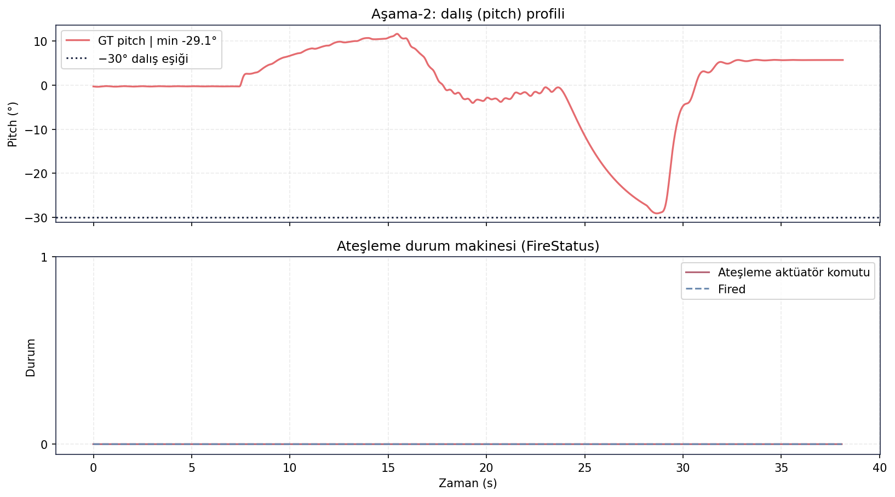
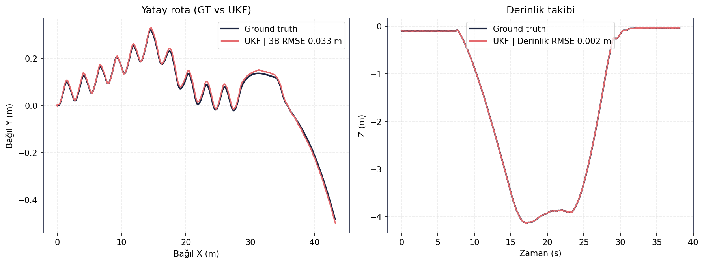
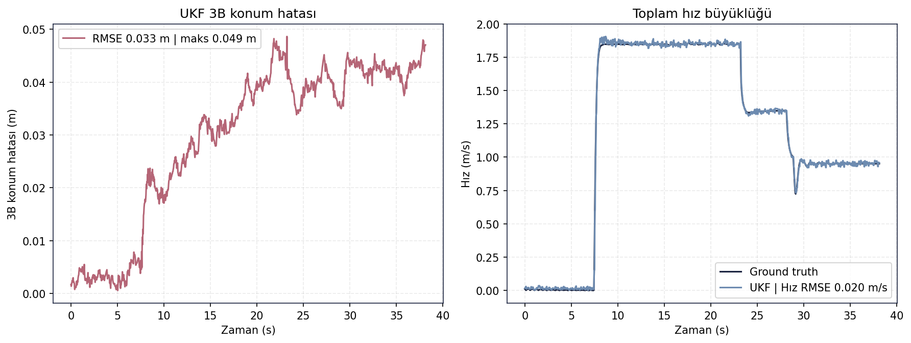

# Fire Behavior Tree Validation (Stage 2)

[← README](../../README.md)

## Table of Contents
- [Purpose](#purpose)
- [Methodology](#methodology)
- [Inputs](#inputs)
- [Execution / Commands](#execution--commands)
- [Logs](#logs)
- [Results](#results)
- [Figures](#figures)
- [Decision](#decision)
- [Evidence Files](#evidence-files)
- [Limitations](#limitations)

## Purpose
Yarışma Aşama-2 görevini davranış ağacı (BT) yaklaşımıyla koşturmak ve yaklaşma/dalış/fire-state
entegrasyon kanıtını raporlamak. Fire karar mantığı için izole test kanıtı yoksa bunu açıkça ayırmak.

## Methodology
`control_backend:=ros` ile tam görev düğüm yığını çalıştırıldı. Dalma kriteri `pitch <= -30°`, ateşleme
durumu ise `/auv/fire/status` alanlarından (`state`, `actuator_command`, `fired`) okundu.

## Inputs
`mission_manager_node` (Stage 2 BT), `competition_mission_runner.py`, `safety_monitor_node`,
`guidance_node`, kontrol zinciri, UKF ve GT odometri.

## Execution / Commands
```bash
python src/validation/run_final_validation.py --cases stage2_bt
python scripts/generate_validation_figures.py --results <final_validation/results> --cases stage2_bt
```

## Logs
Özet ve fire-state logları:
[summary.csv](../metrics/stage2_bt/summary.csv) ·
[summary.json](../metrics/stage2_bt/summary.json) ·
[fire_status.csv](../metrics/stage2_bt/fire_status.csv).

## Results
| Metrik | Değer |
|---|---:|
| Örnek sayısı | 1145 |
| Süre | 38.13 s |
| 3B konum RMSE (UKF) | 0.033 m |
| Maks. 3B hata | 0.049 m |
| Derinlik RMSE | 0.0021 m |
| Hız RMSE | 0.0197 m/s |
| Yaw RMSE / maks. | 0.023° / 0.063° |
| İz boyu mesafe | 43.210 m |
| Maks. cross-track | 0.478 m |
| Min. pitch (GT) | -29.095° |
| `pitch <= -30°` geçerli | False |
| Fire states | IDLE |
| Actuator command / fired | False / False |

Stage 2 entegrasyon koşumu düşük cross-track ve yüksek UKF tutarlılığıyla yürüdü. Ancak dalış açısı
-30° eşiğini az farkla geçmedi ve fire state bu koşumda `IDLE` olarak kaldı.

## Figures


*Stage 2 pitch ve fire-state profili: pitch -29.095° seviyesine geliyor; ateşleme durumu IDLE.*



*Stage 2 GT vs UKF rota ve derinlik takibi; cross-track 0.478 m ile düşük kaldı.*



*Stage 2 hata ve hız zaman serisi; UKF/GT hatası düşük seviyede kalıyor.*

## Decision
- **Görev yürütme → KISMİ** — BT entegrasyon koşumu çalıştı ve düşük cross-track sağladı; fakat dalış
  eşiği `pitch <= -30°` bu koşumda sağlanmadı.
- **Fire decision logic → Needs Evidence** — Fire inhibit/permit davranışı mimaride tanımlıdır, ancak bu
  pakette fire kararını izole eden gerçek bir test çıktısı yoktur. Bu sayfadaki fire kanıtı entegrasyon
  seviyesindedir ve `IDLE / fired=False` sonucunu gösterir.

## Evidence Files
- [docs/metrics/stage2_bt/summary.csv](../metrics/stage2_bt/summary.csv)
- [docs/metrics/stage2_bt/fire_status.csv](../metrics/stage2_bt/fire_status.csv)
- [docs/figures/behavior_tree/](../figures/behavior_tree/)
- [src/validation/analyze_report_bag.py](../../src/validation/analyze_report_bag.py)
- [src/validation/competition_mission_runner.py](../../src/validation/competition_mission_runner.py)
- [docs/architecture/SARA_Baglanti_Listesi.csv](../architecture/SARA_Baglanti_Listesi.csv)

## Limitations
İzole fire-decision testi, güvenli açı/derinlik/mesafe penceresi ve inhibit tetiklerini ayrı ayrı doğrulayan
kanıt bu pakette yoktur. Bu nedenle fire mantığı PASS olarak sunulmaz.
