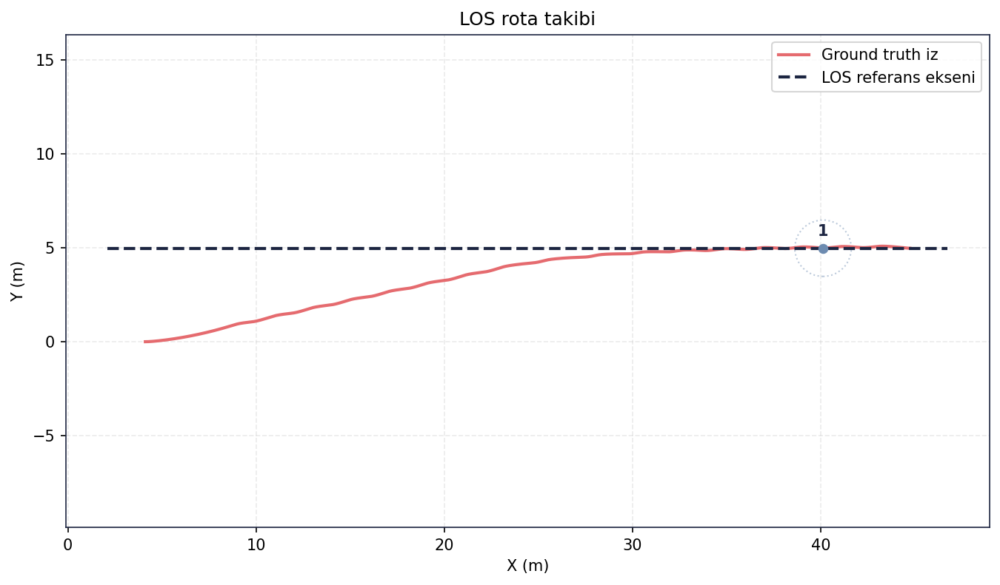
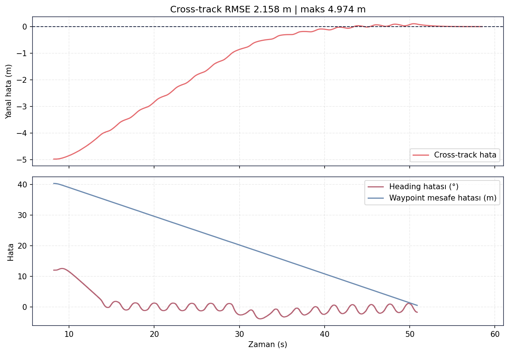
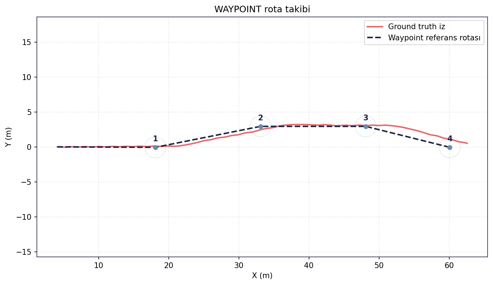
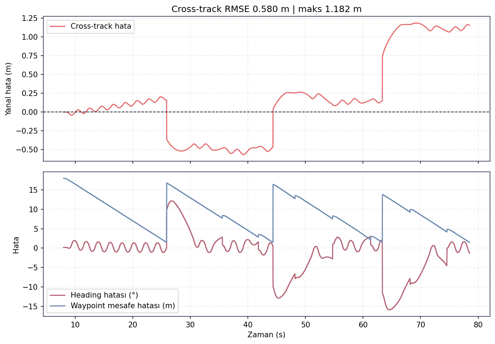

# Guidance Validation

[← README](../../README.md)

## Table of Contents
- [Purpose](#purpose)
- [Methodology](#methodology)
- [Inputs](#inputs)
- [Execution / Commands](#execution--commands)
- [Logs](#logs)
- [Results](#results)
- [Figures](#figures)
- [Decision](#decision)
- [Evidence Files](#evidence-files)
- [Limitations](#limitations)

## Purpose
Line-of-Sight (LOS) güdümünün başlangıç yanal sapmasından rota eksenine yakınsadığını ve waypoint
güdümünün dört hedefli rotayı kabul yarıçapı içinde tamamladığını doğrulamak.

## Methodology
- **LOS:** Tek hedefli rota, yaklaşık 5 m başlangıç cross-track sapması. Cross-track ve heading hataları
  takımın [analyze_guidance_validation.py](../../src/validation/analyze_guidance_validation.py) referans-eksen
  matematiğiyle hesaplandı.
- **Waypoint:** 4 waypoint, kabul yarıçapı 1.5 m. Waypoint tamamlama ve cross-track davranışı aynı analiz
  koduyla özetlendi.

## Inputs
`guidance_node` (LOS / WAYPOINT), `control_setpoint_node`, UKF state (`/odometry/ukf`), GT odometri ve
`final_validation/results` içindeki gerçek `recording/telemetry.csv` dışa aktarımları.

## Execution / Commands
```bash
python src/validation/run_final_validation.py --cases guidance_los guidance_waypoint
python scripts/generate_validation_figures.py --results <final_validation/results> --cases guidance_los guidance_waypoint
```

## Logs
Özet log/metrik dosyaları:
[guidance_los/summary.csv](../metrics/guidance_los/summary.csv) ·
[guidance_waypoint/summary.csv](../metrics/guidance_waypoint/summary.csv).

## Results
| Metrik | LOS | Waypoint |
|---|---:|---:|
| Karar | KABUL | KABUL |
| Waypoint sayısı | 1 | 4 |
| Süre | 50.282 s | 70.541 s |
| Başlangıç cross-track | -4.974 m | 0.000 m |
| Son cross-track | 0.0013 m | 1.152 m |
| Cross-track RMSE | 2.158 m | 0.580 m |
| Maks. cross-track | 4.974 m | 1.182 m |
| Heading RMSE | 3.643° | 5.419° |
| Son hedef mesafesi | 4.614 m | 2.538 m |

LOS testinde araç yaklaşık 5 m yanal sapmadan rota eksenine neredeyse sıfır sapmayla yaklaştı. Waypoint
testinde dört hedefli rota tamamlandı; cross-track RMSE 0.580 m ve maksimum cross-track 1.182 m, 1.5 m
kabul yarıçapıyla uyumludur.

## Figures


*LOS guidance: referans rota, GT/UKF izleri ve başlangıçtaki yanal sapmadan rota eksenine yakınsama.*



*LOS hata geçmişi: cross-track, heading ve hedef mesafesi zaman içinde azalarak kararlı davranıyor.*



*Waypoint guidance: dört hedef, kabul yarıçapları ve aracın tamamlanan çoklu-waypoint izi.*



*Waypoint hata geçmişi: cross-track RMSE 0.580 m; dönüşlerde heading hatası beklenen şekilde yükseliyor.*

## Decision
**PASS** — LOS rota eksenine yakınsadı; waypoint rotası dört hedefli senaryoda kabul yarıçapı içinde
tamamlandı. Bu karar gerçek metrik dosyalarındaki `accepted=True` ve `KABUL` çıktılarıyla tutarlıdır.

## Evidence Files
- [docs/metrics/guidance_los/summary.csv](../metrics/guidance_los/summary.csv)
- [docs/metrics/guidance_waypoint/summary.csv](../metrics/guidance_waypoint/summary.csv)
- [docs/figures/guidance/](../figures/guidance/)
- [src/validation/analyze_guidance_validation.py](../../src/validation/analyze_guidance_validation.py)
- [src/validation/report_test_runner.py](../../src/validation/report_test_runner.py)

## Limitations
Ham rosbag ve büyük `recording/telemetry.csv` dosyaları boyut nedeniyle repoya dahil edilmez. Bu sayfadaki
metrikler, final_validation gerçek telemetrisinden yeniden üretilmiş özet CSV/PNG artefaktlarına dayanır.
