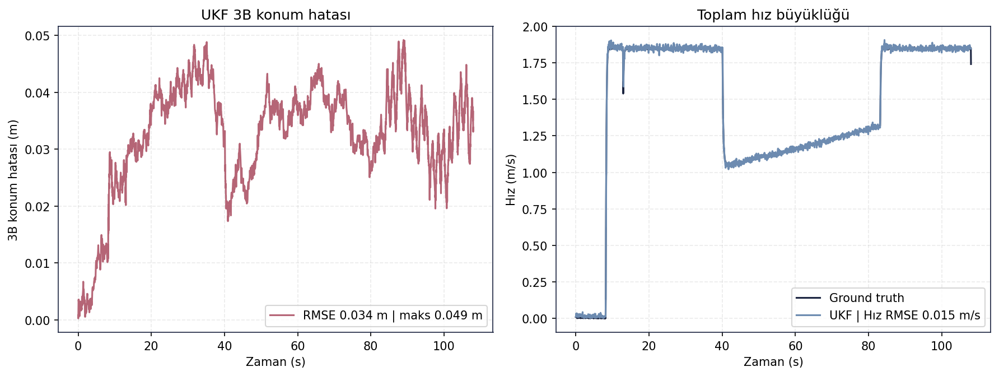

# Mission FSM Validation (Stage 1)

[← README](../../README.md)

## Table of Contents
- [Purpose](#purpose)
- [Methodology](#methodology)
- [Inputs](#inputs)
- [Execution / Commands](#execution--commands)
- [Logs](#logs)
- [Results](#results)
- [Figures](#figures)
- [Decision](#decision)
- [Evidence Files](#evidence-files)
- [Limitations](#limitations)

## Purpose
Yarışma Aşama-1 görev akışını sonlu durum makinesi (FSM) ile uçtan uca koşturmak: başlangıç noktasını
kaydetme, dalış, 10 m ön-seyir, 50 m zamanlı koşu, dönüş, bitiş çizgisi ve güç kesme.

## Methodology
Tam görev düğüm yığını `control_backend:=ros` ile çalıştırıldı. Faz dizisi `/auv/mission/status` üzerinden,
bitiş çizgisi kriteri ise [analyze_report_bag.py](../../src/validation/analyze_report_bag.py) stage1 mantığıyla
hesaplandı: boyuna hata `|along-10| <= 2 m`, yanal hata `|cross| <= 3 m`.

Bu validation koşumu runtime gerçek araç kontrol zincirini değil, ROS sim kontrol zincirini doğrular.
Runtime kapsamda mission çıktısı guidance üzerinden `control_setpoint_bridge_node → /control/setpoint`
zincirine gider; bu paket Stage 1 için Pixhawk/ArduPilot performans kanıtı sunmaz.

## Inputs
`mission_manager_node` (Stage 1 FSM), `guidance_node`, `control_setpoint_node` / `setpoint_controller`,
`velocity_controller`, `navigation_health_node`, UKF ve GT odometri.

## Execution / Commands
```bash
python src/validation/run_final_validation.py --cases stage1_fsm
python scripts/generate_validation_figures.py --results <final_validation/results> --cases stage1_fsm
```

## Logs
Özet ve faz logları:
[summary.csv](../metrics/stage1_fsm/summary.csv) ·
[summary.json](../metrics/stage1_fsm/summary.json) ·
[mission_phases.csv](../metrics/stage1_fsm/mission_phases.csv).

## Results
| Metrik | Değer |
|---|---:|
| Örnek sayısı | 3241 |
| Süre | 108.0 s |
| 3B konum RMSE (UKF) | 0.034 m |
| Maks. 3B hata | 0.049 m |
| Derinlik RMSE | 0.0015 m |
| Hız RMSE | 0.015 m/s |
| Yaw RMSE / maks. | 0.059° / 0.119° |
| İz boyu maks. mesafe | 73.843 m |
| Maks. cross-track | 32.602 m |
| Bitiş çizgisi boyuna hata | 1.724 m |
| Bitiş çizgisi yanal hata | 32.545 m |
| Dışa 50 m geçerli | True |
| Bitiş çizgisi geçerli | False |

FSM faz dizisi:
`IDLE → SAVE_START_POINT → DIVE_TO_DEPTH → PRE_CRUISE_10M → START_TIMED_RUN → OUTBOUND_CRUISE_50M → TURN_AROUND → RETURN_TO_FINISH_LINE → CUT_POWER → COMPLETE`.

## Figures


*Stage 1 görev profili: along-track mesafe, cross-track davranışı ve görev fazları.*


*Stage 1 GT vs UKF rota ve derinlik takibi; UKF konum RMSE 0.034 m.*



*Stage 1 hata ve hız zaman serisi; görev boyunca UKF/GT tutarlılığı korunuyor.*

## Decision
**KISMİ** — FSM'in 10 fazlık tam dizisi sırayla yürüdü ve dışa 50 m koşusu geçerli. Ancak dönüş geometrisi
nedeniyle araç bitiş çizgisine 32.545 m yanal hata ile döndü; `stage1_finish_line_valid=False`. Bu nedenle
Stage 1 tam PASS olarak raporlanmamalıdır.

## Evidence Files
- [docs/metrics/stage1_fsm/summary.csv](../metrics/stage1_fsm/summary.csv)
- [docs/metrics/stage1_fsm/mission_phases.csv](../metrics/stage1_fsm/mission_phases.csv)
- [docs/figures/fsm/](../figures/fsm/)
- [src/validation/analyze_report_bag.py](../../src/validation/analyze_report_bag.py)
- [src/validation/competition_mission_runner.py](../../src/validation/competition_mission_runner.py)

## Limitations
Bitiş çizgisi yanal kriteri bu koşumda sağlanmadı; iyileştirme konusu dönüş geometrisi/guidance ayarıdır.
Ham rosbag ve büyük telemetry kayıtları repoya dahil edilmez. `safety_monitor_node` adı eski/yüksek seviye
güvenlik etiketi olarak belgelerde görülebilir; runtime sözleşmede bu rol `failsafe_manager_node` ve
`/auv/failsafe/status` çıkışıyla temsil edilir.
