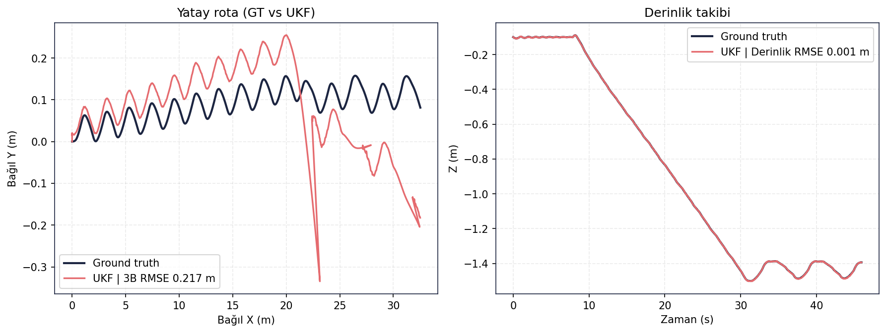
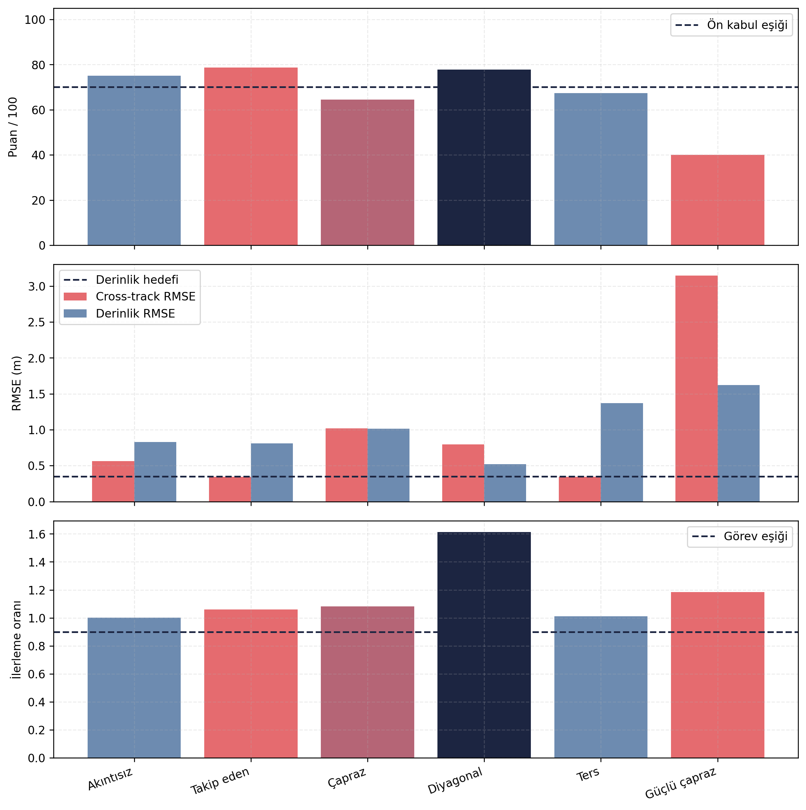

# Raw Data Index

[← README](../../README.md)

## Table of Contents
- [Purpose](#purpose)
- [Methodology](#methodology)
- [Inputs](#inputs)
- [Execution / Commands](#execution--commands)
- [Logs](#logs)
- [Results](#results)
- [Figures](#figures)
- [Decision](#decision)
- [Evidence Files](#evidence-files)
- [Limitations](#limitations)

## Purpose
Repodaki doğrulanabilir veri/kanıt yapısını ve repoya alınmayan ağır ham kayıtları tek yerde göstermek.

## Methodology
Bu indeks, curated jüri artefaktlarını (`docs/metrics`, `docs/figures`, `docs/validation_cases`,
`docs/diagnostics`, `reports`, `src/validation`) ve `.gitignore` ile dışarıda bırakılan ham kayıt sınıflarını
ayırır.

## Inputs
Repo dosya ağacı, [README.md](../../README.md), [.gitignore](../../.gitignore) ve
[scripts/verify_validation_artifacts.py](../../scripts/verify_validation_artifacts.py).

## Execution / Commands
```bash
python scripts/verify_validation_artifacts.py
git status
git diff --stat
```

## Logs
Curated log özetleri ham `.log` dosyası olarak değil, test başına `summary.csv/json` ve olay CSV'leri
olarak tutulur:
[stage1 mission phases](../metrics/stage1_fsm/mission_phases.csv) ·
[stage2 fire status](../metrics/stage2_bt/fire_status.csv) ·
[sensor topic rates](../metrics/sensor_health/topic_rates.csv).

## Results
| Category | Path | Description | Included in Git? | Notes |
|---|---|---|---|---|
| Metrics | [docs/metrics/](../metrics/) | Curated summary CSV/JSON | Yes | Jüri için küçük, okunabilir özetler |
| Figures | [docs/figures/](../figures/) | Validation plots | Yes | README/wiki içine gömülü |
| Validation cases | [docs/validation_cases/](../validation_cases/) | Test bazlı `figures/` + `metrics/` düzeni | Yes | `final_validation/results/<case>` yapısının küçük kanıt karşılığı |
| RL diagnostics | [docs/diagnostics/rl_ukf/](../diagnostics/rl_ukf/) | UKF artefakt kanıtı, fixed/legacy exporter | Yes | Raw telemetry yerine doğrulanabilir özet |
| Architecture | [docs/architecture/](../architecture/) | PNG/PDF/drawio + node/edge CSV | Yes | Verify mimari CSV tutarlılığını kontrol eder |
| Logs | [docs/metrics/stage1_fsm/mission_phases.csv](../metrics/stage1_fsm/mission_phases.csv), [docs/metrics/stage2_bt/fire_status.csv](../metrics/stage2_bt/fire_status.csv) | Curated logs/summaries | Yes/Partial | Büyük raw loglar hariç |
| Raw recordings | `recording/`, `recordings/`, `rosbag2_*`, `*.db3`, `*.mcap` | Heavy raw data | No | `.gitignore` ile dışarıda |
| Archives | `*.zip`, `*.rar`, `*.bundle`, `*.7z` | Handoff/raw bundles | No | Git'e gitmemeli |
| Reports | [reports/](../../reports/) | HTML/PNG/video | Yes/Partial | Curated küçük raporlar; raw kayıt değil |
| Source scripts | [src/validation/](../../src/validation/) | Real validation code | Yes | Takımın final_validation analiz/test kodları |
| Helper scripts | [scripts/](../../scripts/) | Recompute, figure generation, verify | Yes | Yardımcı teslim/yeniden üretim araçları |
| Episode data | [data/episodes/sara_best_episode.csv](../../data/episodes/sara_best_episode.csv) | Curated best-episode CSV | Yes | 34 kolon, 662 adım |
| Runtime control contract | `/control/setpoint` | Real vehicle / Pixhawk handoff topic | No direct telemetry evidence | Validation koşumları `control_backend:=ros` kullanır |
| DVL canonical topics | `/dvl/raw`, `/dvl/quality_twist` | Raw DVL and quality-gated UKF input | Yes, in recorder/analysis config | `/dvl/twist` legacy mission-runner recording entry; curated metrics use `/dvl/quality_twist` |

## Source Bundle Notes

| Kaynak paket | Rol | Repoya alınan kısım | Repoya alınmayan kısım |
|---|---|---|---|
| `final_validation1.zip` | Ana final validation referansı | Kısa RL episode summary CSV'leri ve mevcut curated türevler | `recording/`, `.db3`, telemetry, büyük timeseries/aligned CSV |
| `final_validation.zip` | Önceki/ham final validation arşivi | Mevcut `docs/metrics`, `docs/figures`, `src/validation` türevleri | Ham kayıt ve arşiv içeriği |
| `rl.zip` | RL prevalidation + episode karşılaştırma paketi | `docs/validation_cases/rl_policy/` altındaki küçük CSV/MD ve Türkçe figürler | Zip arşivinin kendisi |
| `algorithm_io_dataflow.md` | Runtime veri akışı sözleşmesi | README/wiki/mimari kapsam notları | Ana repo dışındaki ham runtime workspace |

## Figures


*Örnek curated figür: wiki/README içinde gömülü; yalnızca klasörde bırakılmış PNG değil.*


*Örnek diagnosis/validation figürü: RL policy candidate sonuçları için curated kanıt.*



*`rl.zip` kaynaklı Türkçe episode performans paneli: final ROS/Gazebo policy adayının 6 senaryoda kabul
edilmediğini gösteren özet.*

## Decision
**PASS** — Curated metrikler, figürler, mimari dosyaları ve gerçek validation kodları repoda tutulur; ağır
raw recording, arşiv, build/log/cache dosyaları `.gitignore` ile dışarıda bırakılır.

## Evidence Files
- [.gitignore](../../.gitignore)
- [scripts/verify_validation_artifacts.py](../../scripts/verify_validation_artifacts.py)
- [docs/metrics/all_summaries.json](../metrics/all_summaries.json)
- [src/validation/README.md](../../src/validation/README.md)
- [reports/sara_mission_report.html](../../reports/sara_mission_report.html)

## Limitations
Ham `recording/telemetry.csv` ve `.db3` bag dosyaları boyut nedeniyle repoda değildir. Gerektiğinde
`final_validation.zip` veya harici `final_validation/results` klasöründen yeniden üretim yapılır. Pixhawk/
ArduPilot runtime performansı, `/control/setpoint` sonrası düşük seviye kontrol ve izole fire-decision
kanıtı bu validasyon paketinde bulunmaz.
