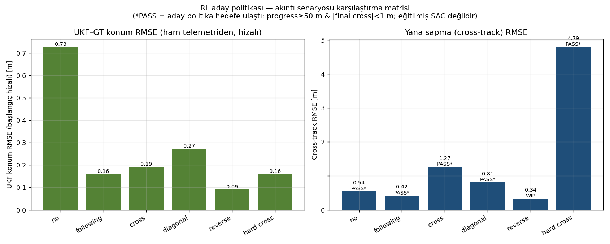
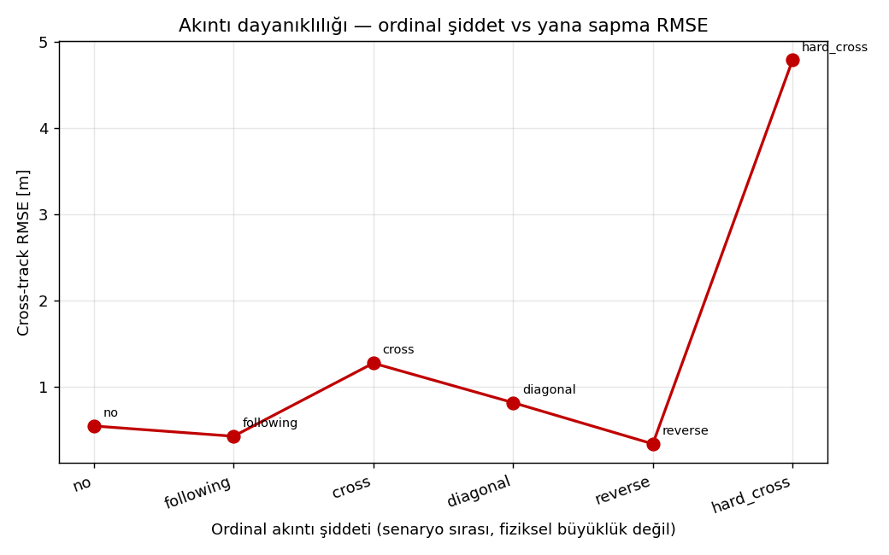
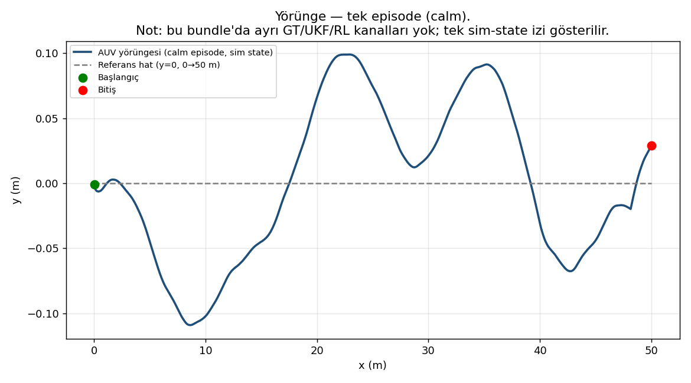

# RL Policy Validation

[← README](../../README.md)

> **This section validates a policy candidate / RL-style control candidate under multiple current
> scenarios. It should not be presented as a fully trained SAC agent unless the corresponding training
> checkpoints, training curves, and evaluation protocol are included.**
>
> Bu bölüm, eğitilmiş bir SAC ajanı kesinliğiyle değil; farklı akıntı senaryolarında test edilen bir
> **policy candidate** doğrulaması olarak değerlendirilmelidir.

## İçindekiler
- [Purpose](#purpose)
- [Methodology](#methodology)
- [Inputs](#inputs)
- [Metrics](#metrics)
- [Results](#results)
- [Decision](#decision)
- [Evidence Files](#evidence-files)
- [Limitations](#limitations)

## Purpose
Seçilen politika adayının tam ROS/Gazebo zinciri (UKF + guidance + kontrolcü) üzerinde 6 akıntı
senaryosunda hedefe ilerleyip ilerlemediğini ölçmek.

## Methodology
6 senaryoluk episode matrisi. Her episode için Gazebo sıfırdan başlatılır, kayıt alınır, analiz yapılır,
Gazebo kapatılır. UKF–GT konum hatası ham `recording/telemetry.csv` üzerinden hem **raw** hem
**başlangıç-hizalı (aligned)** olarak yeniden hesaplanmıştır (teşhis paketi).

| # | Senaryo | Akıntı (x, y, z) m/s | Ordinal şiddet |
|---|---|---|:---:|
| ep01 | no_current | (0.00, 0.00, 0.00) | 0 |
| ep02 | following_current | (0.25, 0.00, 0.00) | 1 |
| ep03 | cross_current | (0.00, 0.25, 0.00) | 2 |
| ep04 | diagonal_current | (0.25, 0.20, 0.00) | 3 |
| ep05 | reverse_current | (−0.20, 0.00, 0.00) | 4 |
| ep06 | hard_cross_current | (0.00, 0.40, 0.00) | 5 |

> **Ordinal şiddet**, senaryoların sıra etiketidir; fiziksel akıntı büyüklüğüyle birebir aynı değildir
> (örn. diagonal'in büyüklüğü hard_cross'tan küçüktür). Robustness grafiğinde bu sıralama
> *ordinal scenario severity* olarak kullanılır.

## Inputs
- [data/episodes/sara_best_episode.csv](../../data/episodes/sara_best_episode.csv) — tek episode (calm), 34 kolon, 662 adım.
- [corrected_rl_ukf_summary_from_raw_telemetry.csv](../diagnostics/rl_ukf/corrected_rl_ukf_summary_from_raw_telemetry.csv)
- [metrics_vs_raw_telemetry_ukf_span_check.csv](../diagnostics/rl_ukf/metrics_vs_raw_telemetry_ukf_span_check.csv)

## Metrics
| Senaryo | Raw UKF RMSE | Aligned UKF RMSE | Progress | Cross-track RMSE | Depth RMSE | nav_valid |
|---|---:|---:|---:|---:|---:|---:|
| no_current | 3.86 m | 0.73 m | 50.12 m | 0.54 m | 1.10 m | 1.0 |
| following_current | 4.13 m | 0.16 m | 56.82 m | 0.42 m | 1.09 m | 1.0 |
| cross_current | 4.01 m | 0.19 m | 53.77 m | 1.27 m | 1.21 m | 1.0 |
| diagonal_current | 4.12 m | 0.27 m | 81.55 m | 0.81 m | 0.79 m | 1.0 |
| reverse_current | 4.00 m | 0.09 m | 47.68 m | 0.34 m | 1.48 m | 1.0 |
| hard_cross_current | 3.94 m | 0.16 m | 58.07 m | 4.79 m | 1.68 m | 1.0 |

## Results

- Navigasyon altyapısı 6 senaryoda da geçerli kaldı (`nav_valid_ratio = 1.0`).
- Aligned UKF–GT RMSE 0.09–0.73 m bandında — navigasyon/controller testleriyle tutarlı.
- Aday politika çoğu senaryoda hedefe oturdu; **iki uyarı**: `reverse_current` ilerlemesi 47.68 m
  (50 m hedefin altında) ve `hard_cross_current` cross-track RMSE'si 4.79 m (güçlü yanal akıntıda
  geçici sapma).
- **trajectory_overlay** yalnızca tek episode'un (calm) sim-state izini gösterir; bu bundle'da ayrı
  GT/UKF/RL kanalları olmadığından 4 ayrı iz çizilemez. Bu durum figürde ve burada açıkça belirtilmiştir.

## Decision
**WIP** — Zincir (Gazebo→sensör→UKF→guidance→kontrolcü) çalışıyor; aday politika güçlü yanal akıntıda
ve reverse senaryosunda kabul eşiğini henüz sağlamıyor. Bu **zincirin değil aday politikanın** durumudur.
Sonraki adım: aday politikayı eğitilmiş SAC ajanı ile değiştirmek ve matrisi per-episode raporlamak.

## Evidence Files
- [tests/10_rl_policy.md](../../tests/10_rl_policy.md)
- [docs/wiki/rl_ukf_diagnosis.md](rl_ukf_diagnosis.md) — UKF kök neden analizi
- [scripts/generate_rl_figures.py](../../scripts/generate_rl_figures.py) — figür üreticisi

## Limitations
- Eğitilmiş SAC kanıtı (checkpoint, öğrenme eğrisi, değerlendirme protokolü, seed, env config,
  hiperparametreler) **bu depoda yoktur** → "trained RL agent" ifadesi kullanılmaz.
- Per-episode ham `recording/telemetry.csv` ve `metrics/rl_policy_timeseries.csv` dosyaları bu bundle'da
  değildir; metrikler teşhis paketinin düzeltilmiş özetinden alınmıştır.
- Önceki paketteki runner her episode'u aynı `rl_policy` satırına yazıp üzerine bindiriyordu
  (per-episode karşılaştırma kaybı) — bkz. [rl_tools/README_RL.md](../../rl_tools/README_RL.md).
