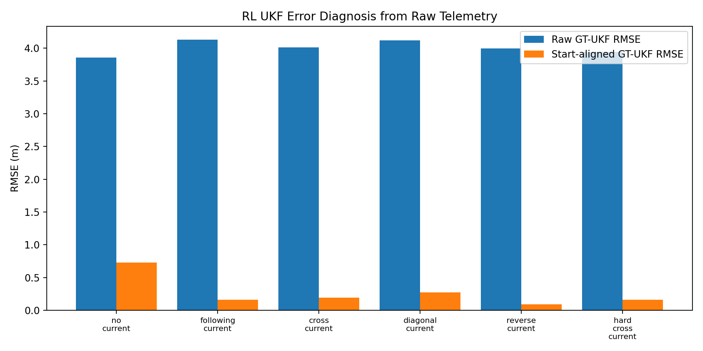

# RL UKF–GT Diagnosis

[← README](../../README.md) · Kaynak teşhis notu: [docs/diagnostics/rl_ukf/RL_UKF_GT_DIAGNOSIS.md](../diagnostics/rl_ukf/RL_UKF_GT_DIAGNOSIS.md)

## İçindekiler
- [Sorun](#sorun)
- [Kanıt (dosyalardan doğrulanmış)](#kanıt-dosyalardan-doğrulanmış)
- [Kök neden değerlendirmesi](#kök-neden-değerlendirmesi)
- [Düzeltilmiş sonuçlar](#düzeltilmiş-sonuçlar)
- [Dürüstlük sınırı](#dürüstlük-sınırı)
- [Evidence Files](#evidence-files)

## Sorun
İlk RL metrik çıktılarında **UKF konum RMSE ≈ 30–46 m** raporlanmıştı (README'de tek satır olarak
`hard_cross_current` için 35.09 m). Bu değer, diğer testlerdeki konum RMSE'leriyle (navigation straight
≈0.82 m, controller tracking ≈0.20 m) karşılaştırıldığında **iki kat büyüklük** kadar tutarsızdır ve
şüphelidir.

## Kanıt (dosyalardan doğrulanmış)

`metrics_vs_raw_telemetry_ukf_span_check.csv` — metrik dosyasındaki UKF kolon **span**'i (max−min) ile
ham telemetri span'inin karşılaştırması:

| Senaryo | metrics x_ukf span | raw telemetry x_ukf span | metrics y_ukf span | raw telemetry y_ukf span |
|---|---:|---:|---:|---:|
| no_current | **0.0** | 50.36 | **0.0** | 1.25 |
| following_current | **0.0** | 56.63 | **0.0** | 1.00 |
| cross_current | **0.0** | 53.38 | **0.0** | 5.14 |
| diagonal_current | **0.0** | 81.43 | **0.0** | 2.32 |
| reverse_current | **0.0** | 50.86 | **0.0** | 0.66 |
| hard_cross_current | **0.0** | 56.15 | **0.0** | 19.61 |

> **Yorum:** `metrics/rl_policy_timeseries.csv` içindeki `x_ukf`/`y_ukf` değerleri episode boyunca
> **sabit kalmış** (span = 0). Aynı episode'un ham `recording/telemetry.csv` kaydında `/odometry/ukf`
> ise 50–81 m boyunca normal ilerlemiş. Yani UKF gerçekte akıyor; **metrik dosyası UKF kolonlarını
> güncellememiş.** `verify_validation_artifacts.py` bu deseni otomatik kontrol eder ve PASS verir.

### Bunun neden 35 m'lik bir RMSE'ye yol açtığı
UKF kolonu başlangıç değerinde (≈origin) donmuşken GT episode boyunca 50+ m ilerlediğinden, GT ile
"donmuş UKF" arasındaki fark episode sonunda ~görev mesafesi kadar (~50 m) büyür. RMSE bu farkın
karekök-ortalaması olduğundan 30–46 m bandına oturur. Bu, **gerçek bir UKF drift'i değil**, metrik
serisindeki sabit-kolon artefaktının doğrudan sonucudur.

## Kök neden değerlendirmesi

| Olası neden | Değerlendirme |
|---|---|
| Gerçek UKF drift | **HAYIR** — ham `/odometry/ukf` normal ilerliyor (span 50–81 m). |
| Frame/origin farkı | Kısmen: raw RMSE ~3.9–4.1 m'lik kalıntı, başlangıç-origin farkından; aligned ile düşüyor. |
| RL analiz scriptinde sabit-kolon yazımı | **EVET (kök neden sınıfı)** — metrics span = 0, donmuş kolon. |
| GT/UKF timestamp join problemi | Olası ikincil etken; aligned RMSE düşüklüğü join'in büyük ölçüde doğru olduğunu gösterir. |
| RL-Gazebo entegrasyon problemi | HAYIR — nav_valid_ratio = 1.0, zincir geçerli. |

**Sonuç:** Kök neden, RL metrik CSV'sini üreten export adımının UKF kolonlarını ilk değerde
dondurmasıdır (sabit-kolon artefaktı). Bu, navigasyonun kendisinde değil, **analiz/export
katmanındadır.**

## Düzeltilmiş sonuçlar

Ham telemetriden yeniden hesaplanan UKF–GT konum RMSE'leri
([corrected_rl_ukf_summary_from_raw_telemetry.csv](../diagnostics/rl_ukf/corrected_rl_ukf_summary_from_raw_telemetry.csv)):

| Senaryo | Eski (metrics) | Raw RMSE | **Aligned RMSE** |
|---|---:|---:|---:|
| no_current | 30.34 m | 3.86 m | **0.73 m** |
| following_current | 36.98 m | 4.13 m | **0.16 m** |
| cross_current | 31.91 m | 4.01 m | **0.19 m** |
| diagonal_current | 46.03 m | 4.12 m | **0.27 m** |
| reverse_current | 32.88 m | 4.00 m | **0.09 m** |
| hard_cross_current | 35.09 m | 3.94 m | **0.16 m** |




Başlangıç-hizalı RMSE **0.09–0.73 m** bandındadır ve diğer testlerle tutarlıdır. Bu nedenle eski 35 m
değeri jüriye doğrudan sunulmamış; **analiz/export artefaktı** olarak işaretlenmiştir.

### RMSE tanımları (yeniden üretilebilir)
```python
# Raw RMSE — origin farkı dahil
error_raw = norm(gt_xyz - ukf_xyz, axis=1)
rmse_raw = sqrt(mean(error_raw ** 2))

# Aligned RMSE — başlangıç pozisyonu çıkarılır
gt_a  = gt_xyz  - gt_xyz[0]
ukf_a = ukf_xyz - ukf_xyz[0]
error_aligned = norm(gt_a - ukf_a, axis=1)
rmse_aligned = sqrt(mean(error_aligned ** 2))
```

## Dürüstlük sınırı
- Yukarıdaki **semptom** (metrics span≈0 vs raw span≈50–81 m) ve **kök-neden sınıfı** (export
  katmanında donmuş UKF kolonu) bu depodaki dosyalardan **doğrulanmıştır**.
- Ancak donmuş kolonu üreten **kaynak script (`run_final_validation.py` / RL metrics export) bu depoda
  mevcut değildir.** Bu yüzden **hatalı kod satırı gösterilememektedir.** Üretici script eklenirse,
  UKF kolonlarının yazıldığı satırda (büyük olasılıkla ilk örneğin değerinin döngü içinde
  yeniden atanmaması / yanlış indeks ya da topic seçimi) düzeltme yapılabilir.
- Ham `recording/telemetry.csv` dosyaları da bu bundle'da yer almadığından, sonuçlar burada
  **teşhis paketinin önceden hesapladığı** değerlerle sınırlıdır; depo bu değerlerin iç tutarlılığını
  (span-check ↔ corrected summary) doğrular.

## Evidence Files
- [RL_UKF_GT_DIAGNOSIS.md](../diagnostics/rl_ukf/RL_UKF_GT_DIAGNOSIS.md)
- [corrected_rl_ukf_summary_from_raw_telemetry.csv](../diagnostics/rl_ukf/corrected_rl_ukf_summary_from_raw_telemetry.csv)
- [metrics_vs_raw_telemetry_ukf_span_check.csv](../diagnostics/rl_ukf/metrics_vs_raw_telemetry_ukf_span_check.csv)
- [rl_ukf_raw_vs_aligned_rmse.png](../diagnostics/rl_ukf/rl_ukf_raw_vs_aligned_rmse.png) · [hard_cross_gt_ukf_alignment.png](../diagnostics/rl_ukf/hard_cross_gt_ukf_alignment.png)
