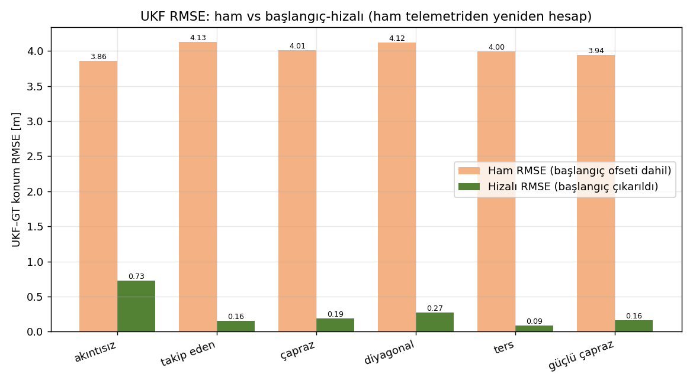
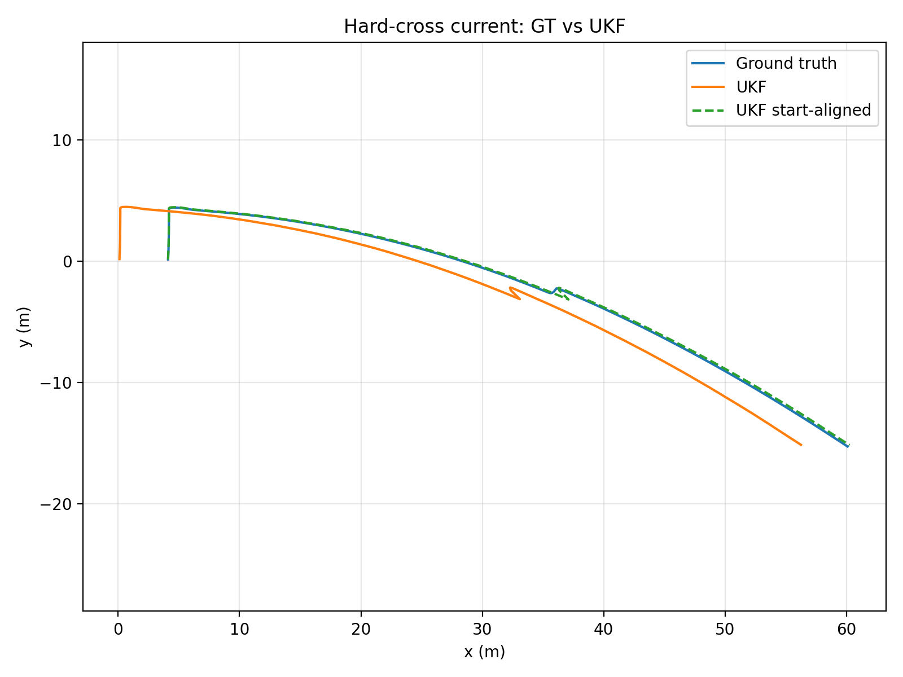

# RL UKF-GT Diagnosis

[← README](../../README.md)

## Table of Contents
- [Purpose](#purpose)
- [Methodology](#methodology)
- [Inputs](#inputs)
- [Execution / Commands](#execution--commands)
- [Logs](#logs)
- [Results](#results)
- [Figures](#figures)
- [Decision](#decision)
- [Evidence Files](#evidence-files)
- [Limitations](#limitations)

## Purpose
İlk RL metriklerinde görülen yaklaşık 30-46 m UKF RMSE değerinin gerçek bir UKF çökmesi mi, yoksa
analiz/export artefaktı mı olduğunu dosya, kod ve telemetri kanıtıyla açıklamak.

## Methodology
`metrics/rl_policy_timeseries.csv` içindeki UKF kolon span'leri, ham `recording/telemetry.csv` içindeki
`/odometry/ukf` hareketiyle karşılaştırıldı. Sonra UKF-GT RMSE, ham telemetriden hem raw hem de
başlangıç-hizalı olarak [recompute_rl_ukf_from_telemetry.py](../../scripts/recompute_rl_ukf_from_telemetry.py)
ile yeniden hesaplandı.

## Inputs
- [legacy/rl_policy_validation_BUGGY.py](../diagnostics/rl_ukf/legacy/rl_policy_validation_BUGGY.py)
- [rl_policy_validation_fixed.py](../diagnostics/rl_ukf/rl_policy_validation_fixed.py)
- [corrected_rl_ukf_summary_from_raw_telemetry.csv](../diagnostics/rl_ukf/corrected_rl_ukf_summary_from_raw_telemetry.csv)
- [metrics_vs_raw_telemetry_ukf_span_check.csv](../diagnostics/rl_ukf/metrics_vs_raw_telemetry_ukf_span_check.csv)

## Execution / Commands
```bash
python scripts/recompute_rl_ukf_from_telemetry.py <final_validation/results> --out docs/diagnostics/rl_ukf/recomputed_rl_ukf_from_telemetry_verification.csv
python scripts/generate_rl_figures.py --results <final_validation/results>
```

## Logs
Doğrulama kayıtları:
[recomputed verification CSV](../diagnostics/rl_ukf/recomputed_rl_ukf_from_telemetry_verification.csv) ·
[span check CSV](../diagnostics/rl_ukf/metrics_vs_raw_telemetry_ukf_span_check.csv) ·
[source diagnosis note](../diagnostics/rl_ukf/RL_UKF_GT_DIAGNOSIS.md).

## Results
İlk metriklerde `x_ukf/y_ukf/z_ukf` kolonları sabitti: exported metrics tarafında UKF span'i 0.0 m iken,
ham telemetry tarafında `/odometry/ukf` 50-81 m aralığında normal ilerliyordu.

| Senaryo | Buggy metrics RMSE | Raw RMSE | Aligned RMSE | raw telemetry UKF x span |
|---|---:|---:|---:|---:|
| no_current | 30.34 m | 3.86 m | 0.73 m | 50.36 m |
| following_current | 36.98 m | 4.13 m | 0.16 m | 56.63 m |
| cross_current | 31.91 m | 4.01 m | 0.19 m | 53.38 m |
| diagonal_current | 46.03 m | 4.12 m | 0.27 m | 81.43 m |
| reverse_current | 32.88 m | 4.00 m | 0.09 m | 50.86 m |
| hard_cross_current | 35.09 m | 3.94 m | 0.16 m | 56.15 m |

Kök neden `rl_policy_validation.py` exporter tarafındadır: `ukf` DataFrame kopyası `start` çıkarılmadan
önce oluşturulmuş, sonra `frames.values()` içindeki orijinal frame'ler normalize edilirken bu kopya
normalize edilmemiştir. Böylece `merge_asof(nearest)` göreli GT zamanlarını epoch tabanlı UKF zamanlarıyla
eşleştirmiş ve tüm satırları ilk UKF örneğine bağlamıştır.

Düzeltme [rl_policy_validation_fixed.py](../diagnostics/rl_ukf/rl_policy_validation_fixed.py) içinde yer alır:

```python
ukf = ukf[ukf["t"] >= start].copy()
ukf["t"] -= start
```

## Figures


*Raw ve başlangıç-hizalı RMSE karşılaştırması: aligned RMSE 0.09-0.73 m bandındadır.*



*Hard-cross episode için GT ve UKF başlangıç hizalaması; ham telemetry'de UKF hareketi donmuş değildir.*

## Decision
**PASS (diagnosis)** — Eski yaklaşık 35 m UKF RMSE gerçek UKF çökmesi değildir; analiz/export artefaktıdır.
RL policy kararı yine de WIP kalır, çünkü başarısız kabul kriteri UKF RMSE değil derinlik RMSE'dir.

## Evidence Files
- [docs/diagnostics/rl_ukf/RL_UKF_GT_DIAGNOSIS.md](../diagnostics/rl_ukf/RL_UKF_GT_DIAGNOSIS.md)
- [docs/diagnostics/rl_ukf/corrected_rl_ukf_summary_from_raw_telemetry.csv](../diagnostics/rl_ukf/corrected_rl_ukf_summary_from_raw_telemetry.csv)
- [docs/diagnostics/rl_ukf/metrics_vs_raw_telemetry_ukf_span_check.csv](../diagnostics/rl_ukf/metrics_vs_raw_telemetry_ukf_span_check.csv)
- [docs/diagnostics/rl_ukf/recomputed_rl_ukf_from_telemetry_verification.csv](../diagnostics/rl_ukf/recomputed_rl_ukf_from_telemetry_verification.csv)
- [docs/diagnostics/rl_ukf/legacy/legacy_rl_metrics_buggy_ukf_rmse.csv](../diagnostics/rl_ukf/legacy/legacy_rl_metrics_buggy_ukf_rmse.csv)
- [scripts/recompute_rl_ukf_from_telemetry.py](../../scripts/recompute_rl_ukf_from_telemetry.py)

## Limitations
Ham `recording/telemetry.csv` ve `.db3` bag dosyaları repoya alınmaz. Düzeltilmiş ROS bag exporter bu
pakette çalıştırılmamıştır; ROS bağımsız yeniden hesap scriptiyle sonuç doğrulanmıştır.
