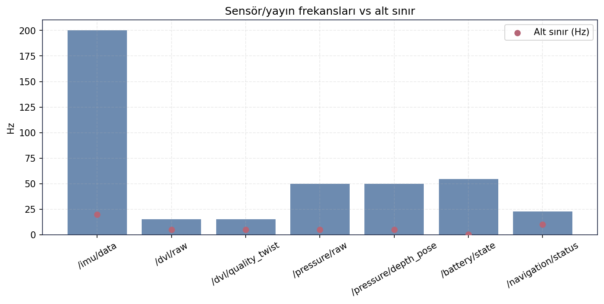

# Sensor Health Validation

[← README](../../README.md)

## Table of Contents
- [Purpose](#purpose)
- [Methodology](#methodology)
- [Inputs](#inputs)
- [Execution / Commands](#execution--commands)
- [Logs](#logs)
- [Results](#results)
- [Figures](#figures)
- [Decision](#decision)
- [Evidence Files](#evidence-files)
- [Limitations](#limitations)

## Purpose
IMU, DVL, basınç, batarya ve navigation status veri sürekliliğinin final_validation koşumunda beklenen
minimum frekansların üzerinde kaldığını doğrulamak.

## Methodology
Sensör topic mesaj sayıları ve yayın frekansları [analyze_environment_validation.py](../../src/validation/analyze_environment_validation.py)
ile özetlendi. Her topic için ölçülen `rate_hz`, beklenen `min_hz` eşiğiyle karşılaştırıldı.

## Inputs
`/imu/data`, `/dvl/raw`, `/dvl/quality_twist`, `/pressure/raw`, `/pressure/depth_pose`,
`/battery/state`, `/navigation/status` topic'leri ve final_validation gerçek telemetry kaydı.

## Execution / Commands
```bash
python src/validation/run_final_validation.py --cases sensor_health
python scripts/generate_validation_figures.py --results <final_validation/results> --cases sensor_health
```

## Logs
Özet metrik dosyaları:
[summary.csv](../metrics/sensor_health/summary.csv) ·
[summary.json](../metrics/sensor_health/summary.json) ·
[topic_rates.csv](../metrics/sensor_health/topic_rates.csv).

## Results
| Topic | Mesaj | Ölçülen Hz | Min Hz | Sonuç |
|---|---:|---:|---:|:---:|
| `/imu/data` | 7720 | 200.17 | 20.0 | KABUL |
| `/dvl/raw` | 586 | 15.17 | 5.0 | KABUL |
| `/dvl/quality_twist` | 586 | 15.17 | 5.0 | KABUL |
| `/pressure/raw` | 1930 | 50.03 | 5.0 | KABUL |
| `/pressure/depth_pose` | 1930 | 50.03 | 5.0 | KABUL |
| `/battery/state` | 2099 | 54.44 | 0.5 | KABUL |
| `/navigation/status` | 871 | 22.56 | 10.0 | KABUL |

Özet: `navigation_valid_ratio=1.0`, `imu_ok_ratio=1.0`, `dvl_ok_ratio=1.0`,
`pressure_ok_ratio=1.0`, `min_topic_rate_ratio=2.256`.

## Figures


*Sensor health: ölçülen topic yayın frekansları ve minimum eşikler.*

## Decision
**PASS** — Tüm izlenen sensor/navigation topic'leri minimum frekans eşiğinin üzerinde kaldı ve tüm sağlık
oranları 1.0 olarak raporlandı.

## Evidence Files
- [docs/metrics/sensor_health/summary.csv](../metrics/sensor_health/summary.csv)
- [docs/metrics/sensor_health/topic_rates.csv](../metrics/sensor_health/topic_rates.csv)
- [docs/figures/sensor/sensor_topic_rates.png](../figures/sensor/sensor_topic_rates.png)
- [src/validation/analyze_environment_validation.py](../../src/validation/analyze_environment_validation.py)

## Limitations
Bu sayfa topic sürekliliğini doğrular; sensör fiziksel kalibrasyonu veya bağımsız donanım doğrulaması
kanıtı bu pakette yoktur.
