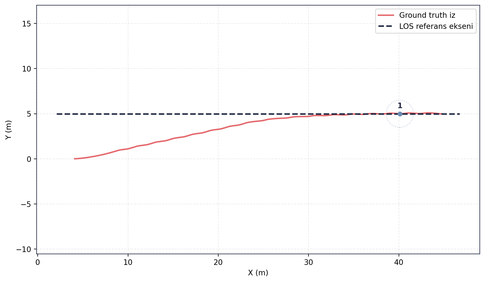
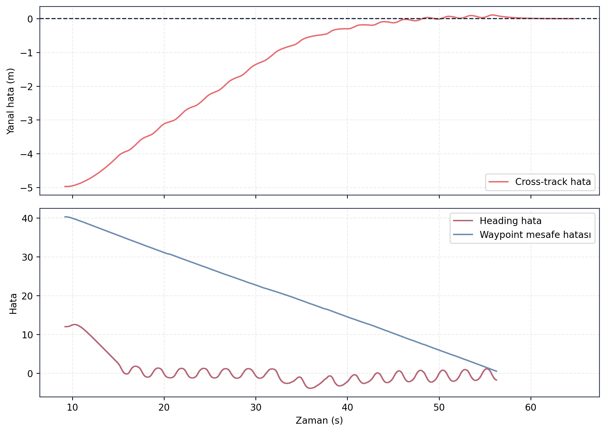
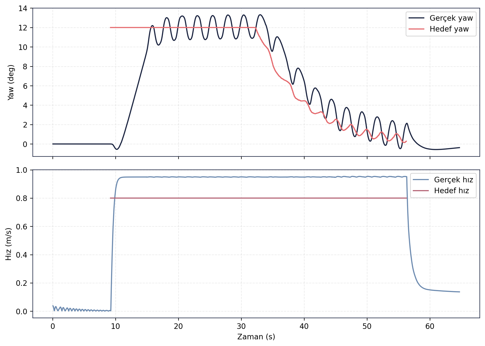

> [← Controller Tracking](../controller_tracking/README.md) - [Ana Dogrulama Sayfasi](../README.md) - [Guidance Waypoint →](../guidance_waypoint/README.md)

# Guidance LOS Dogrulama Sonuclari

## Amac

Bu test, Line-of-Sight (LOS) gudum yapisinin referans rota eksenine yakinsama davranisini degerlendirmek icin hazirlanmistir. Testte arac baslangicta rota ekseninden sapmis durumdayken LOS algoritmasinin cross-track hatayi azaltma basarimi incelenmistir.

## Sayisal Ozet

| Metrik | Deger |
|---|---:|
| Gudum modu | LOS |
| Waypoint sayisi | 1 |
| Test suresi | 64.6740 s |
| Cross-track RMSE | 2.1570 m |
| Maksimum cross-track hata | 4.9737 m |
| Baslangic cross-track hata | -4.9737 m |
| Son cross-track hata | 0.0013 m |
| Cross-track azalma orani | 0.9997 |
| Heading hata RMSE | 3.6430 derece |
| Maksimum heading hata | 12.5515 derece |

## Gorsel Sonuclar

## Yorum

LOS algoritmasi baslangictaki yaklasik 5 m yanal hatayi test sonunda milimetre seviyesine indirmistir. Heading hatasi gecis surecinde 12.5515 dereceye kadar ciksa da rota eksenine yakinsama tamamlanmistir. Bu sonuc, LOS gudum yapisinin rota takip testleri icin kullanilabilir oldugunu gosterir.

## Kayit ve Log Bilgileri

Test sirasinda toplam **121.138 mesaj**, **25 topic** uzerinden kaydedilmis ve kayit suresi **65.19 saniye** olmustur. Olusan rosbag boyutu **19.28 MB** olup ortalama veri yuku **0.296 MB/s** seviyesindedir. Bu deger yaklasik **1.065 GB/saat** kayit hacmine karsilik gelir.

Analiz sirasinda **45 ROS log kaydi** uretilmistir. Loglarin **44 adedi INFO**, **1 adedi WARN** seviyesindedir; hata veya kritik seviye log kaydi bulunmamaktadir. Bu durum, testin analiz ve kayit hattinda kesintisiz tamamlandigini gosterir.

## Dosya Indeksi

| Klasor | Icerik |
|---|---|
| `gorseller/` | Rota, hata gecmisi ve komut takip grafikleri. |
| `metrikler/` | LOS dogrulama ozeti, waypoint ve hizalanmis referans CSV dosyalari. |
| `loglar/` | Analiz logu. |
| `ham_veriler/` | Guncel `final_validation/results` kosumundan alinmis CSV/JSON/Markdown kayıt dışa aktarımları. |

> [← Controller Tracking](../controller_tracking/README.md) - [Ana Dogrulama Sayfasi](../README.md) - [Guidance Waypoint →](../guidance_waypoint/README.md)
