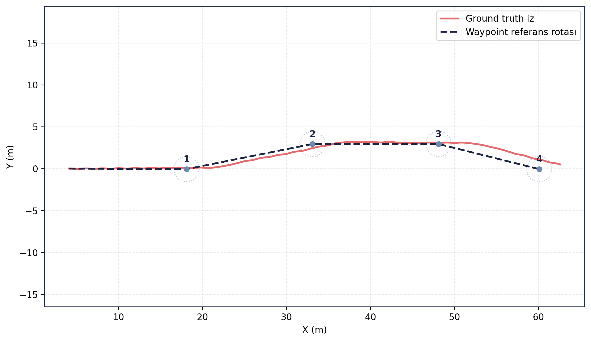
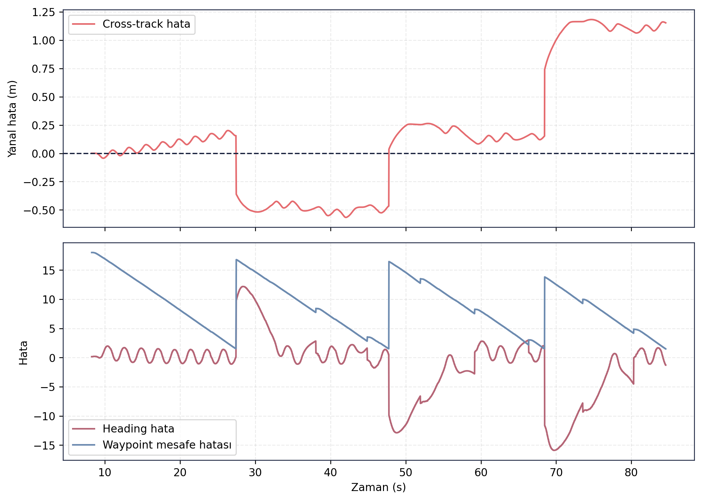
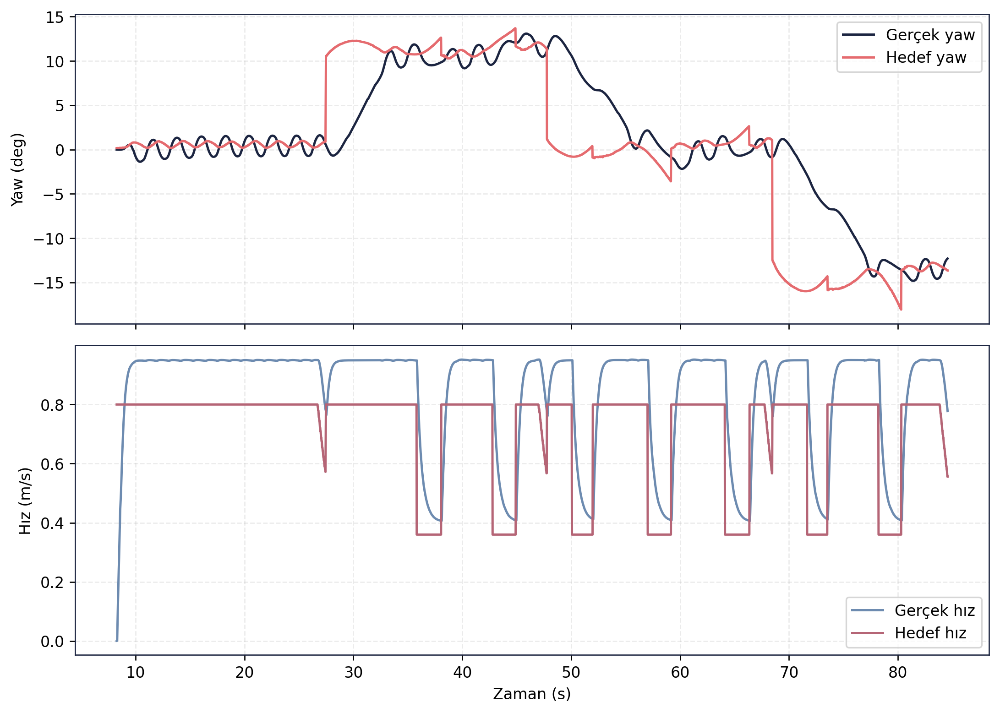

> [← Guidance LOS](../guidance_los/README.md) - [Ana Dogrulama Sayfasi](../README.md) - [Stage 1 FSM →](../stage1_fsm/README.md)

# Guidance Waypoint Dogrulama Sonuclari

## Amac

Bu test, waypoint tabanli gudum yapisinin cok noktalı bir rota uzerinde hedef gecislerini ve rota takip hatalarini degerlendirmek icin kosulmustur.

## Sayisal Ozet

| Metrik | Deger |
|---|---:|
| Gudum modu | WAYPOINT |
| Waypoint sayisi | 4 |
| Test suresi | 76.2953 s |
| Cross-track RMSE | 0.5797 m |
| Maksimum cross-track hata | 1.1816 m |
| Son cross-track hata | 1.1523 m |
| Heading hata RMSE | 5.4192 derece |
| Maksimum heading hata | 15.9032 derece |
| Son waypoint mesafesi | 2.5381 m |

## Gorsel Sonuclar

## Yorum

Waypoint rotasi tamamlanmis ve cross-track RMSE 0.5797 m seviyesinde kalmistir. Maksimum heading hatasi gecis anlarinda artmis olsa da rota takip performansi simülasyon dogrulama seviyesinde kabul edilebilir durumdadir. Son waypoint mesafesinin 2.5381 m olmasi, tolerans ayarlarinin gorev kosullarina gore yeniden ele alinabilecegini gosterir.

## Kayit ve Log Bilgileri

Test sirasinda toplam **162.106 mesaj**, **25 topic** uzerinden kaydedilmis ve kayit suresi **85.68 saniye** olmustur. Olusan rosbag boyutu **25.80 MB**, ortalama veri yuku ise **0.301 MB/s** olarak hesaplanmistir. Bu yaklasik **1.084 GB/saat** kayit hacmine karsilik gelir.

Analiz boyunca **49 ROS log kaydi** olusmustur. Bunlarin **34 adedi INFO**, **15 adedi WARN** seviyesindedir. Uyari sayisinin LOS testinden yuksek olmasi, waypoint gecisleri ve rota tamamlama surecindeki ek durum degisimleriyle iliskilidir; hata veya kritik log seviyesi raporlanmamistir.

## Dosya Indeksi

| Klasor | Icerik |
|---|---|
| `gorseller/` | Waypoint rota, hata gecmisi ve komut takip grafikleri. |
| `metrikler/` | Waypoint listesi, hizalanmis referans ve dogrulama ozeti. |
| `loglar/` | Analiz logu. |
| `ham_veriler/` | Guncel `final_validation/results` kosumundan alinmis CSV/JSON/Markdown kayıt dışa aktarımları. |

> [← Guidance LOS](../guidance_los/README.md) - [Ana Dogrulama Sayfasi](../README.md) - [Stage 1 FSM →](../stage1_fsm/README.md)
