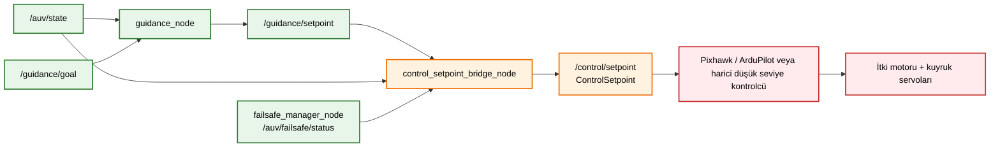

> [Ana Dogrulama Sayfasi](../README.md) 
# ROS 2 Navigasyon ve Kontrol Veri Akışı

Bu sayfa, `algorithm_io_dataflow.md` ile uyumlu kısa görsel özettir. Validasyon/simülasyon zinciri ile gerçek
araç teslim sınırı özellikle ayrı gösterilir.

## Üst Düzey ROS 2 Veri Akışı

```mermaid
---
config:
  layout: dagre
---
flowchart LR

    subgraph SENS["1. Sensör ve simülasyon kaynakları"]
        GT["Gerçek konum odometrisi<br/><small>yalnız doğrulama</small>"]
        IMU["IMU<br/>/imu/data"]
        DVL["DVL<br/>/dvl/raw"]
        PRESS["Basınç / derinlik<br/>/pressure/raw<br/>/pressure/depth_pose"]
        CURRENT["Okyanus akıntısı<br/>/ocean_current"]
    end

    subgraph NAV["2. Navigasyon ve durum kestirimi"]
        BRIDGE["ros_gz köprüleri"]
        GATE["DVL kalite kapısı<br/><small>dvl_quality_gate_node</small>"]
        UKF["UKF sensör füzyonu<br/><small>robot_localization</small>"]
        HEALTH["Navigasyon sağlık izleme<br/><small>valid / degraded</small>"]
    end

    subgraph MISSION["3. Durum birleştirme ve görev yönetimi"]
        STATE["AUV durum yayıncısı<br/>/auv/state"]
        FSM["Görev yöneticisi<br/><small>Aşama-1 FSM + Aşama-2 BT</small>"]
    end

    subgraph GUIDANCE["4. Güdüm ve üst seviye kontrol referansı"]
        GUID["Güdüm düğümü<br/><small>LOS / Waypoint</small>"]
        GSP["Güdüm setpoint'i<br/>/guidance/setpoint"]
    end

    subgraph CONTROL["5. Kontrol profilleri"]
        SIMCTRL["ROS simülasyon kontrolü<br/><small>setpoint + velocity controller</small>"]
        REALCTRL["Kontrol setpoint köprüsü<br/><small>gerçek / ArduPilot profili</small>"]
    end

    subgraph ACT["6. Aktüatör / araç arayüzü"]
        SIMACT["Sim aktüatör komutları<br/><small>pervane + X-fin</small>"]
        CSP["ControlSetpoint<br/>/control/setpoint"]
        LOW["Haricî düşük seviye kontrolcü<br/><small>Pixhawk / ArduPilot</small>"]
    end

    GT -.->|"kayıt / doğrulama"| BRIDGE
    IMU --> BRIDGE
    DVL --> BRIDGE
    PRESS --> BRIDGE

    BRIDGE --> GATE
    GATE -->|"/dvl/quality_twist"| UKF
    IMU --> UKF
    PRESS --> UKF

    UKF -->|"/odometry/ukf"| HEALTH
    HEALTH -->|"/navigation/status"| STATE
    UKF --> STATE
    IMU --> STATE
    PRESS --> STATE

    STATE --> FSM
    CURRENT --> FSM
    FSM -->|"/guidance/goal"| GUID
    STATE --> GUID
    GUID --> GSP

    GSP --> SIMCTRL
    SIMCTRL -->|"/sara_uuv/cmd_vel"| SIMACT

    GSP --> REALCTRL
    REALCTRL --> CSP
    CSP --> LOW

    classDef sens fill:#E3F2FD,stroke:#1565C0,stroke-width:2px,color:#0D1B2A;
    classDef nav fill:#E8F5E9,stroke:#2E7D32,stroke-width:2px,color:#0D1B2A;
    classDef mission fill:#FFF3E0,stroke:#EF6C00,stroke-width:2px,color:#0D1B2A;
    classDef guidance fill:#F3E5F5,stroke:#7B1FA2,stroke-width:2px,color:#0D1B2A;
    classDef control fill:#E0F7FA,stroke:#00838F,stroke-width:2px,color:#0D1B2A;
    classDef act fill:#FFEBEE,stroke:#C62828,stroke-width:2px,color:#0D1B2A;

    class GT,IMU,DVL,PRESS,CURRENT sens;
    class BRIDGE,GATE,UKF,HEALTH nav;
    class STATE,FSM mission;
    class GUID,GSP guidance;
    class SIMCTRL,REALCTRL control;
    class SIMACT,CSP,LOW act;
```

## Gerçek Araç Teslim Sınırı

## Kapsam Notu

Bu validasyon paketindeki performans figürleri ROS simülasyon kontrol zincirinden gelir. ArduPilot/MAVLink veya
Pixhawk düşük seviye kontrol performansı bu pakette doğrudan kanıt olarak sunulmaz; gerçek araç tarafı
`/control/setpoint` teslim sözleşmesiyle sınırlı anlatılır.
