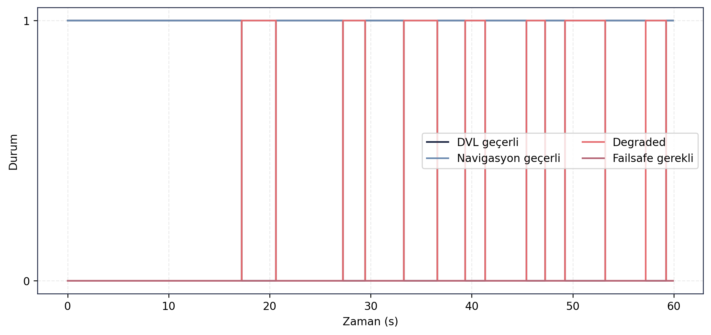
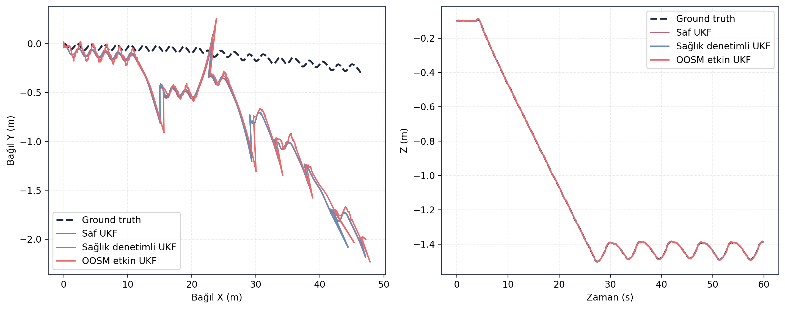

> [← Navigation Straight](../navigation_straight/README.md) - [Ana Dogrulama Sayfasi](../README.md) - [Akinti Servisleri →](../ocean_current_services/README.md)

# Navigation Resilience Dogrulama Sonuclari

## Amac

Bu test, DVL veri kesintisi ve zaman uyumsuz olcum durumlarinda navigasyon katmaninin davranisini incelemek icin kosulmustur. Saf `robot_localization` UKF, saglik denetimli UKF ve OOSM etkin UKF sonuclari karsilastirilmistir.

## Sayisal Ozet

| Yapi | 3B konum RMSE (m) | Maksimum 3B hata (m) | Derinlik RMSE (m) | Yaw RMSE (deg) | Saf UKF'ye oran |
|---|---:|---:|---:|---:|---:|
| Saf robot_localization UKF | 1.1096 | 3.6544 | 0.0014 | 0.0033 | 1.0000 |
| Saglik denetimli UKF | 1.1064 | 3.6493 | 0.0014 | 0.0030 | 0.9971 |
| OOSM etkin UKF | 1.3165 | 4.4988 | 0.0015 | 0.0030 | 1.1865 |

## Gorsel Sonuclar

## Yorum

Saglik denetimli UKF, saf UKF ile neredeyse ayni dogruluk seviyesini korumus ve DVL kesintilerini degraded durum olarak yonetmistir. Bu kisim raporlanabilir ve sistem guvenligi acisindan anlamlidir.

OOSM etkin yapi ise bu testte ortalama konum RMSE degerini iyilestirmemis, tersine saf UKF'ye gore 1.1865 oraninda artirmistir. Bu nedenle OOSM bu haliyle dogruluk kazanci olarak raporlanmamalidir. Mevcut sonuc, OOSM algoritmasinin gelistirme ihtiyacini ve zaman gecikmeli olcumlerin daha dikkatli agirliklandirilmasi gerektigini gosterir.

## Kayit ve Log Bilgileri

Test sirasinda toplam **134.587 mesaj**, **31 topic** uzerinden kaydedilmis ve kayit suresi **70.37 saniye** olmustur. Olusan rosbag boyutu **24.87 MB**, ortalama veri yuku **0.353 MB/s** olarak hesaplanmistir. Bu deger yaklasik **1.272 GB/saat** kayit hacmine karsilik gelir.

Analiz boyunca **89 ROS log kaydi** uretilmistir. Loglarin **73 adedi INFO**, **16 adedi WARN** seviyesindedir. Uyari yogunlugu, testin DVL kesintisi ve degraded durumlari icermesi nedeniyle beklenen bir durumdur; kayit ozeti hata veya kritik log seviyesi raporlamamistir.

## Dosya Indeksi

| Klasor | Icerik |
|---|---|
| `gorseller/` | Konum hatasi, navigation status ve trajectory karsilastirmalari. |
| `metrikler/` | Saf, saglik denetimli ve OOSM UKF CSV/Markdown sonuclari. |
| `loglar/` | Analiz logu. |
| `ham_veriler/` | Guncel `final_validation/results` kosumundan alinmis CSV/JSON/Markdown kayıt dışa aktarımları. |

> [← Navigation Straight](../navigation_straight/README.md) - [Ana Dogrulama Sayfasi](../README.md) - [Akinti Servisleri →](../ocean_current_services/README.md)
