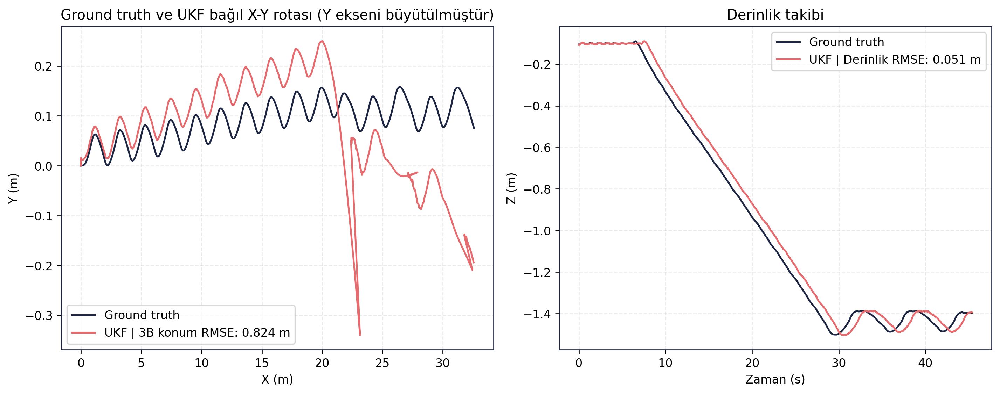
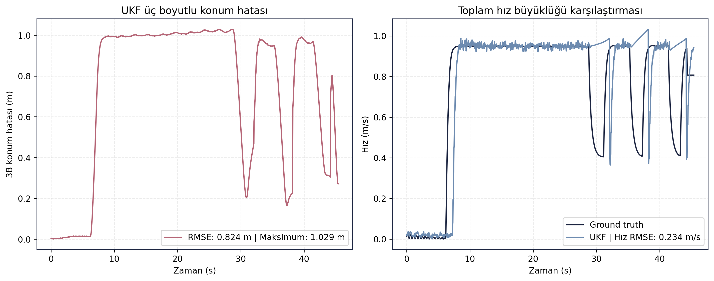
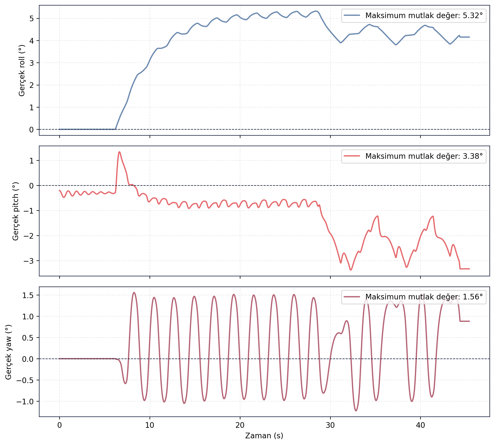

> [← RL Politika](../rl_politika/README.md) - [Ana Dogrulama Sayfasi](../README.md) - [Navigation Resilience →](../navigation_resilience/README.md)

# Navigation Straight Dogrulama Sonuclari

## Amac

Bu test, duz seyir kosulunda UKF odometri ciktisinin ground truth odometriye gore konum, hiz ve yonelim dogrulugunu incelemek icin kosulmustur.

## Sayisal Ozet

| Metrik | Deger |
|---|---:|
| Test suresi | 45.4000 s |
| 3B konum RMSE | 0.8237 m |
| Maksimum 3B konum hatasi | 1.0289 m |
| Derinlik RMSE | 0.0508 m |
| Toplam hiz RMSE | 0.2336 m/s |
| Roll RMSE | 0.3576 derece |
| Pitch RMSE | 0.4535 derece |
| Yaw RMSE | 1.5134 derece |
| Maksimum yanal sapma | 0.1578 m |

## Gorsel Sonuclar

## Yorum

Duz seyir sirasinda yanal sapma 0.1578 m seviyesinde kalmis ve derinlik RMSE 0.0508 m olarak olculmustur. UKF konum RMSE degeri 0.8237 m olup simülasyon dogrulama kosulu icin kullanilabilir seviyededir. Bu test, navigasyon zincirinin duz rota kosulunda tutarli odometri urettigini gosterir.

## Kayit ve Log Bilgileri

Test sirasinda toplam **94.674 mesaj**, **25 topic** uzerinden kaydedilmis ve kayit suresi **50.07 saniye** olmustur. Olusan rosbag boyutu **14.71 MB**, ortalama veri yuku **0.294 MB/s** olarak hesaplanmistir. Bu deger yaklasik **1.058 GB/saat** kayit hacmine karsilik gelir.

Analiz boyunca **57 ROS log kaydi** uretilmistir. Loglarin **50 adedi INFO**, **7 adedi WARN** seviyesindedir. Kritik hata kaydi bulunmamaktadir; bu durum navigasyon kaydinin analiz icin kullanilabilir sekilde tamamlandigini gosterir.

## Dosya Indeksi

| Klasor | Icerik |
|---|---|
| `gorseller/` | Trajectory, derinlik, hiz ve attitude grafikleri. |
| `metrikler/` | UKF-ground truth hizalanmis veri ve ozet metrikler. |
| `loglar/` | Analiz logu. |
| `ham_veriler/` | Guncel `final_validation/results` kosumundan alinmis CSV/JSON/Markdown kayıt dışa aktarımları. |

> [← RL Politika](../rl_politika/README.md) - [Ana Dogrulama Sayfasi](../README.md) - [Navigation Resilience →](../navigation_resilience/README.md)
