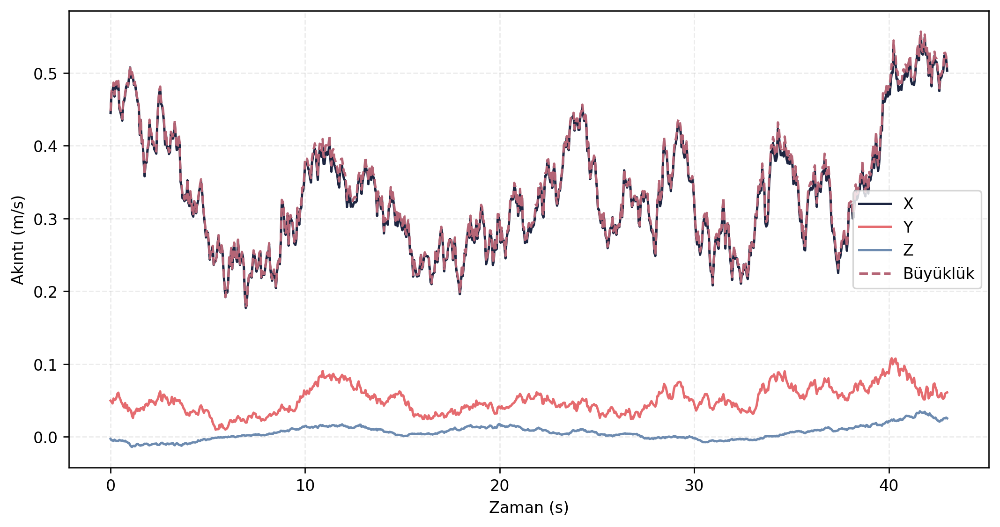

> [← Navigation Resilience](../navigation_resilience/README.md) - [Ana Dogrulama Sayfasi](../README.md) - [Sensor Health →](../sensor_health/README.md)

# Akinti Servisleri Dogrulama Sonuclari

## Amac

Bu test, ocean current node uzerindeki servislerin ve akinti senaryosu yonetiminin ROS 2 ortaminda yanit verip vermedigini dogrulamak icin kosulmustur.

## Sayisal Ozet

| Olcut | Deger |
|---|---:|
| Dogrulama karari | KABUL |
| Basarili servis sayisi | 8 |
| Toplam servis sayisi | 8 |

## Gorsel Sonuc

## Yorum

Tum akinti servisleri beklenen sekilde yanit vermistir. Bu sonuc, simülasyon tarafinda sabit, gecis ve senaryo tabanli akinti kosullarinin test otomasyonu icinde kullanilabilecegini gosterir. Gorev testlerinde akinti etkisinin tekrar uretilebilir sekilde baslatilabilmesi icin bu servis katmani temel bagimlilik olarak kabul edilebilir.

## Kayit ve Log Bilgileri

Test sirasinda toplam **81.399 mesaj**, **26 topic** uzerinden kaydedilmis ve kayit suresi **44.56 saniye** olmustur. Olusan rosbag boyutu **12.81 MB**, ortalama veri yuku **0.288 MB/s** olarak hesaplanmistir. Bu deger yaklasik **1.035 GB/saat** kayit hacmine karsilik gelir.

Analiz boyunca **37 ROS log kaydi** uretilmistir. Loglarin **36 adedi INFO**, **1 adedi WARN** seviyesindedir. Servislerin tamamindan yanit alindigi icin bu kayit seti akinti senaryo yonetimi icin temiz dogrulama ciktisi olarak degerlendirilebilir.

## Dosya Indeksi

| Klasor | Icerik |
|---|---|
| `gorseller/` | Servis aktivite grafigi. |
| `metrikler/` | Servis sonucu, servis ozeti ve akinti zaman serisi CSV/MD dosyalari. |
| `loglar/` | Analiz logu. |
| `ham_veriler/` | Guncel `final_validation/results` kosumundan alinmis CSV/JSON/Markdown kayıt dışa aktarımları. |

> [← Navigation Resilience](../navigation_resilience/README.md) - [Ana Dogrulama Sayfasi](../README.md) - [Sensor Health →](../sensor_health/README.md)
