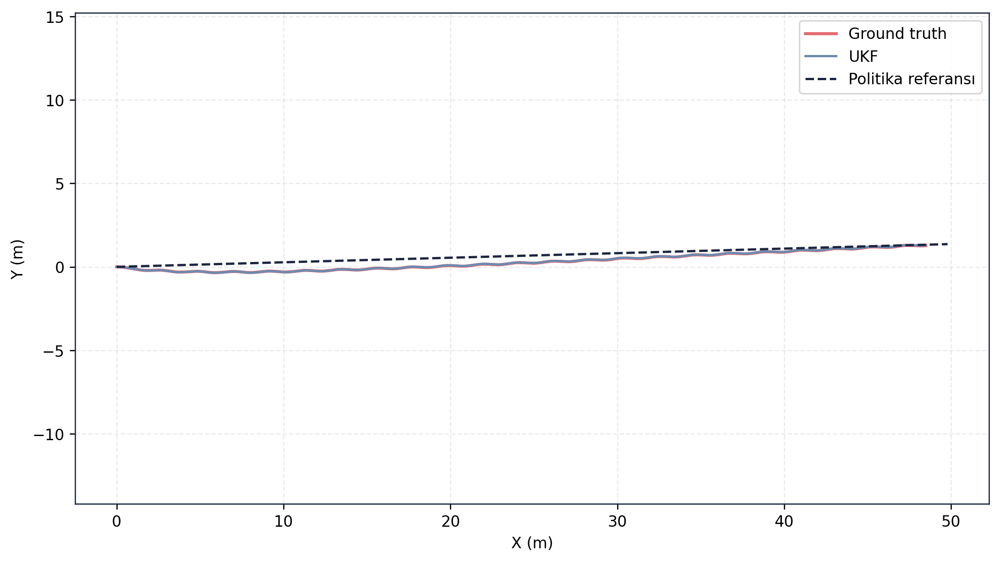
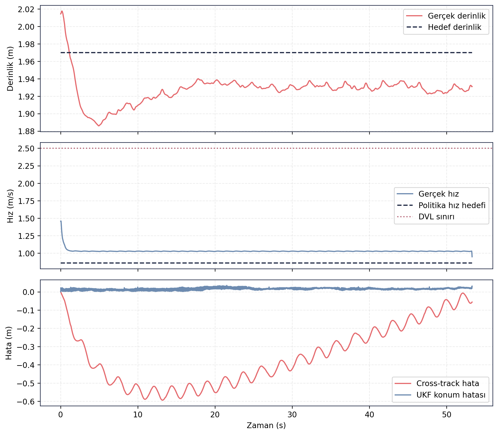

# RL Politika Doğrulama — Episode 01: Akıntısız Senaryo

> [← Ana RL Politika Sayfası](../../README.md)  -   [Takip Eden Akıntı →](../02_takip_eden_akinti/README.md)

---

# Amaç

Bu senaryoda politika adayı, herhangi bir dış akıntı etkisi olmadan değerlendirilmiştir.

Amaç, temel rota takip performansını, derinlik kontrolünü, UKF konum kestirim doğruluğunu ve navigasyon sürekliliğini referans çevre koşullarında ölçmektir.

---

# Senaryo Tanımı

| Parametre       | Değer                       |
| --------------- | --------------------------- |
| Akıntı X        | 0.00 m/s                    |
| Akıntı Y        | 0.00 m/s                    |
| Hedef mesafe    | 49.81 m                     |
| Hedef derinlik  | 2.0 m                       |
| Test ortamı     | Gazebo Harmonic             |
| Kontrol zinciri | ROS 2 Guidance + Controller |
| Navigasyon      | UKF                         |

---

# Doğrulama Sonucu

✅ **KABUL**

Politika adayı tüm kabul koşullarını sağlamış ve hedefe başarıyla ulaşmıştır. Test sonunda navigasyon geçerliliği korunmuş, DVL sınırı aşılmamış ve rota takibi başarılı şekilde tamamlanmıştır. 

---

# Temel Metrikler

| Ölçüt                     |     Değer |
| ------------------------- | --------: |
| Test süresi               |   53.28 s |
| Hedef mesafe              |   49.81 m |
| Gerçek ilerleme           |   48.51 m |
| Cross-track RMSE          |   0.389 m |
| Son cross-track hata      |  -0.056 m |
| Derinlik RMSE             |   0.046 m |
| UKF konum RMSE            |   0.016 m |
| Maksimum hız              | 1.459 m/s |
| DVL ihlali                |         0 |
| Navigation valid ratio    |      1.00 |
| Navigation degraded ratio |      0.00 |

Kaynak: episode analiz çıktıları. 

---

# Rota Takibi

Araç yaklaşık 50 m uzunluğundaki referans rotayı başarıyla takip etmiştir. Ground truth ve UKF çıktıları büyük ölçüde çakışmaktadır. Politika referans hattına yakın şekilde ilerlemiş ve test sonunda hedefe ulaşmıştır.

---

# Zaman Serisi Analizi

Üst grafik derinlik davranışını göstermektedir. Araç başlangıçta hedef derinliğe yaklaşmış ve test boyunca yaklaşık 2 m operasyon derinliğini korumuştur.

Orta grafikte araç hızının politika hedefinin üzerinde ancak DVL çalışma sınırının altında kaldığı görülmektedir.

Alt grafikte cross-track hata zamanla azaltılmış ve test sonunda sıfıra yakın seviyeye getirilmiştir. UKF konum hatası tüm test boyunca düşük seviyede kalmıştır.

---

## Kayıt ve Log Bilgileri

Test sırasında toplam **137.407 mesaj**, **26 topic** üzerinden kaydedilmiş ve kayıt süresi **73.58 saniye** olmuştur. Oluşan rosbag dosyasının boyutu **21.58 MB** olup yaklaşık **0.293 MB/s** veri üretmiştir.

Analiz aşamasında **49 adet ROS log kaydı** üretilmiş, tüm kayıtlar **INFO** seviyesinde kalmış ve herhangi bir hata veya kritik uyarı gözlenmemiştir. Analiz logları, rosbag verisinin başarıyla açıldığını ve işleme sürecinin hatasız tamamlandığını göstermektedir. 

Guncel test kosumundan alinan CSV/JSON/Markdown kayıt dışa aktarımları `ham_veriler/` klasorunde tutulmuştur. Rosbag `.db3` veritabanı paylaşım setine dahil edilmemiştir.

---

## Değerlendirme

Akıntısız referans senaryosu, politika adayının temel performansını göstermektedir. Sistem hedefe ulaşmış, düşük yanal hata ile rota takibini tamamlamış, derinlik kontrolünü korumuş ve navigasyon filtresi boyunca geçerli durumunu sürdürmüştür. Bu nedenle senaryo başarıyla tamamlanmış ve **KABUL** olarak değerlendirilmiştir. 

---

> [← Ana RL Politika Sayfası](../../README.md)  -   [Takip Eden Akıntı →](../02_takip_eden_akinti/README.md)
