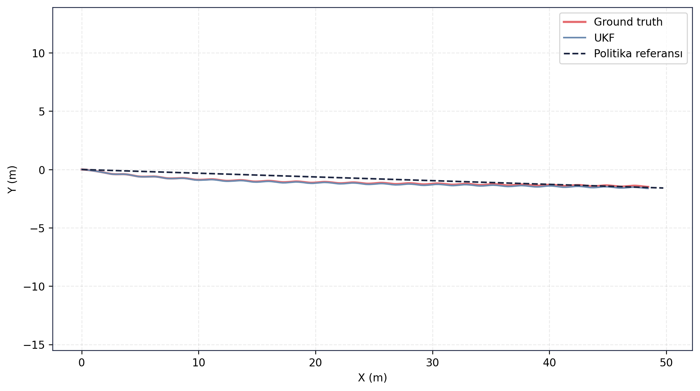
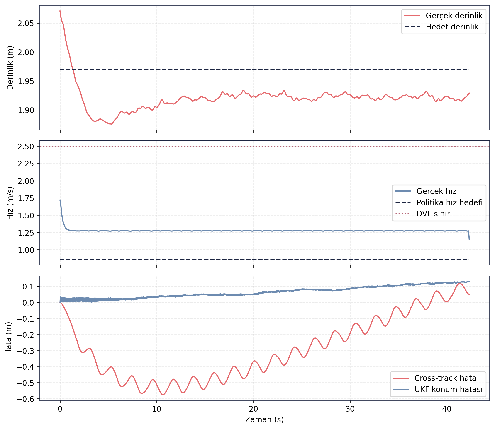

# RL Politika Doğrulama — Episode 02: Takip Eden Akıntı

> [← Akıntısız Senaryo](../01_akintisiz/README.md) - [Ana RL Politika Sayfası](../../README.md) - [Çapraz Akıntı →](../03_capraz_akinti/README.md)

---

# Amaç

Bu senaryoda politika adayı, araç hareket yönüyle aynı doğrultuda etki eden akıntı altında değerlendirilmiştir.

Amaç, takip eden akıntının ilerleme performansı, rota takibi, derinlik kontrolü ve navigasyon doğruluğu üzerindeki etkilerini incelemektir.

---

# Senaryo Tanımı

| Parametre | Değer |
|---|---|
| Akıntı X | 0.25 m/s |
| Akıntı Y | 0.00 m/s |
| Hedef mesafe | 49.77 m |
| Hedef derinlik | 2.0 m |
| Test ortamı | Gazebo Harmonic |
| Kontrol zinciri | ROS 2 Guidance + Controller |
| Navigasyon | UKF |

---

# Doğrulama Sonucu

✅ **KABUL**

Politika adayı takip eden akıntı koşullarında hedefe başarıyla ulaşmıştır. Navigasyon geçerliliği test boyunca korunmuş, DVL hız sınırı ihlal edilmemiş ve rota takibi kabul kriterleri içerisinde tamamlanmıştır. Takip eden akıntının etkisiyle araç akıntısız senaryoya kıyasla daha kısa sürede hedef bölgeye ulaşmıştır.

---

# Temel Metrikler

| Ölçüt | Değer |
|---|---:|
| Test süresi | 42.31 s |
| Hedef mesafe | 49.77 m |
| Gerçek ilerleme | 48.47 m |
| Cross-track RMSE | 0.350 m |
| Son cross-track hata | 0.051 m |
| Derinlik RMSE | 0.055 m |
| UKF konum RMSE | 0.073 m |
| Maksimum hız | 1.720 m/s |
| DVL ihlali | 0 |
| Navigation valid ratio | 1.00 |
| Navigation degraded ratio | 0.00 |

Kaynak: episode analiz çıktıları.

---

# Rota Takibi

Ground truth ve UKF çıktıları büyük ölçüde çakışmaktadır. Araç yaklaşık 50 m uzunluğundaki referans rotayı takip etmiş ve takip eden akıntının yardımıyla hedefe ulaşmıştır. Rota boyunca yanal sapma düşük seviyede kalmıştır.

---

# Zaman Serisi Analizi

Üst grafikte derinlik davranışı görülmektedir. Araç test boyunca hedef operasyon derinliğine yakın seyretmiş ve derinlik kontrolünü korumuştur.

Orta grafikte takip eden akıntının etkisiyle hızın akıntısız senaryoya göre daha yüksek seviyelerde gerçekleştiği görülmektedir. Buna rağmen DVL çalışma sınırı aşılmamıştır.

Alt grafikte cross-track hata düşük seviyelerde korunmuş ve test sonunda sıfıra yakın değere ulaşmıştır. UKF konum hatası tüm koşum boyunca düşük seviyede kalmıştır.

---

## Kayıt ve Log Bilgileri

Test sırasında toplam **114.535 mesaj**, **26 topic** üzerinden kaydedilmiş ve kayıt süresi **60.91 saniye** olmuştur. Oluşan rosbag dosyasının boyutu **18.17 MB** olup yaklaşık **0.298 MB/s** veri üretmiştir.

Analiz aşamasında **35 adet ROS log kaydı** üretilmiş, tüm kayıtlar **INFO** seviyesinde kalmış ve herhangi bir hata veya kritik uyarı gözlenmemiştir. Analiz logları, rosbag verisinin başarıyla açıldığını ve işleme sürecinin sorunsuz tamamlandığını göstermektedir.

Guncel test kosumundan alinan CSV/JSON/Markdown kayıt dışa aktarımları `ham_veriler/` klasorunde tutulmuştur. Rosbag `.db3` veritabanı paylaşım setine dahil edilmemiştir.

---

## Değerlendirme

Takip eden akıntı senaryosunda politika adayı hedefe başarıyla ulaşmış ve kabul koşullarını sağlamıştır. Akıntının araç hareket yönünü desteklemesi nedeniyle hedef mesafe daha kısa sürede tamamlanmış, buna rağmen rota takibi ve derinlik kontrol performansında belirgin bir bozulma gözlenmemiştir. Bu nedenle senaryo **KABUL** olarak değerlendirilmiştir.

---

> [← Akıntısız Senaryo](../01_akintisiz/README.md) - [Ana RL Politika Sayfası](../../README.md) - [Çapraz Akıntı →](../03_capraz_akinti/README.md)
