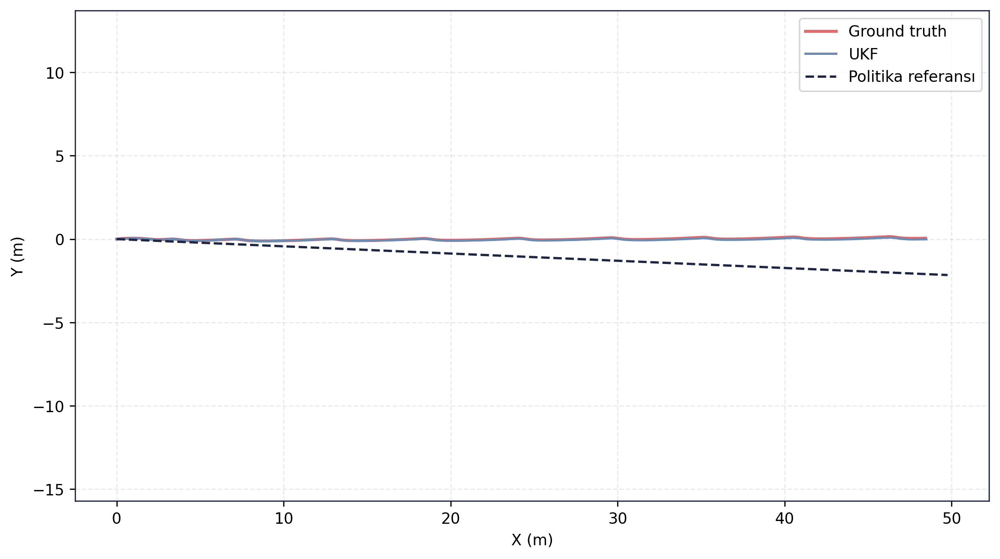
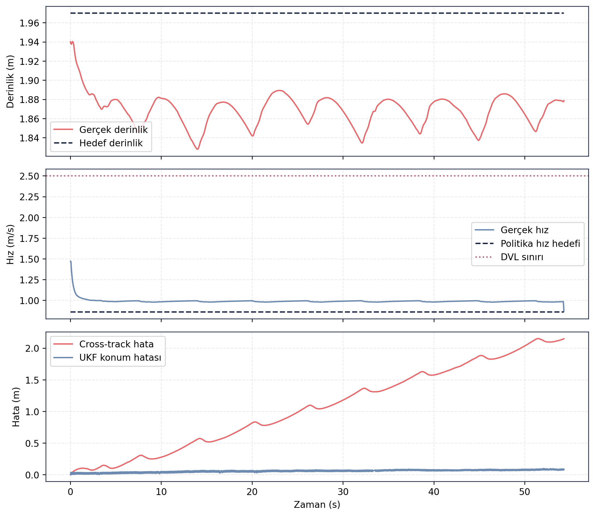

# RL Politika Doğrulama — Episode 03: Çapraz Akıntı

> [← Takip Eden Akıntı](../02_takip_eden_akinti/README.md) - [Ana RL Politika Sayfası](../../README.md) - [Diyagonal Akıntı →](../04_diyagonal_akinti/README.md)

---

# Amaç

Bu senaryoda politika adayı, araç hareket doğrultusuna dik yönde etki eden çapraz akıntı altında değerlendirilmiştir.

Amaç, yanal bozucu etkilerin rota takibi, derinlik kontrolü ve navigasyon performansı üzerindeki etkilerini incelemektir.

---

# Senaryo Tanımı

| Parametre | Değer |
|---|---|
| Akıntı X | 0.00 m/s |
| Akıntı Y | 0.25 m/s |
| Hedef mesafe | 49.81 m |
| Hedef derinlik | 2.0 m |
| Test ortamı | Gazebo Harmonic |
| Kontrol zinciri | ROS 2 Guidance + Controller |
| Navigasyon | UKF |

---

# Doğrulama Sonucu

✅ **KABUL**

Politika adayı çapraz akıntı etkisi altında hedefe başarıyla ulaşmıştır. Yanal sürüklenme nedeniyle rota hatası önceki senaryolara göre artmış olsa da sistem navigasyon geçerliliğini korumuş, DVL sınırını aşmamış ve kabul kriterlerini sağlamıştır.

---

# Temel Metrikler

| Ölçüt | Değer |
|---|---:|
| Test süresi | 54.30 s |
| Hedef mesafe | 49.81 m |
| Gerçek ilerleme | 48.39 m |
| Cross-track RMSE | 1.233 m |
| Son cross-track hata | 2.148 m |
| Derinlik RMSE | 0.103 m |
| UKF konum RMSE | 0.060 m |
| Maksimum hız | 1.471 m/s |
| DVL ihlali | 0 |
| Navigation valid ratio | 1.00 |
| Navigation degraded ratio | 0.00 |

Kaynak: episode analiz çıktıları.

---

# Rota Takibi

Ground truth ve UKF çıktıları büyük ölçüde çakışmaktadır. Araç hedef rotayı takip etmeye devam etmiş ancak çapraz akıntının etkisiyle referans hattından belirli ölçüde uzaklaşmıştır. Buna rağmen görev ilerlemesi korunmuş ve hedef bölgeye ulaşılmıştır.

---

# Zaman Serisi Analizi

Üst grafikte araç derinlik kontrolünün çapraz akıntı altında da korunduğu görülmektedir. Derinlik hatası önceki senaryolara göre artmış olsa da operasyon sınırları içerisinde kalmıştır.

Orta grafikte araç hızının kararlı şekilde sürdürüldüğü ve DVL çalışma sınırının aşılmadığı görülmektedir.

Alt grafikte çapraz akıntının etkisiyle cross-track hatanın önceki senaryolara göre belirgin şekilde arttığı gözlenmektedir. Buna rağmen UKF konum hatası düşük seviyede kalmış ve navigasyon performansı korunmuştur.

---

## Kayıt ve Log Bilgileri

Test sırasında toplam **145.596 mesaj**, **26 topic** üzerinden kaydedilmiş ve kayıt süresi **76.95 saniye** olmuştur. Oluşan rosbag dosyasının boyutu **22.34 MB** olup yaklaşık **0.290 MB/s** veri üretmiştir.

Analiz aşamasında **61 adet ROS log kaydı** üretilmiştir. Logların büyük bölümü **INFO** seviyesinde olup bir adet **WARNING** kaydı bulunmaktadır. Buna rağmen test akışı tamamlanmış, navigasyon geçerliliği korunmuş ve analiz süreci başarıyla sonuçlanmıştır.

Guncel test kosumundan alinan CSV/JSON/Markdown kayıt dışa aktarımları `ham_veriler/` klasorunde tutulmuştur. Rosbag `.db3` veritabanı paylaşım setine dahil edilmemiştir.

---

## Değerlendirme

Çapraz akıntı senaryosu, politika adayının yanal bozucular altındaki davranışını göstermektedir. Akıntı nedeniyle cross-track hatası belirgin şekilde artmış olsa da araç hedefe ulaşmış, navigasyon geçerliliğini korumuş ve kabul kriterlerini sağlamıştır. Sonuçlar mevcut guidance ve kontrol katmanının orta seviyeli çapraz akıntılar altında görev icrasını sürdürebildiğini göstermektedir.

---

> [← Takip Eden Akıntı](../02_takip_eden_akinti/README.md) - [Ana RL Politika Sayfası](../../README.md) - [Diyagonal Akıntı →](../04_diyagonal_akinti/README.md)
