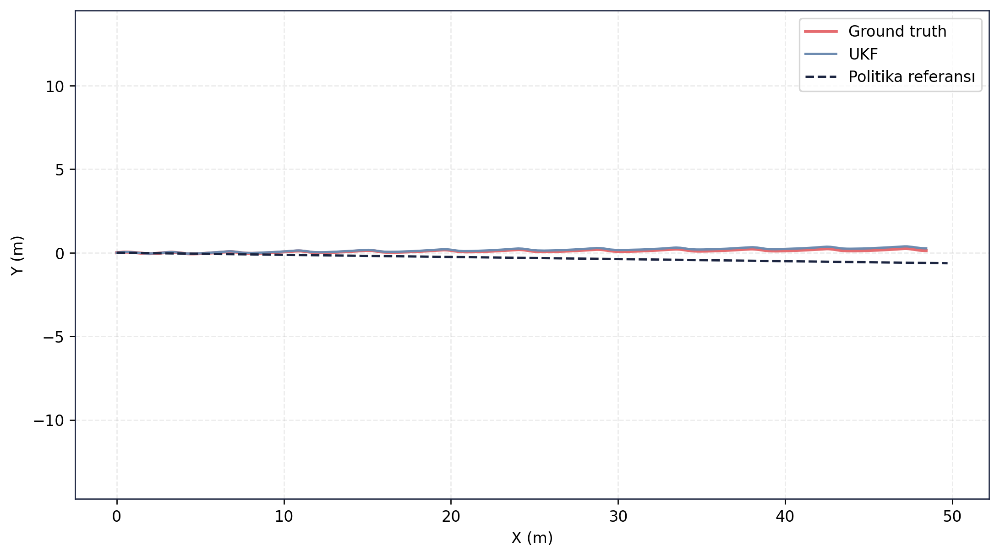
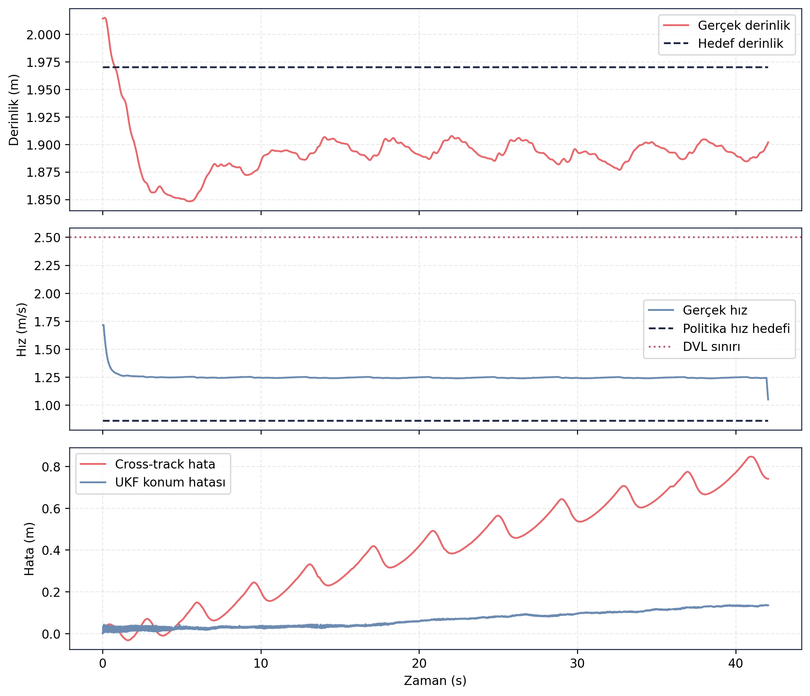

# RL Politika Doğrulama — Episode 04: Diyagonal Akıntı

> [← Çapraz Akıntı](../03_capraz_akinti/README.md) - [Ana RL Politika Sayfası](../../README.md) - [Ters Akıntı →](../05_ters_akinti/README.md)

---

# Amaç

Bu senaryoda politika adayı, hem ilerleme yönünde hem de yanal doğrultuda bileşen içeren diyagonal akıntı altında değerlendirilmiştir.

Amaç, birleşik akıntı etkilerinin rota takibi, derinlik kontrolü ve navigasyon performansı üzerindeki etkilerini incelemektir.

---

# Senaryo Tanımı

| Parametre | Değer |
|---|---|
| Akıntı X | 0.25 m/s |
| Akıntı Y | 0.20 m/s |
| Hedef mesafe | 49.72 m |
| Hedef derinlik | 2.0 m |
| Test ortamı | Gazebo Harmonic |
| Kontrol zinciri | ROS 2 Guidance + Controller |
| Navigasyon | UKF |

---

# Doğrulama Sonucu

✅ **KABUL**

Politika adayı diyagonal akıntı koşullarında hedefe başarıyla ulaşmıştır. İleri yönlü akıntının ilerlemeyi desteklemesine rağmen yanal akıntı bileşeni rota üzerinde bozucu etki oluşturmuştur. Buna rağmen sistem navigasyon geçerliliğini korumuş, DVL sınırını aşmamış ve tüm kabul koşullarını sağlamıştır.

---

# Temel Metrikler

| Ölçüt | Değer |
|---|---:|
| Test süresi | 42.03 s |
| Hedef mesafe | 49.72 m |
| Gerçek ilerleme | 48.42 m |
| Cross-track RMSE | 0.470 m |
| Son cross-track hata | 0.741 m |
| Derinlik RMSE | 0.081 m |
| UKF konum RMSE | 0.077 m |
| Maksimum hız | 1.715 m/s |
| DVL ihlali | 0 |
| Navigation valid ratio | 1.00 |
| Navigation degraded ratio | 0.00 |

Kaynak: episode analiz çıktıları.

---

# Rota Takibi

Ground truth ve UKF çıktıları büyük ölçüde çakışmaktadır. Araç hedef rotayı takip etmeyi sürdürmüş ve diyagonal akıntı altında görev mesafesini başarıyla tamamlamıştır. Yanal sapma oluşmasına rağmen rota kontrolü korunmuştur.

---

# Zaman Serisi Analizi

Üst grafikte araç derinliğinin hedef operasyon seviyesine yakın kaldığı görülmektedir. Derinlik hatası akıntısız senaryoya göre artmış olsa da kabul sınırları içerisinde kalmıştır.

Orta grafikte hızın kararlı şekilde korunduğu ve DVL çalışma sınırının aşılmadığı görülmektedir. İleri yönlü akıntı bileşeni araç ilerlemesini desteklemiştir.

Alt grafikte cross-track hatanın zaman içerisinde arttığı ancak kontrol altında tutulduğu gözlenmektedir. UKF konum hatası tüm test boyunca düşük seviyelerde kalmış ve navigasyon performansı korunmuştur.

---

## Kayıt ve Log Bilgileri

Test sırasında toplam **118.589 mesaj**, **26 topic** üzerinden kaydedilmiş ve kayıt süresi **62.06 saniye** olmuştur. Oluşan rosbag dosyasının boyutu **18.84 MB** olup yaklaşık **0.304 MB/s** veri üretmiştir.

Analiz aşamasında **36 adet ROS log kaydı** üretilmiştir. Logların büyük bölümü **INFO** seviyesinde olup bir adet **WARNING** kaydı bulunmaktadır. Buna rağmen test akışı başarıyla tamamlanmış, navigasyon geçerliliği korunmuş ve analiz süreci sorunsuz şekilde sonuçlanmıştır.

Guncel test kosumundan alinan CSV/JSON/Markdown kayıt dışa aktarımları `ham_veriler/` klasorunde tutulmuştur. Rosbag `.db3` veritabanı paylaşım setine dahil edilmemiştir.

---

## Değerlendirme

Diyagonal akıntı senaryosu, politika adayının aynı anda hem ilerlemeyi destekleyen hem de yanal sapma oluşturan çevresel etkiler altındaki performansını göstermektedir. Araç hedefe başarıyla ulaşmış, navigasyon geçerliliğini korumuş ve rota takibini kabul sınırları içerisinde sürdürmüştür. Sonuçlar, mevcut guidance ve kontrol katmanının orta seviyeli birleşik akıntılar altında görev icrasını sürdürebildiğini göstermektedir.

---

> [← Çapraz Akıntı](../03_capraz_akinti/README.md) - [Ana RL Politika Sayfası](../../README.md) - [Ters Akıntı →](../05_ters_akinti/README.md)
