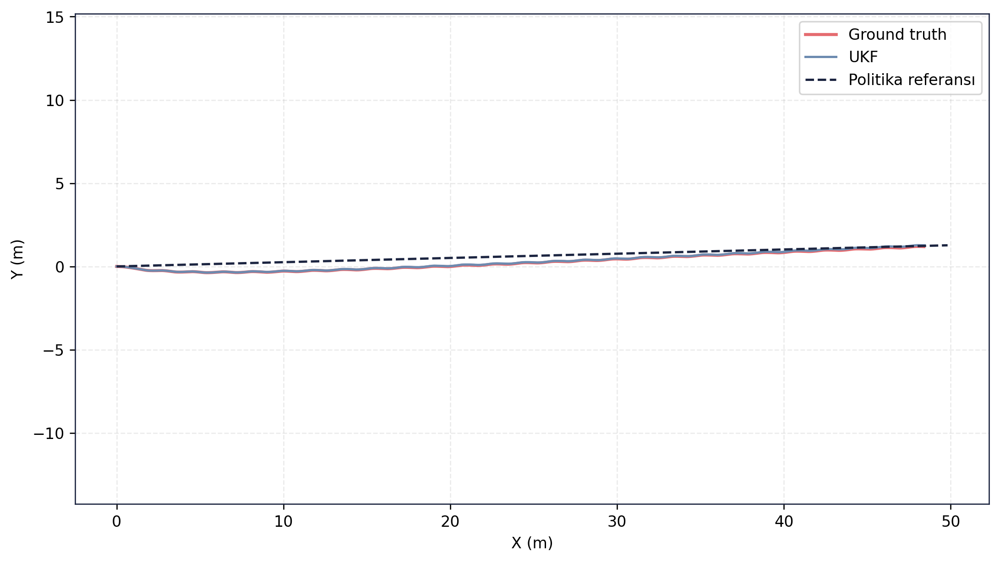
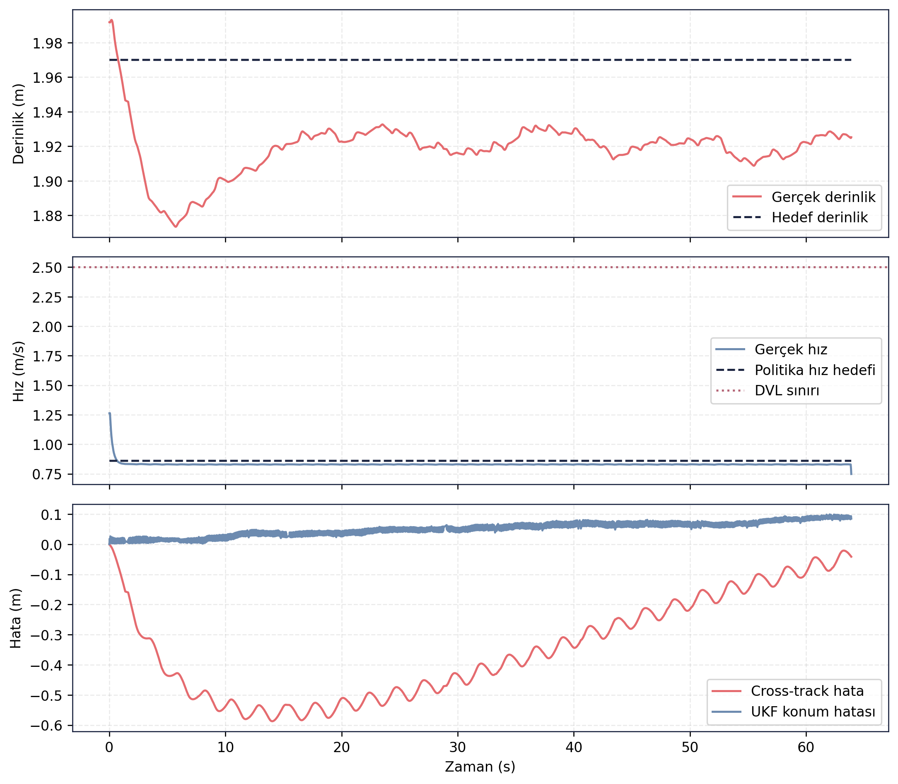

# RL Politika Doğrulama — Episode 05: Ters Akıntı

> [← Diyagonal Akıntı](../04_diyagonal_akinti/README.md) - [Ana RL Politika Sayfası](../../README.md) - [Güçlü Çapraz Akıntı Stres →](../06_guclu_capraz_akinti_stres/README.md)

---

# Amaç

Bu senaryoda politika adayı, araç ilerleme yönüne karşı etki eden ters akıntı altında değerlendirilmiştir.

Amaç, karşı akıntı koşullarında rota takibi, ilerleme performansı, derinlik kontrolü ve navigasyon kararlılığını incelemektir.

---

# Senaryo Tanımı

| Parametre | Değer |
|---|---|
| Akıntı X | -0.20 m/s |
| Akıntı Y | 0.00 m/s |
| Hedef mesafe | 49.83 m |
| Hedef derinlik | 2.0 m |
| Test ortamı | Gazebo Harmonic |
| Kontrol zinciri | ROS 2 Guidance + Controller |
| Navigasyon | UKF |

---

# Doğrulama Sonucu

✅ **KABUL**

Politika adayı ters akıntı koşullarında hedefe başarıyla ulaşmıştır. Akıntının ilerleme yönüne karşı etki etmesi nedeniyle görev süresi diğer senaryolara göre uzamış olsa da navigasyon geçerliliği korunmuş, DVL sınırı aşılmamış ve tüm kabul koşulları sağlanmıştır.

---

# Temel Metrikler

| Ölçüt | Değer |
|---|---:|
| Test süresi | 63.88 s |
| Hedef mesafe | 49.83 m |
| Gerçek ilerleme | 48.41 m |
| Cross-track RMSE | 0.387 m |
| Son cross-track hata | -0.041 m |
| Derinlik RMSE | 0.054 m |
| UKF konum RMSE | 0.055 m |
| Maksimum hız | 1.263 m/s |
| DVL ihlali | 0 |
| Navigation valid ratio | 1.00 |
| Navigation degraded ratio | 0.00 |

Kaynak: episode analiz çıktıları.

---

# Rota Takibi

Ground truth ve UKF çıktıları büyük ölçüde çakışmaktadır. Araç ters akıntıya rağmen referans rotayı takip etmiş ve hedef bölgeye ulaşmıştır. Yanal sapma düşük seviyede kalmış ve rota kararlılığı korunmuştur.

---

# Zaman Serisi Analizi

Üst grafikte araç derinliğinin hedef operasyon seviyesine yakın kaldığı görülmektedir. Derinlik kontrolü test boyunca korunmuş ve belirgin bir kararsızlık oluşmamıştır.

Orta grafikte araç hızının diğer senaryolara göre daha düşük seviyede gerçekleştiği görülmektedir. Bunun temel nedeni, ters akıntının araç ilerlemesine karşı kuvvet oluşturmasıdır. Buna rağmen DVL çalışma sınırı aşılmamıştır.

Alt grafikte cross-track hatanın düşük seviyelerde kaldığı ve test sonunda sıfıra yaklaştığı görülmektedir. UKF konum hatası da tüm koşum boyunca düşük seviyelerde seyretmiş ve navigasyon performansı korunmuştur.

---

## Kayıt ve Log Bilgileri

Test sırasında toplam **167.955 mesaj**, **26 topic** üzerinden kaydedilmiş ve kayıt süresi **87.85 saniye** olmuştur. Oluşan rosbag dosyasının boyutu **26.54 MB** olup yaklaşık **0.302 MB/s** veri üretmiştir.

Analiz aşamasında **48 adet ROS log kaydı** üretilmiş, tüm kayıtlar **INFO** seviyesinde kalmış ve herhangi bir hata veya kritik uyarı gözlenmemiştir. Analiz logları, rosbag verisinin başarıyla işlendiğini ve doğrulama sürecinin sorunsuz tamamlandığını göstermektedir.

Guncel test kosumundan alinan CSV/JSON/Markdown kayıt dışa aktarımları `ham_veriler/` klasorunde tutulmuştur. Rosbag `.db3` veritabanı paylaşım setine dahil edilmemiştir.

---

## Değerlendirme

Ters akıntı senaryosu, politika adayının ilerleme yönüne karşı etki eden çevresel bozucular altındaki performansını göstermektedir. Araç hedefe ulaşmayı başarmış, navigasyon geçerliliğini korumuş ve rota takibini kabul sınırları içerisinde sürdürmüştür. Akıntı nedeniyle görev süresi uzamış ve maksimum hız düşmüş olsa da sistem görevini başarıyla tamamlamıştır. Bu nedenle senaryo **KABUL** olarak değerlendirilmiştir.

---

> [← Diyagonal Akıntı](../04_diyagonal_akinti/README.md) - [Ana RL Politika Sayfası](../../README.md) - [Güçlü Çapraz Akıntı Stres →](../06_guclu_capraz_akinti_stres/README.md)
