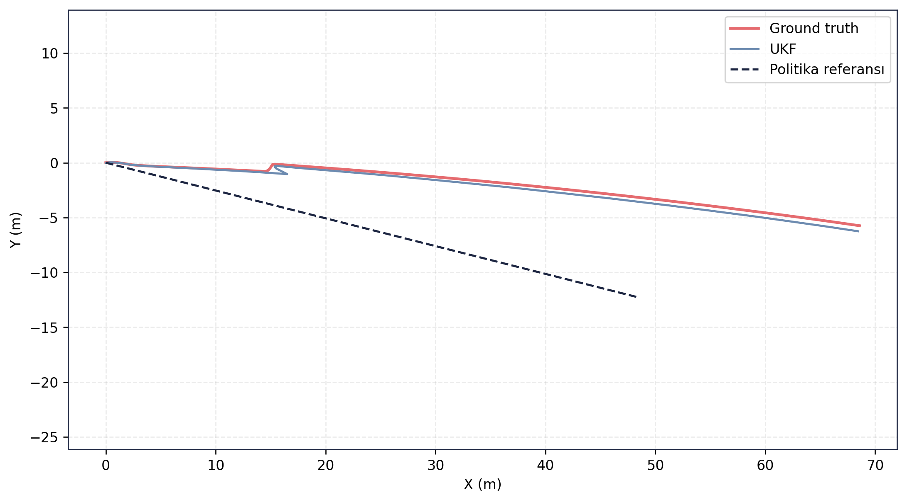
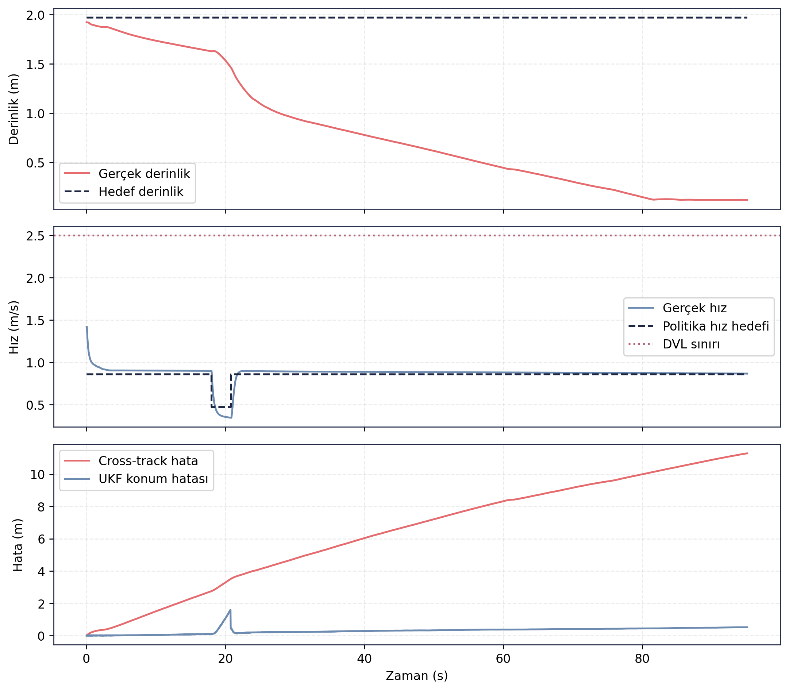

# RL Politika Doğrulama — Episode 06: Güçlü Çapraz Akıntı (Stres Testi)

> [← Ters Akıntı](../05_ters_akinti/README.md) - [Ana RL Politika Sayfası](../../README.md)

---

# Amaç

Bu senaryoda politika adayı, önceki testlerde kullanılan akıntı seviyelerinin üzerinde, güçlü çapraz akıntı altında değerlendirilmiştir.

Amaç, sistemin operasyonel çalışma sınırlarını belirlemek ve yüksek yanal bozucular altında guidance, kontrol ve navigasyon performansının nasıl değiştiğini incelemektir.

---

# Senaryo Tanımı

| Parametre | Değer |
|---|---|
| Akıntı X | 0.00 m/s |
| Akıntı Y | 0.40 m/s |
| Hedef mesafe | 49.83 m |
| Hedef derinlik | 2.0 m |
| Test ortamı | Gazebo Harmonic |
| Kontrol zinciri | ROS 2 Guidance + Controller |
| Navigasyon | UKF |

---

# Doğrulama Sonucu

❌ **BAŞARISIZ**

Politika adayı güçlü çapraz akıntı koşullarında kabul kriterlerini sağlayamamıştır. Araç hareketini sürdürmüş ve navigasyon sistemi çalışmaya devam etmiş olsa da yanal sürüklenme zamanla birikmiş, rota takibi bozulmuş ve görev başarı koşulları karşılanamamıştır.

Bu senaryo sistemin çalışma sınırını göstermek amacıyla korunmuştur.

---

# Temel Metrikler

| Ölçüt | Değer |
|---|---:|
| Test süresi | 95.09 s |
| Hedef mesafe | 49.83 m |
| Gerçek ilerleme | 67.89 m |
| Cross-track RMSE | 7.154 m |
| Son cross-track hata | 11.283 m |
| Derinlik RMSE | 1.303 m |
| UKF konum RMSE | 0.360 m |
| Maksimum hız | 1.420 m/s |
| DVL ihlali | 0 |
| Navigation valid ratio | 1.00 |
| Navigation degraded ratio | 0.032 |

Kaynak: episode analiz çıktıları.

---

# Rota Takibi

Ground truth ve UKF çıktıları birbirini takip etmeye devam etmektedir. Ancak güçlü çapraz akıntı nedeniyle araç referans rotadan sürekli uzaklaşmıştır. Araç ilerlemeyi sürdürmesine rağmen hedef koridoru içerisinde kalamamış ve rota hatası zamanla büyümüştür.

---

# Zaman Serisi Analizi

Üst grafikte derinlik performansının zamanla bozulduğu görülmektedir. Araç hedeflenen operasyon derinliğini koruyamamış ve test sonunda hedef derinlikten belirgin şekilde uzaklaşmıştır.

Orta grafikte hızın genel olarak kararlı kaldığı ve DVL çalışma sınırının aşılmadığı görülmektedir. Başarısızlığın nedeni hız limiti veya itki yetersizliği değildir.

Alt grafikte cross-track hatanın sürekli büyüdüğü ve test sonunda 11 metreyi aştığı görülmektedir. UKF hata seviyesi artsa da navigasyon çözümü geçerliliğini korumuştur. Bu durum problemin esas olarak navigasyon katmanından değil, guidance ve kontrol katmanlarının güçlü yanal akıntıyı yeterince telafi edememesinden kaynaklandığını göstermektedir.

---

## Kayıt ve Log Bilgileri

Test sırasında toplam **207.959 mesaj**, **26 topic** üzerinden kaydedilmiş ve kayıt süresi **117.40 saniye** olmuştur. Oluşan rosbag dosyasının boyutu **32.90 MB** olup yaklaşık **0.280 MB/s** veri üretmiştir.

Analiz aşamasında **39 adet ROS log kaydı** üretilmiştir. Logların büyük bölümü **INFO** seviyesinde olup dört adet **WARNING** kaydı bulunmaktadır. Buna rağmen veri kaydı ve analiz süreci başarıyla tamamlanmıştır.

Guncel test kosumundan alinan CSV/JSON/Markdown kayıt dışa aktarımları `ham_veriler/` klasorunde tutulmuştur. Rosbag `.db3` veritabanı paylaşım setine dahil edilmemiştir.

---

## Değerlendirme

Bu senaryo, RL politika adayının başarısız olduğu tek doğrulama koşuludur. Güçlü çapraz akıntı altında araç ilerlemeyi sürdürmüş ancak rota takibini koruyamamıştır. Cross-track hata ve derinlik hatası kabul sınırlarının üzerine çıkmış, sonuç olarak görev başarı kriterleri sağlanamamıştır.

Bununla birlikte navigasyon sistemi çalışmaya devam etmiş, UKF çözümü geçerliliğini korumuş ve DVL hız sınırı ihlal edilmemiştir. Sonuçlar, mevcut politika ve guidance yapısının orta seviyeli akıntılarda yeterli performans gösterdiğini; ancak **0.40 m/s seviyesindeki güçlü yanal akıntıların mevcut kontrol yaklaşımının operasyonel sınırını oluşturduğunu** göstermektedir.

---

> [← Ters Akıntı](../05_ters_akinti/README.md) - [Ana RL Politika Sayfası](../../README.md)
