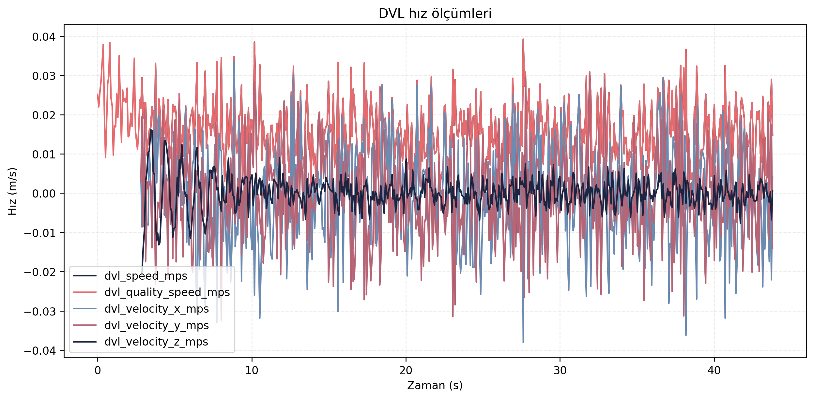
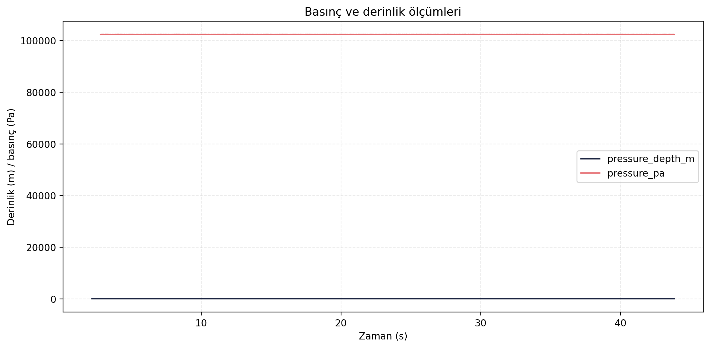
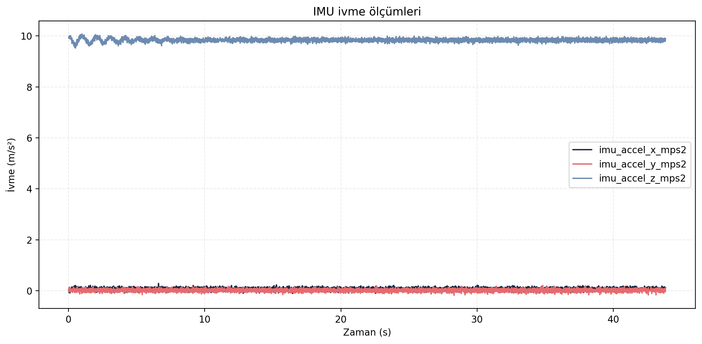

> [← Akinti Servisleri](../ocean_current_services/README.md) - [Ana Dogrulama Sayfasi](../README.md)

# Sensor Sagligi Dogrulama Sonuclari

## Amac

Bu test, simülasyon ortaminda DVL, IMU, basinc ve navigasyon saglik durumlarinin veri surekliligini dogrulamak icin kosulmustur. Degerlendirme topic frekanslari, sensor zaman serileri ve `/navigation/status` bayraklari uzerinden yapilmistir.

## Sayisal Ozet

| Olcut | Deger |
|---|---:|
| Dogrulama karari | KABUL |
| navigation_valid orani | 1.00000 |
| imu_ok orani | 1.00000 |
| dvl_ok orani | 1.00000 |
| pressure_ok orani | 1.00000 |

## Gorsel Sonuclar

## Yorum

Test suresince IMU, DVL ve basinc verileri navigasyon saglik denetimi tarafindan gecersiz sayilmamistir. Bu sonuc, simülasyon sensor zincirinin algoritma dogrulama testleri icin yeterli veri surekliligi sagladigini gosterir. Gercek arac testlerinde bu metriklerin tekrar kosulmasi ve oranlarin saha kosullariyla yeniden raporlanmasi gerekir.

## Kayit ve Log Bilgileri

Test sirasinda toplam **81.871 mesaj**, **26 topic** uzerinden kaydedilmis ve kayit suresi **44.42 saniye** olmustur. Olusan rosbag boyutu **12.57 MB**, ortalama veri yuku **0.283 MB/s** olarak hesaplanmistir. Bu deger yaklasik **1.018 GB/saat** kayit hacmine karsilik gelir.

Analiz boyunca **53 ROS log kaydi** uretilmistir. Loglarin **52 adedi INFO**, **1 adedi WARN** seviyesindedir. Sensor veri surekliligi boyunca kritik hata kaydi bulunmamasi, simülasyon sensor zincirinin dogrulama testleri icin kararlı veri urettigini destekler.

## Dosya Indeksi

| Klasor | Icerik |
|---|---|
| `gorseller/` | Sensor frekansi, DVL, IMU ve basinc grafikleri. |
| `metrikler/` | Sensor saglik ozeti, topic hizlari ve sensor zaman serileri. |
| `loglar/` | Analiz logu. |
| `ham_veriler/` | Guncel `final_validation/results` kosumundan alinmis CSV/JSON/Markdown kayıt dışa aktarımları. |

> [← Akinti Servisleri](../ocean_current_services/README.md) - [Ana Dogrulama Sayfasi](../README.md)
