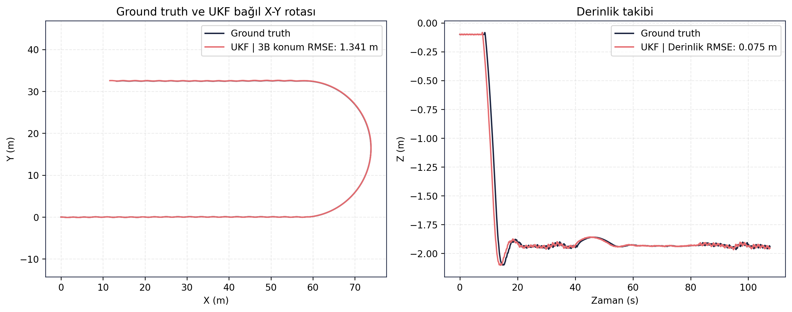
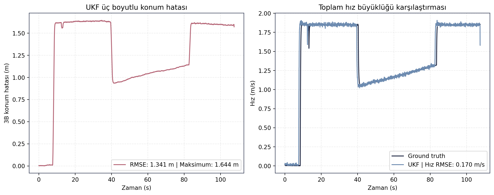
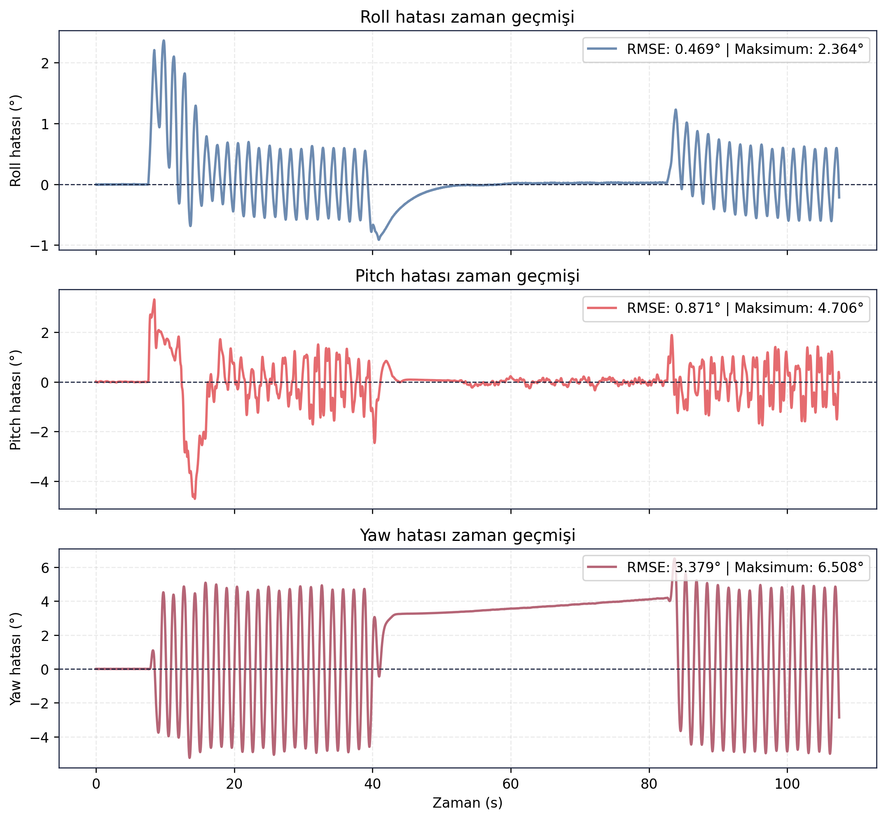

> [← Guidance Waypoint](../guidance_waypoint/README.md) - [Ana Dogrulama Sayfasi](../README.md) - [Stage 2 BT →](../stage2_bt/README.md)

# Stage 1 FSM Dogrulama Sonuclari

## Amac

Bu test, Asama-1 gorev yonetimi icin FSM akisini, derinlik tutma davranisini, donus/gecis fazlarini ve baslangic hattina donus performansini incelemek icin kosulmustur.

## Sayisal Ozet

| Metrik | Deger |
|---|---:|
| Test suresi | 107.5000 s |
| 3B konum RMSE | 1.3407 m |
| Derinlik RMSE | 0.0749 m |
| Toplam hiz RMSE | 0.1695 m/s |
| Yaw RMSE | 3.3788 derece |
| Maksimum yaw hatasi | 6.5078 derece |
| Maksimum roll | 10.3822 derece |
| Maksimum pitch | 9.7315 derece |
| Maksimum rota dogrultusu mesafesi | 73.8435 m |
| Bitis cizgisi boyuna hatasi | 3.1975 m |
| Bitis cizgisi yanal hatasi | 32.4550 m |

## Gorsel Sonuclar

## Yorum

FSM akisi ve derinlik kontrolu calismistir; derinlik RMSE 0.0749 m seviyesindedir. Ancak bitis cizgisi yanal hatasinin 32.4550 m olmasi, donus ve geri donus fazinda rota geometrisinin yeterli hassasiyette korunmadigini gosterir. Bu nedenle test dogrudan basarisiz olarak degil, gorev akisi calisan ancak rota/donus performansi gelistirme gerektiren sonuc olarak raporlanmalidir.

Ilgili gelistirme basliklari: 180 derece donus sirasinda ileri itki ve donus yaricapi yonetimi, akinti telafisi, bitis cizgisine gore yanal hata kapanisi ve gorev suresiyle hiz planlama iliskisi.

## Kayit ve Log Bilgileri

Test sirasinda toplam **232.249 mesaj**, **27 topic** uzerinden kaydedilmis ve kayit suresi **122.02 saniye** olmustur. Olusan rosbag boyutu **36.57 MB**, ortalama veri yuku **0.300 MB/s** olarak hesaplanmistir. Bu deger yaklasik **1.079 GB/saat** kayit hacmine karsilik gelir.

Analiz boyunca **65 ROS log kaydi** uretilmistir. Loglarin **64 adedi INFO**, **1 adedi WARN** seviyesindedir. Gorev akisi boyunca kritik hata kaydi bulunmamasi, FSM kosumunun yazilim tarafinda tamamlandigini; performans sorununun daha cok rota/donus geometrisi tarafinda oldugunu destekler.

## Dosya Indeksi

| Klasor | Icerik |
|---|---|
| `gorseller/` | Trajectory, derinlik, hiz ve yonelim hata grafikleri. |
| `metrikler/` | FSM test ozetleri ve hizalanmis navigasyon verisi. |
| `loglar/` | Analiz logu. |
| `ham_veriler/` | Guncel `final_validation/results` kosumundan alinmis CSV/JSON/Markdown kayıt dışa aktarımları. |

> [← Guidance Waypoint](../guidance_waypoint/README.md) - [Ana Dogrulama Sayfasi](../README.md) - [Stage 2 BT →](../stage2_bt/README.md)
