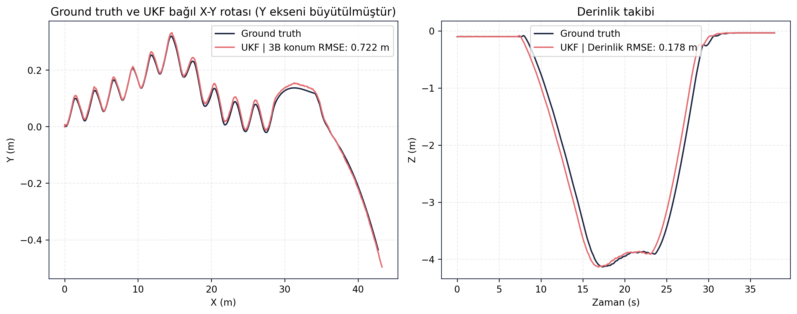
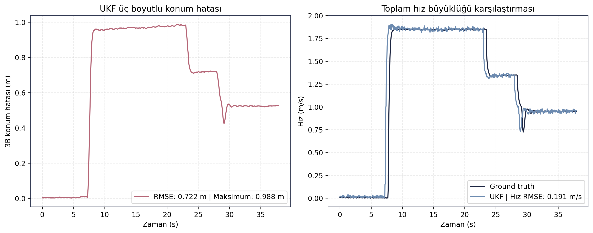
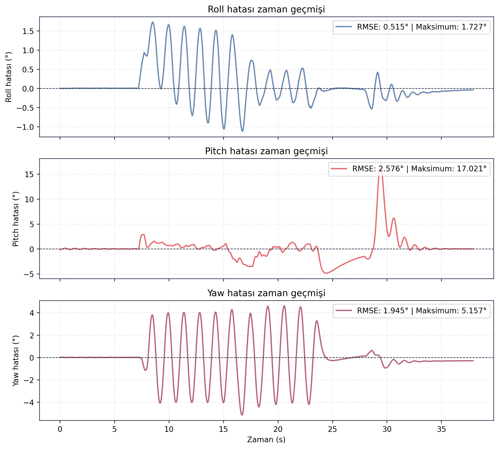

> [← Stage 1 FSM](../stage1_fsm/README.md) - [Ana Dogrulama Sayfasi](../README.md) - [RL Politika →](../rl_politika/README.md)

# Stage 2 BT Dogrulama Sonuclari

## Amac

Bu test, Asama-2 icin FSM ve BT destekli atis hazirlik akisini; 30 m guvenli bolgeye ilerleme, hizalanma, pitch-up manevrasi ve yuzeye yaklasma davranisi uzerinden degerlendirmek icin kosulmustur.

<video src="../mimari/stage2_bt.webm" width="1000" controls></video>

## Sayisal Ozet

| Metrik | Deger |
|---|---:|
| Test suresi | 37.9000 s |
| 3B konum RMSE | 0.7224 m |
| Derinlik RMSE | 0.1776 m |
| Toplam hiz RMSE | 0.1913 m/s |
| Roll RMSE | 0.5150 derece |
| Pitch RMSE | 2.5765 derece |
| Yaw RMSE | 1.9448 derece |
| Maksimum roll | 10.0531 derece |
| Maksimum pitch | 29.0937 derece |
| Maksimum yanal sapma | 0.4335 m |

## Gorsel Sonuclar

## Yorum

Asama-2 testinde arac pitch-up manevrasinda 29.0937 derece seviyesine ulasmistir ve yanal sapma 0.4335 m ile dusuk kalmistir. Buna karsilik X-konfigürasyon hidrodinamik/su yuzeyi modelinde burun cikarma ve pitch koruma davranisi henuz tam olarak kararlı degildir. Bu nedenle sonuc, BT/FSM akisi calisiyor ancak simülasyon fizik modeli ve kontrol ayarlari gelistirme asamasinda seklinde yorumlanmalidir.

Bu test, atis izni algoritmasinin nihai saha kabul sonucu degil; Asama-2 yazilim akisi ve yuzeye yaklasma manevrasi icin ara dogrulama ciktisidir.

## Kayit ve Log Bilgileri

Test sirasinda toplam **86.874 mesaj**, **30 topic** uzerinden kaydedilmis ve kayit suresi **46.33 saniye** olmustur. Olusan rosbag boyutu **13.38 MB**, ortalama veri yuku **0.289 MB/s** olarak hesaplanmistir. Bu deger yaklasik **1.039 GB/saat** kayit hacmine karsilik gelir.

Analiz boyunca **78 ROS log kaydi** uretilmistir. Loglarin **76 adedi INFO**, **1 adedi WARN**, **1 adedi ERROR** seviyesindedir. ERROR seviyesinin bulunmasi nedeniyle bu test nihai kabul kaniti olarak degil, Asama-2 simülasyon/model uyumu gelistirme ciktisi olarak ele alinmalidir.

## Dosya Indeksi

| Klasor | Icerik |
|---|---|
| `gorseller/` | Trajectory, derinlik, hiz ve yonelim hata grafikleri. |
| `metrikler/` | Asama-2 test ozetleri ve hizalanmis navigasyon verisi. |
| `loglar/` | Analiz logu. |
| `ham_veriler/` | Guncel `final_validation/results` kosumundan alinmis CSV/JSON/Markdown kayıt dışa aktarımları. |

> [← Stage 1 FSM](../stage1_fsm/README.md) - [Ana Dogrulama Sayfasi](../README.md) - [RL Politika →](../rl_politika/README.md)
